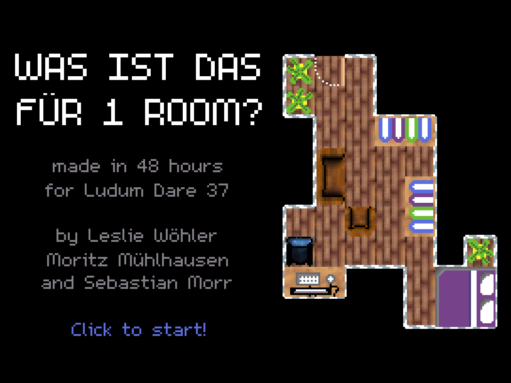

This was my contribution to the game jam Ludum Dare 37, and my third participation in a row. The theme was "One Room", and we worked in a three-person team. We also had to do this half-remotely, as I was still in Japan at the time, but that worked out pretty well!

This time, we created a puzzle game about placing furniture in rooms. One beta tester described it as "Sokoban meets IKEA"! Many reviewers told us the puzzles are rather hard, and it seems consistently to take about an hour to complete. We invite you to give it a go! :)

Again, we used the [LÖVE](https://love2d.org/) engine. You can download the game [from the Ludum Dare website](http://ludumdare.com/compo/ludum-dare-37/?action=preview&uid=64665)!

