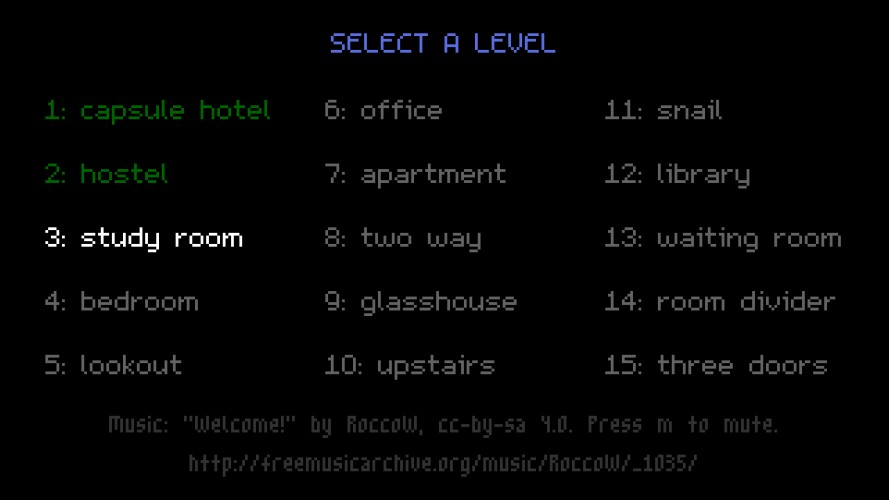
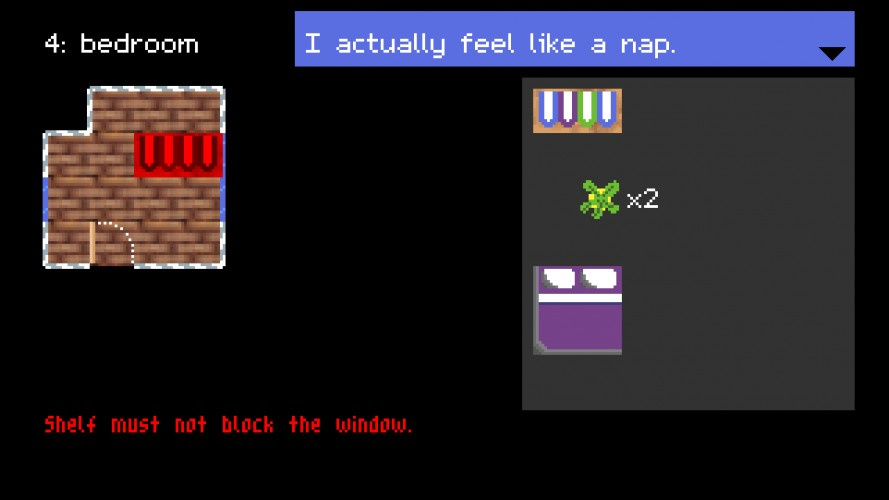
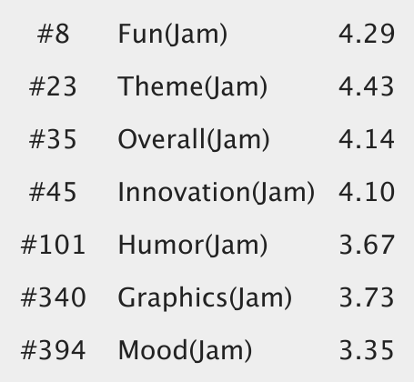

This was my contribution to the game jam Ludum Dare 37, and my third participation in a row. The theme was "One Room", and we worked in a three-person team. We also had to do this half-remotely, as I was still in Japan at the time, but that worked out pretty well! This turned out to be the most popular Ludum Dare game I ever did by far!

This time, we created a puzzle game about placing furniture in rooms. One beta tester described it as "Sokoban meets IKEA"! Many reviewers told us the puzzles are rather hard, and it seems consistently to take about an hour to complete. We invite you to give it a go! :)

Again, we used the [LÖVE](https://love2d.org/) engine. You can download the game [from the Ludum Dare website](http://ludumdare.com/compo/ludum-dare-37/?action=preview&uid=64665)!

## Development

Working remotely was challenging for the team – we talked via Skype a lot, but struggled to sync our sleeping cycles because of the different time zones. Even though, we had a lot of fun!

## Recordings

*rnlf* recorded a nice playthrough. He got stuck on one of the more tricky levels, but told us he came back to it later and completed the game. :)

<%= youtube("KZBHX8cfwxc", start: 2555) %>

## Comments

*Wow, I löved everything about this game. I like (and make) optimization puzzles in general, but this one I liked a lot. Finally beat it after about an hour. The puzzles were challenging but not frustrating, and it was very satisfying every time I solved a level.* --BoltKey

*Arrrrrgh! Who the hell puts four book shelves and a Queen Size Bed in a single room with windows all around?!* --Moritz

## Results

This game definitely got the best ratings of every Ludum Dare game I've done so far. We're especially proud of the "Fun" rating, where we reached the 8th place!

