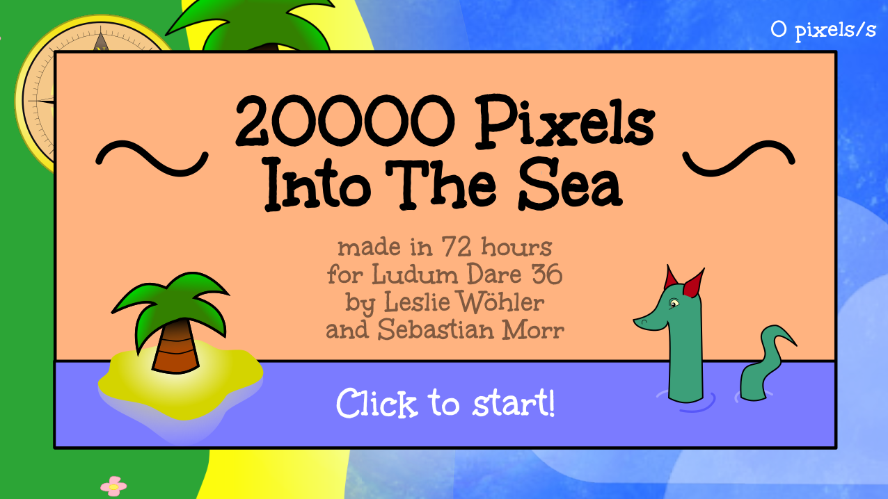
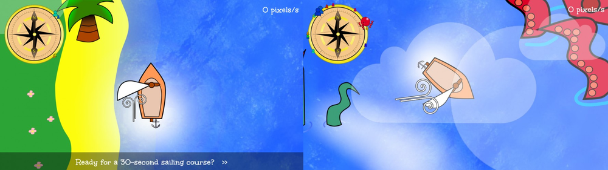

My second participation in a game jam, Ludum Dare 36. This time, I was part of a two-person team, which was crazily fun! The theme was "Ancient Technology", and we made a sailing game, which semi-realistic wind mechanics! You sail around, rescue people, and discover some secrets! If you ever wanted to learn how to sail against the wind, we invite you to give it a go!

We used the (awesome) 2D game engine [LÖVE](https://love2d.org/), which uses the Lua programming language. You can download the game [from the Ludum Dare website](http://ludumdare.com/compo/ludum-dare-36/?action=preview&uid=64665)!

## Development

Fun fact: When we were implementing the sailing mechanics, we put hours into reading Wikipedia and other articles, because we were puzzled: Which forces led the boat to turn when you put the sail in the wind in a certain way? Then, we realized that boats have a rudder...

## Recording

Alice kindly recorded a fun playthrough:

<%= twitch("88809110", start: "18m40s") %>

## Comments

*Wow! What a stellar entry! The sailing mechanics are interesting and very well made - I had so much fun navigating, and was constantly playing with how I tacked into the wind. Wonderful!* --johnbjuice

*This was a lot of fun to play! :) 
I like how you explained just enough about the mechanics for players to figure out the rest themselves. Getting the hang of how the sailing works just by experimenting a bit was really satisfying!* --Waterman7

## Results

Ludum Dare 36 was special because it was community-organized (instead of Mike doing all the work), and there were no ratings. This led to very constructive and in-depth feedback, which I liked!
