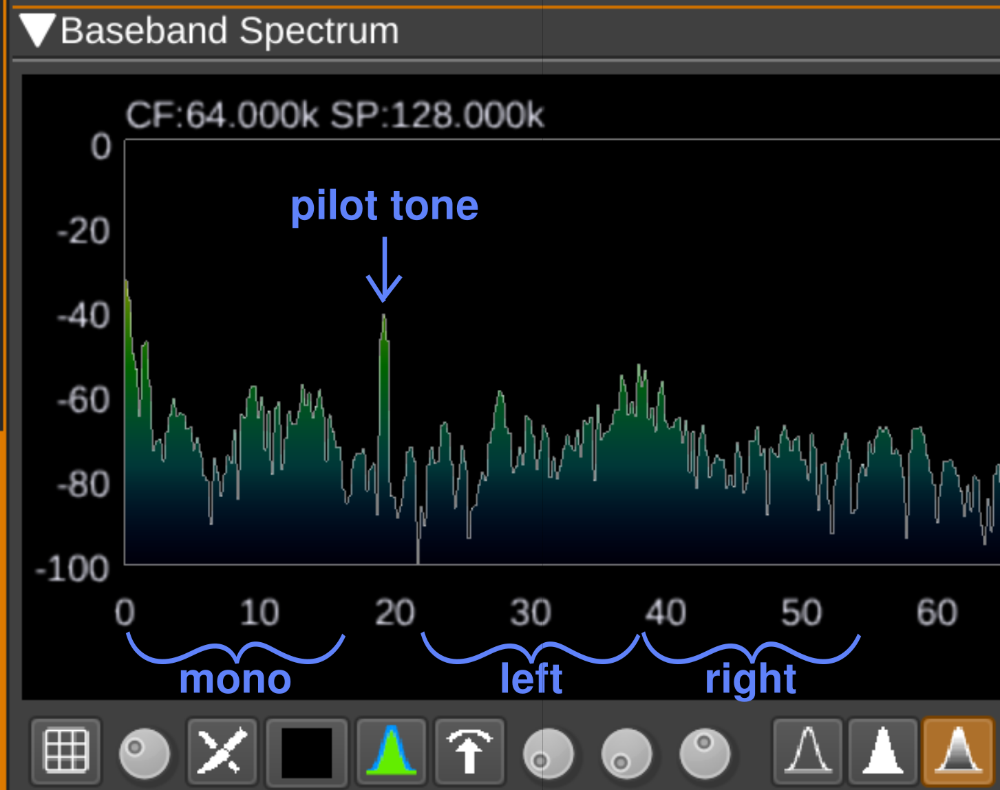
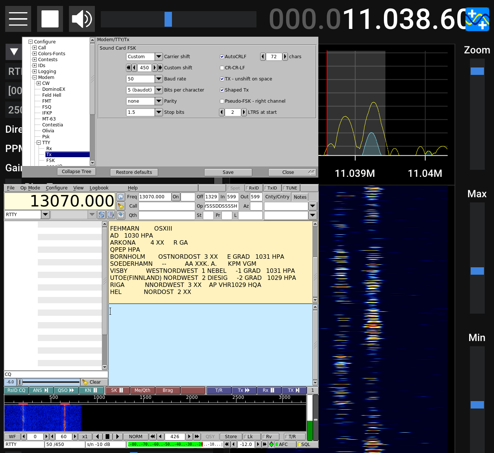
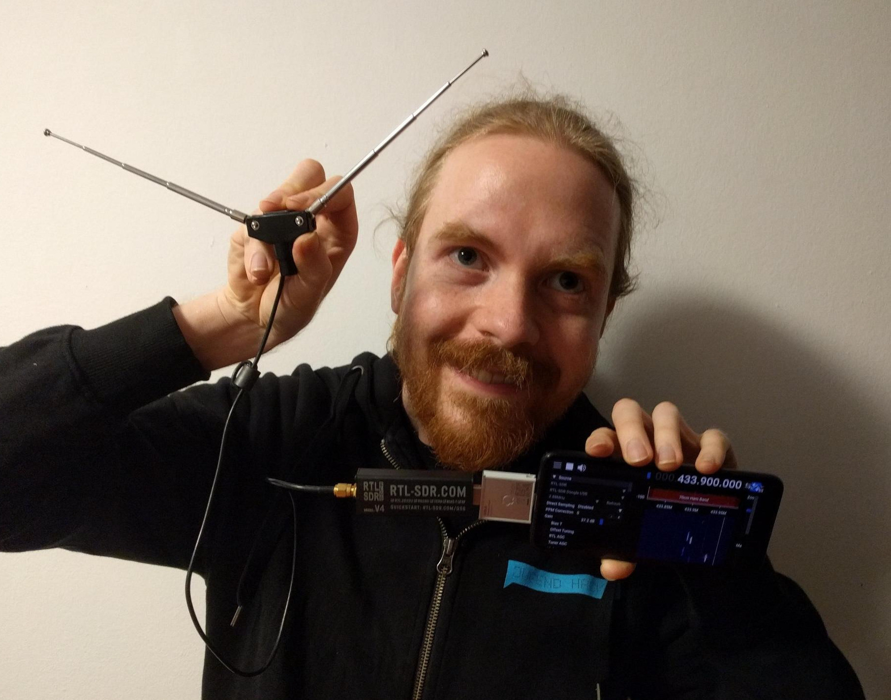

Last week, I went on an adventure through the electromagnetic spectrum!

It's like an invisible world that always surrounds us, and allows us to do many amazing things: It's how radio and TV are transmitted, it's how we communicate using Wi-Fi or our phones. And there are many more things to discover there, from all over the world.

In this post, I'll show you fifty things you can find there -- all you need is this simple USB dongle and an antenna kit!


## The "Make 50 of Something" technique

A couple of years ago, I heard about the "Make 50 of Something" technique in Vi Hart’s [Fifty Fizzbuzzes](https://github.com/vihart/fiftyfizzbuzzes/blob/master/Fifty%20Fizzbuzzes.ipynb). Since then, I've already made [fifty programs for the fantasy console TIC-80](/50-tic80-carts/) in one weekend in 2021.

I found that a very exciting experience -- trying to make so many new things really pushed me to leave my comfort zone, to be creative, and not to get sucked into rabbit holes too deep.

I knew I definitely wanted to try the technique again. So, when I took a week of vacation, I decided to try to find 50 things to do with a Software Defined Radio!

## What is an SDR?

A Software Defined Radio is essentially a radio that relies on a computer to do most of its data processing. It doesn't rely on analog hardware too much -- instead, most of what is does is "defined in software", hence the name.

Usually, SDRs can detect electromagnetic waves in a much wider range than a common FM radio, which makes it especially exciting! I got interested in SDRs after reading about [Albert's project](https://community.frame.work/t/rtl-sdr-expansion-card/37098/15) to build one as a module for the Framework laptop!

## What you'll need

I went into this week without much knowledge of the things I'd find. I'd read through a introductory course for aspiring amateur radio operators (more on that later), but I barely knew which way to point my antenna.

If you want to follow along, this section is intended to help you get started!

Most of the 50 things also have a little infobox at the beginning, explaining the frequencies, and some special knowledge needed to receive them.

### Hardware

I looked into the topic a bit, and a popular, cheap SDR right now is the [*RTL-SDR Blog V4*](https://www.rtl-sdr.com/rtl-sdr-blog-v4-dongle-initial-release/), which has the form factor of a simple SUB dongle. You can get it for around $30, or as a kit with telescopic antennas for $50.

Everything I tried during this week was done using this USB dongle, the antenna kit, and a long piece of wire!

(By the way, there's another great option if you don't want to buy anything -- lots of people make their SDR accessible through the Internet! You can find a map [here](https://rx-tx.info/map-sdr-points).)

### Using the antennas

I tried to adjust my antenna to the desired frequencies as best as I could. I think for receiving, it's not super important that your antenna is perfectly configured, though.

For most applications, I used the dipole antennas that came with the kit I purchased. Dipole antennas have two sides that stick out the same length. You generally wanna make the whole antenna half as long as the wave length you want to receive, and orient it vertically.

My rule of thumb was to divide 72 by the frequency in MHz, and take that as the length of each side of the dipole in meters. That'd make the whole antenna a bit shorter than half of the wavelength.

For example, this is what the configuration looked like for frequencies around 100 MHz:


And for higher frequencies, I used the tiny screw-on antennas from the kit:


For specific applications like receiving satellites, or receiving locators for airplanes, I used special configurations, but I'll discuss these as we go!

### Software

The software I liked best, and which I used for many things, was [SDR++](https://www.sdrpp.org). It allows you to explore the frequency spectrum very smoothly, and has a modern user interface!

But I also used plenty of other software, on Linux in my case. I'll link to the software as needed below.

## Monday

On Monday morning, I was excited to start this project! I sat down at my desk, and got to work!

### 1: Listen to FM radio

- **Frequency:** 87.5-108 MHz
- **Modulation:** FM ("frequency modulation")

This as an obvious first thing to do, as the signals are very strong! I was using the SDR++ software, and it felt very nice browsing around and discovering the stations around me! It reminded me of exploring the radio as a child.

<video src="545dc74004d1946b.mp4" controls></video>

I found a local station that gives 1-hour slots to civic groups, for example!

### 2: Listen to Freenet

- **Frequency:** 149.01-149.11 MHz
- **Modulation:** FM

This is a special frequency range in Germany: Anyone is allowed to send there, using licensed devices. There are 6 channels.

I think someone was testing their device there when I listened in. :D I heard a "Hellooo?", then a "Test, test", and then a "General call to all stations". Oh, and shortly after a short transmission on channel 3 in a Slavic-sounding language!

Freenet devices have a range of only a couple of kilometers, so these people must have been pretty close! :O


### 3: Receive weather conditions from airports

- **Frequency:** Differs by airport, search term is "ATIS"
- **Modulation:** AM

While browsing the aviation frequencies, I found this station that reports weather conditions in an endless loop. It seems to be the "Automatic Terminal Information Service" of Hamburg airport!

Thanks to that, I found out that the current air pressure was 1011 hPa! :D

<video src="ecdd3c2ce2b8da7b.mp4" controls></video>

### 4: Listen to airplane communication

Listening to "messages not meant for the general public" is [not allowed](https://www.buzer.de/5_TTDSG.htm) in Germany, so of course I didn't do that. And if I had accidentally done that, I wouldn't be allowed to tell you about it. 🙅

### 5: Track aircraft via ADS-B

- **Frequency:** 1090 MHz
- **Protocol:** ADS-B

That's short for "Automatic Dependent Surveillance -- Broadcast". Aircraft send it automatically to be tracked.

For this, I built my first antenna! From wire and and an antenna connector called "SMA".


And it worked! \o/ I decoded the signal using the software [SDRangel](https://www.sdrangel.org). Fascinating! I saw some big & small airplanes, and even a helicopter!


### 6: Listen to *stereo* FM radio

- **Frequency:** 87.5-108 MHz
- **Modulation:** FM

How stereo audio is transmitted is really interesting, because it's backwards-compatible to receivers that don't support it:

Here, you see the demodulated audio frequency spectrum, as shown in SDRangel. Below 19k Hz, it's just mono audio. Then, to mark a stereo station, there's a constant "pilot tone" at 19k Hz! (Outside of what most humans can hear.)

Then, if you double the frequency of the pilot tone, you can derive the sections where the difference of the left & right channel to the mono channel is transmitted!

**Correction:** I've been told that instead of what I call "left" and "right" in this diagram, the upper frequencies transmit the *difference of the left and right channels*! That way, the receiver can calculate the left and right channels from the mono signal (which is, esseutially, the *sum* of left and right).



### 7: Receive road traffic information

- **Frequency:** 87.5-108 MHz

If you *triple* the frequency of the pilot tone, you get to a range where FM stations transmit small amounts of digital metadata, like the name and genre of the station, and the current song! That's a protocol called Radio Data System.

This system can also transmit road traffic information! There seemed to be a road closure at "0x64BE", as decoded by SDRangel.


The Federal Highway Research Institute [publishes](https://www.bast.de/BASt_2017/DE/Verkehrstechnik/Fachthemen/v2-LCL/location-code-list-start_node.html) an Excel table, where I could look up that this is a town in Lower Saxony!


### 8: Listen to conversations on the 2-meter amateur radio band

- **Frequency:** 144-146 MHz
- **Modulation:** FM

This is a frequency range reserved for amateur radio operators -- for non-commercial use only. You may send on this band after getting a license.

What I found here is seemingly a conversation circle facilitated by a relay around 15 km away from here -- it takes input on a certain frequency, and outputs an amplified copy of it on another frequency! Klaus, Bernd, Jürgen and Horst were talking about antennas, relays, and Windows XP! 😁


### 9: Listen to digital radio

- **Frequency:** 174-240 MHz

The SDRangel software also has a demodulator for Digital Audio Broadcast! :O I continue to be amazed by it!

I think this was the first time I've received digital radio via air! I saw so many stations, and I've only checked a couple of channels.

The advantage of this digital channel is that there's no noise. And I even saw a "cover image" in one of the programs!

<video src="57ee52cbbbfe70d1.mp4" controls></video>

### 10: Listen to PMR446

- **Frequency:** 446.0-446.2 MHz
- **Modulation:** FM

This is a frequency range for "Private Mobile Radio". It's another of these bands where anyone can transmit using a licensed device!

Not a lot of activity here. I heard "Hello, hellooo!", "Can you hear me?" and some short transmissions that sounded like a child! :D

There also seemed to be digital transmissions, but I didn't know how to decode them yet.


The range of PMR446 devices is pretty low (a couple of hundred metres in cities), so again, the people must've been close!

## Tuesday

After the first day of SDR experiments, I was amazed how much invisible communication is going on around us in the electromagnetic spectrum at the same time!

I posted each of these things [on Mastodon](https://chaos.social/@blinry/112036984423655020) as I went, and asked people for suggestions for more things I could receive.

### 11: Read your neighbors' sensors

- **Frequency:** 433.05-434.79 MHz

At 433 MHz, there's a frequency band for "industrial, scientific and medical" applications. And wow, there was quite a lot of activity nearby!


Using the decoder [rtl_433](https://github.com/merbanan/rtl_433), I saw two sensors that output the current temperature, humidity, and air pressure!

There were also some "IBIS beacons" flying by, which are used in public transportation, so maybe it's buses driving by?


Later, an "Interlogix Security" device also appeared, reporting "closed switch states" :O

### 12: Track ships!

- **Frequency:** 162.025 MHz

Ships send out their status using AIS (Automatic Identification System). And again, I received *a lot* of them here in Hamburg! :O

I was especially excited to receive data from the [MS Stubnitz](https://www.stubnitz.com/) (a fisher boat that was turned into a culture center/techno club)! It reports its status as "moored", and its speed as 0.1 knots! :D


Again, I used the software SDRangel. Apparently, it can also display a 3D map, but I haven't figured out how to add 3D models...

### 13: Detect GSM activity

- **Frequency:** 876-959 MHz, I looked up the specific ranges for Germany [on Wikipedia](https://de.wikipedia.org/wiki/Global_System_for_Mobile_Communications#Situation_in_Deutschland)

I was curious whether you could tell if someone used their phone! So I borrowed a GSM phone, tuned to the correct frequencies, and made some test calls.

What surprised me most: You can kind of "see" the volume at which I was talking!?

In the recording, the three dense bands at the end were when I was humming into the phone at the other end. This only worked in the "receiving" direction.

<video src="9ef1c5c2fec6053d.mp4" controls></video>

## Wednesday

### 14: Receive signals from a satellite!

- **Frequency:** 136-138 MHz

I spent all Tuesday afternoon and evening learning about satellites. The program [gpredict](https://oz9aec.dk/gpredict/) is really nice to find out when satellites will pass overhead! I learned a lot, including that one satellite I was trying to receive burned up last week! :D


I was super excited when I first received a signal from a NOAA satellite! 🛰️


But I didn't manage to decode it properly yet. Maybe my reception was too noisy? I wanted to keep trying, but I had to move on.


### 15: Admire TETRA signals

In Germany, the police has switched to an encrypted digital protocol called TETRA.

Even though I've seen some interesting talks at CCC events about weaknesses in the decryption, all I wanted to do for now is looking at the pretty signals in SDR++. :3


### 16: Listen to taxi dispatchers

Again, this is communication not meant for the general public.

I didn't listen to someone dispatching taxis to specific addresses, and you also shouldn't do that either. 🚕

Stay away from a site called "frequenzdatenbank"!

### 17: Ponder mysterious signals

Some of the most fun I had was just browsing frequencies and seeing what I can find! Sometimes, I encountered signals I can't identify.

For example, at 865-868 MHz, there was a family of slow, continuous, digital signals that made a nice melody when listened to in single-sideband demodulation!


And at 177-180 MHz, there were two very broadband transmissions. Might be TV? But I couldn't find out what type. (It later turned out that I'd already listened to these signals – it was digital radio, DAB+.)


### 18: Track weather balloons

- **Frequency:** 400-405.9 MHz

As I was browsing around for things to receive, I saw on this [tracking website](https://s1.radiosondy.info) that a radiosonde was just launched in Hamburg! SDRangel could decode its transmission! It had climbed to a height of 7 km, and it's -17 °C there!

I knew that it would eventually burst and fall back to Earth, and that I could try to get to it and find it!


### 19: *Hunt* weather balloons!

I decided to go on a field trip, using trains and my bike.


I was following the tracker. The balloon popped earlier than predicted, and I frantically changed travel plans!


Eventually, it landed in a forest. I hoped I could get to it! What made this adventure more tricky was that my mobile Internet contract ran out while I was on the go, and my battery was also almost empty.

But I made it to the forest, and entered it.


As I circled the site, I encountered a person in their 60s, with a stubbly beard and a blue wool hat. He was looking in the direction of the crash site, and was holding a smartphone, so I asked him whether he also was looking for the radiosonde.

He was! We looked for it together for half an hour, jumping over small rivers and crawling through the woods, while he gave me a lot of tips related to hunting sondes.

He told me that he had found around 40 of them so far!

Usually, the sondes keep broadcasting after landing, but this one wasn't. So he quickly guessed that someone else could've taken it. Or maybe it landed in the water and died?

Some pictures of the area we searched:


Eventually, we gave up, and walked back to our vehicles. He also is an amateur radio operator, and could answer a couple of questions related to building antennas!

And he was right: Someone had been faster than us! The status [was changed](https://radiosondy.info/sonde_archive.php?sondenumber=V2930794). So in the end, I didn't find the sonde. But something that might be even better -- a friend!

### 20: Receive amateur packet radio

- **Frequency:** 144.8 MHz

In the 2-meter amateur band, there are certain frequencies for the "Automatic Packet Reporting System". It's a bit like IP -- packets have a "from" and a "to". They can also broadcast their position, or weather data.

Some stations seem to announce themselves as repeaters, which probably help forward the packets to increase the range.

And two people seemed to be on a "fieldday", and broadcasted their location. :D


SDRangel can create a map automatically:


## Thursday

I started the day by building an antenna!


This was going to be a simple "random wire" antenna, to allow me to get better reception in the lower frequencies, which I've omitted so far (because I knew it would be much more fun with a better antenna)!

I measured out 21.6 m of wire (which for ✨magic✨ reasons seem to be a good universal antenna length)...


...directly attached it to the center of another SMA connector...


...and draped it all around my room!


People on the Internet say that there are many problems with this -- that it would be better to have it outside, and that there's an impedance mismatch between the receiver and the wire.

I could address those problems, but I wanna try how well this works first :)

### 21: Receive Morse code from other countries

- **Frequency:** 10.10-10.13 MHz
- **Modulation:** CW ("continuous wave")

On the 30-meter amateur band, I found people sending Morse code! :O

I'd been learning it a little bit, so if I recorded it and slowed it down, I could understand it: They're sending their callsigns. These are from Belgium, France, and Italy! \o/

<video src="41b56fe1ef140bd5.mp4" controls></video>

I compared to my 2-meter dipole antenna, and the reception was definitely better -- I can pick up more transmissions, and with much less noise!

### 22: Receive maritime weather reports

- **Frequency:** 11.039 MHz

The German Weather Service broadcasts maritime information throughout the day on various shortwave frequencies.

They use a protocol called RTTY (radioteletype), and it took me a while to decode it. But I found a neat little program called ["fldigi"](https://en.wikipedia.org/wiki/Fldigi): You can pipe audio to it (single side band modulation), and then if you pick the correct settings (see screenshot), it happily transcribes the messages!

Here's the station weather reports for the Baltic Sea and Northern Sea!



### 23: Receive digimodes from other countries

- **Frequency:** 10.130-10.15 MHz

I found some other strange signals on the 30-meter band. The Signal Identification Wiki was really helpful for figuring out what they were: [FT8!](https://www.sigidwiki.com/wiki/FT8)

FT8 is quite a new protocol, invented in 2017, and it seems to be super popular right now! It allows you to transmit short messages, and again, people are looking for people to talk to (CQ), saying how well they receive each other, or saying goodbye (73).

This is the [WSJT-X](https://wsjt.sourceforge.io/wsjtx.html) software.


### 24: Detect whether your notebook is charging

- **Frequency:** Below 1 MHz

As I was browsing the very low-frequency bands, I had a strange problem: Sometimes, that would work okayish, sometimes I could even make out voices!

But other times, it wouldn't work at all, and everything would be loud, angry noise. Even in regions where I had better reception before!

Eventually, I found out how to solve that issue -- by unplugging my notebook charger. D'oh! :D

<video src="068d1287e06581c8.mp4" controls></video>

### 25 & 26: See ionosondes and radar signals

- **Frequency:** 6-30 MHz

In the low frequencies, occasionally, you can hear a short *chirp*! :D These are caused by ionosondes, scientific instruments which measure the properties of the ionosphere by sweeping a wide frequency spectrum.

Another signal (which I accidentally got in the same screenshot) is a radar system -- in this case, according to the Signal Identification Wiki, it's a ["CODAR"](https://www.sigidwiki.com/wiki/CODAR) system, used to measure the motion of water waves and currents along coasts! :O


### 27: Listen to "single side band" conversations

- **Frequency:** In all [amateur bands](https://en.wikipedia.org/wiki/Amateur_radio_frequency_allocations), especially the ones below 30 MHz
- **Modulation:** SSB ("single side band")

How do you transmit speech over long distances? You can use "amplitude modulation", where you change the volume of the carrier frequency to model your audio.

As a side effect, the bands to the sides of the carrier will contain a signal, as well.

One trick is to transmit *just* those sidebands, which saves power! But you have to "guess" the base frequency when listening. Depending on which part you transmit, this is called "lower side band" or "upper side band".

SDR++ makes it very easy to play with this! :) Here's someone from Serbia!

<video src="2afcbe7fd3bb5662.mp4" controls></video>

### 28: Listen to AM radio from the other side of the world

- **Frequency:** [Shortwave bands](https://en.wikipedia.org/wiki/Shortwave_bands) below 26 MHz

At night, low-frequency radio waves can travel further around the world, because they're reflected by the layers of the ionosphere! There's something magical about this.

I put my antenna outside, and I could hear *a lot* of broadcasting stations! On [short-wave.info](https://www.short-wave.info), you can look up where they are located.

Some stations in China are broadcasting with very high power! Some I could hear were over 7500 km away.

Wow. It's full of stars! 🌌

<video src="64de3ddfeb284a58.mp4" controls></video>

## Friday

Originally, I had planned the project to run from Monday to Friday. When I still had 32 things to do in Friday morning, I knew I'd need to extend it. But I hadn't run out of ideas yet:

### 29: Listen to CB radio

- **Frequency:** 26.965-27.405 MHz
- **Modulation:** FM or AM

After I'd looked into the low frequencies on Thursday, I went to a higher band again: The Citizens Band!

This is the third frequency band I'm aware of where anyone is allowed to transmit -- provided that you use a licensed device!

This is a band where my random wire antenna really came in handy. Without it, I would have had a hard time understanding anything. And even with it, transmissions are extremely noisy.

CB radio is used internationally, especially by truck drivers, it seems.

<video src="2f373dda05a9737e.mp4" controls></video>

### 30: Assess the propagation of radio waves using beacons

- **Frequency:** 14.100, 18.110, 21.150, 24.930, and 28.200 MHz
- **Modulation:** CW

The International Beacon Project runs a network of 18 stations, which take turns transmitting their callsigns at certain frequencies.

Using this system, you can quickly get a sense of how well radio waves are currently propagating to your location. Clever!

I picked up the beacon from southern Finland! You can see its callsign scrolling away in the video. It's followed by four dashes send with decreasing power. I only heard the first one...

<video src="4909ef87ba8bc182.mp4" controls></video>

### 31: Receive a time signal

- **Frequency:** 9996 kHz
- **Modulation:** CW

I would've loved to receive DCF77, which powers the radio clocks in Germany! But no matter how hard I listened to 77.5 kHz, there was nothing there. I don't think my dongle can do that.

So I used higher frequencies! Russia transmits its "RWM" time signal at 9996 kHz, which beeps every second, with a long beep for the full minute.

Not enough to tell the time, but enough to adjust your wrist watch, I guess!

<video src="2bc9c809876b536b.mp4" controls></video>

### 32: Receive a weather fax

- **Frequency:** 3855, 7880, and 13882.5 kHz (see [weatherfax.com](https://weatherfax.com/stations/) for more)

The German Weather Service broadcasts weather maps throughout the day! You can decode them using fldigi's "WEFAX-576" setting.

I caught this one only halfway through. According to the schedule, it's the "Surface weather chart North Atlantic, Europe"!

If you squint *really* hard, you can make out the coast of Spain and the Mediterranean Sea on the right side!


### 33: Decode images from a weather satellite!

- **Frequency:** 137.62, 137.9125, and 137.1 MHz

I couldn't stop trying to capture a weather satellite, it's just too cool to receive an image from space!

That evening, an American satellite called NOAA-15 passed right over us, so I thought I'd try again. And this time, I got parts of an image! \o/

This is real-time data! At night, both transmitted images are infrared recordings.

I recorded the FM signal using SDR++, and then decoded the image using [noaa-apt](https://noaa-apt.mbernardi.com.ar), which also added country outlines.


### 34: Estimate the speed of satellites

- **Frequency:** 136-138 MHz

Here's what the NOAA-15 weather satellite sounds like, by the way! *tick-tock*

While recording, I noticed something strange: The transmission didn't happen at the frequency I had expected it to! And also, the frequency changed.

Then it hit me: Doppler effect! At the time of the recording, the frequency was around 4250 Hz higher than expected.

After looking up the formula, I calculated a relative speed of 9 km/s! (Which got close to its real speed, 7.5 km/s.)

<video src="59b7a4e629869e09.mp4" controls></video>

### 35: Listen to number stations

- **Frequency:** 5-30 MHz?
- **Modulation:** Differs by station

These stations send encrypted messages using number sequences, possibly for espionage purposes!

So why not listen to one? There's a surprisingly well-maintained database of them on a site call [Priyom](https://priyom.org/number-stations/station-schedule).

So I tuned into the next frequency that was listed, and: Bingo!

Allegedly, this was a [station in Moscow](https://priyom.org/number-stations/morse/m12). That day, it sent "218, 218, 218" in a loop, followed by three long beeps, which is the format of a "null message".

So no news for the Russian spies.

<video src="060921524b7db346.mp4" controls></video>

## Saturday

The week was really intense for me. Initially, I thought I'd do 10 things per day, but it turned out that that was too much. I had to learn so many new things.

Many things I tried don't work on my first attempt. Finding LoRaWAN signals, decoding packet radio, finding something on PMR446, decoding the satellite -- those were all things that required a second (or third) attempt.

This project was exhausting, but also joyful -- having committed to it, I got in a nice flow state, where I could focus on it for hours.

Often, I thought: "Okay, this is it. I can't possibly find more things." But this is the power of the 50 Things technique: I have to keep looking, leave my comfort zone, be creative, try things I otherwise wouldn't have tried!

So, 15 more things, huh?

### 36: Receive images from amateur radio operators

- **Frequency:** 14.230, 14.233, 21.340, 28.680, 145.625 MHz seem to be popular

Using a protocol called "SSTV" (slow-scan television), amateur radio operators send each other postcards! :D

I've been browsing the usual frequencies, and tried to decode images using the software QSSTV on Linux. And I accidentally caught a piece of what seems to be a test image!

SSTV has the prettiest noise! :3


### 37: Listen to The Buzzer

- **Frequency:** 4625 kHz
- **Modulation:** Upper side band

There's a mysterious Russian station broadcasting at 4625 kHz. Sometimes, it sends encrypted voice messages.

But usually, all it does is send a honking sound every two seconds, to deter other stations from using the same frequency.

The purpose of the station is unclear, but most theories think it's military communication.

<video src="a66449021d13a72c.mp4" controls></video>

### 38: Catch a LoRaWAN chirp

- **Frequency:** 868.1-868.5 MHz

This was a bit like trying to catch a rare insect! 🐛

LoRaWAN is a low-power, wide-area networking protocol, intended for "Internet of Things" applications.

You can see transmission in the lower half of the screenshot! It has a very cute structure: You can see eight "down-chirps", followed by two "up-chirps". That's the header, followed by the payload.

To look for the signal, I made a "baseband capture" in SDR++, and opened the recording in [Sonic Visualizer](https://www.sonicvisualiser.org).


### 39: Read data from utility meters

- **Frequency:** 868.95 MHz

Devices like smoke detectors or meters for water or heat are sending their readings via a protocol called Wireless M-Bus.

Again, I was surprised by how many devices seem to be around! Thanks for the tip, @envy :)

[wmbusmeters](https://wmbusmeters.org) is a really nice tool for decoding the messages.


### 40: "Watch" TV

- **Frequency:** 174-786 MHz

The chips in my SDR stick are also being used in DVB-T dongles! So, can we watch TV? Unfortunately, no.

From what I pieced together, there's a difference between using the stick in SDR mode (where it sends the full spectrum), and in TV mode (where it sends the decoded video).

In Germany, there's now DVB-T2, which my hardware doesn't support in TV mode. And in SDR mode, the bandwidth is too narrow for DVB-T2. But we can scroll over a channel and look at it! :3

<video src="298b8a7c6a56cd04.mp4" controls></video>

### 41: Track cars and buses

- **Frequency:** 433.05-434.79 MHz

Did a little walk to a big intersection, to see what "device signals" I'd find there at 433 MHz.

I could confirm that the IBIS beacons are in fact being sent by buses! The included "vehicle ID" even matches the white number that's printed on it.

I also saw some messages from tire pressure monitoring systems in cars! They also include an ID, and usually, the brand of the car! The owners probably aren't aware how easy it would be to track them... (Thanks, @scy!)


Side note: I wonder why some signals in that band are warped like the one at 433.96 MHz here!

At first, I thought "Ah, Doppler effect again, it's coming from a moving car!" But if that'd be the case, that car would be moving at over 700 m/s...


Friends later suspected that this effect is due to weak batteries affecting the crystal in the sending devices, or temperature changes.

### 42: Receive Morse code from a satellite!

- **Frequency:** 145.860 (status information) and 145.960 (beacon)
- **Modulation:** CW

So I caught a satellite again! :D This time, it was school project, the Italian satellite "Max Valier". It continuously sends Morse code on a beacon frequency.

Pretty weak signal, but here's what I could hear:

```
3MV MAX VALIER SAT ... MANFRED ES CHRISTA FUKSE 73 ... II3MV ...
```

Super happy about this! I got both the name of the satellite, as well as its callsign at the end, and what seems to be some kind of greeting? I later learned that `ES` is Morse code shorthand for "and", and that Manfred and Christa Fuchs were the founders of a company that helped launch the satellite!

(Thanks for the tip, @manawyrm!)


### 43: Receive emergency service pagers

This is another thing that's not allowed in Germany, so you shouldn't do it.

Pagers use a format called "POCSAG" (Post Office Code Standardisation Advisory Group...), which you should not decode using multimon-ng.

Because you would find that the content is short and cryptic anyway. It would probably be repeated by several stations all around you, to make sure the whole region is covered.

Do not read the English Wikipedia page! It contains frequencies!

## Sunday

At this point, I was pretty tired. Focusing on this project for 6 days straight took a lot of energy, and I was always uncertain if I could actually complete all 50 things in that week! But I woke up with a fun idea:

### 44: Detect when a smartphone is turned on

- **Frequency:** 13.56 MHz

I was curious whether I could see the NFC transceiver in my smartphone! And yeah, especially using my random wire antenna, this works really well!

My smartphone seems to emit at the NFC frequency a couple of times per second. And when unlocking the screen, it emits five very strong beeps on that frequency! I can see those from the other side of our apartment.

Surely, these signals are the same for every device, right? 😶

Observe the five beeps here:

<video src="feb0a619986a7006.mp4" controls></video>

### 45: Communicate wirelessly using… a book

- **Frequency:** 13.56 MHz

[Piko](https://chaos.social/@piko) and I played around with NFC a bit more, and we found out that when getting close to an NFC tag, a smartphone emits at 13.56 MHz continuously!

So, we started sending Morse code to each other between rooms, using a smartphone and a library book! :'D

Take that, Bundesnetzagentur!

Seems that the shortest signal you can create is 0.7 s long, resulting in a meager communication speed of 3-4 words per minute...


### 46: Receive navigational aids for airplanes

- **Frequency:** 108.00-117.95 MHz

There are ground stations that emit a signal that allow calculating your angle relative to it! If you receive two, you can determine your position. (Thanks, @fly_it!)

I heard the one close to Hamburg! And SDRangel has a decoder, of course! It calculated angles between 210° and 230°, which is pretty close to the actual value of 224°! I don't think they are meant to be used from the ground.

The neat navigational map is from <https://skyvector.com>!


I spent ages trying to build my own decoder in GNU Radio. But I wasn't familiar with it at all, and I eventually gave up. Still, that seems to be the software you wanna learn for tasks like these!


By the way, how the ground stations work is fascinating: In my case, it's a "Doppler VOR": It transmits a static frequency via amplitude modulation, and adds another signal that moves around in circles, so you get a Doppler frequency shift.

If you compare the two, you can calculate the angle!

### 47: See how low you can go in the frequency spectrum

- **Modulation:** mostly AM

This was a fun exploration: What's the lowest-frequency broadcast I can receive?

The RTL-SDR Blog V4 stick I'm using has a neat feature -- a built-in "upconverter", which is enabled automatically when you try to listen to frequencies below what the chipset supports. This allows it to receive down to ~500 kHz!

The first stations that are comprehensible started at 1 MHz for me.

<video src="cc5ff2908379955d.mp4" controls></video>

### 48: See how high you can go in the frequency spectrum

The chipset in my SDR stick go up to maximum frequency of 1766 MHz. It seems pretty quiet up there, probably because I lack proper antennas. I found these three lines in an amateur band, but they probably originate from the stick itself, or another device.

So the highest-frequency thing I've received is ADS-B at 1090 MHz (see entry #5)! 🎉


### 49: Listen to marine radio

We've been over this. Not allowed in Germany. Don't do it. ⛔

But if you're in the US, anyone can purchase a marine radio, and even use it to transmit! :D

### 50: Go mobile!

Just now, I was wondering whether there are any Android apps for controlling SDRs.

And it turned out, the software I liked best that week, SDR++, had an [Android version](https://www.sdrpp.org/nightly) since a couple of weeks! \o/

So now I could go track down the source of some of these strange signals! :3



## Looking back

And with that, ... 🥁 ... I was officially done with my "50 things to do with a software defined radio"! 🎉

This were seven very intense days, where I learned a lot of new things about radio waves and the many things they can be used for!

I was proud! I was tired! I was amazed that all those things I received are all around us, everywhere, all at once -- if you know where to look. :O

## More things to explore

Here's some things that I haven't tried or that haven't worked:

- Receiving digital voice modes (SDRangel should be able to do it, but I couldn't figure it out)
- Receive something from the ISS
- Use the GRAVES radar to detect meteors (couldn't detect it)
- Receive videos on ham bands
- Receive Iridium satellites
- Listen to pirate stations
- Receive Cubesat

Also, doing things with Wi-Fi/Bluetooth/Zigbee could be fun, but I'd need a more expensive receiver for those frequencies.

## Future thoughts

So, was this project in fact a gateway drug to getting an amateur radio license?

Yeah, probably. I'd love to transmit something and experiment more! :D

In Germany, a new license class will be introduced in summer 2024, that'll allow you to send on the 10-meter, 2-meter and 70-cm bands (the "N class").

In fact, there's a really good German online course that teaches you everything you need to know: [50ohm.de](https://50ohm.de)

Highly recommended, even if you're not planning on getting a license.

Finally, thanks to Piko, Chris, and Cqoicebordel for proof-reading this blog post! <3
