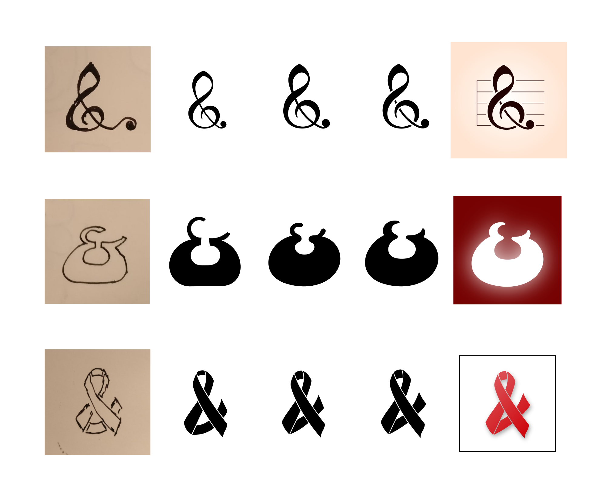
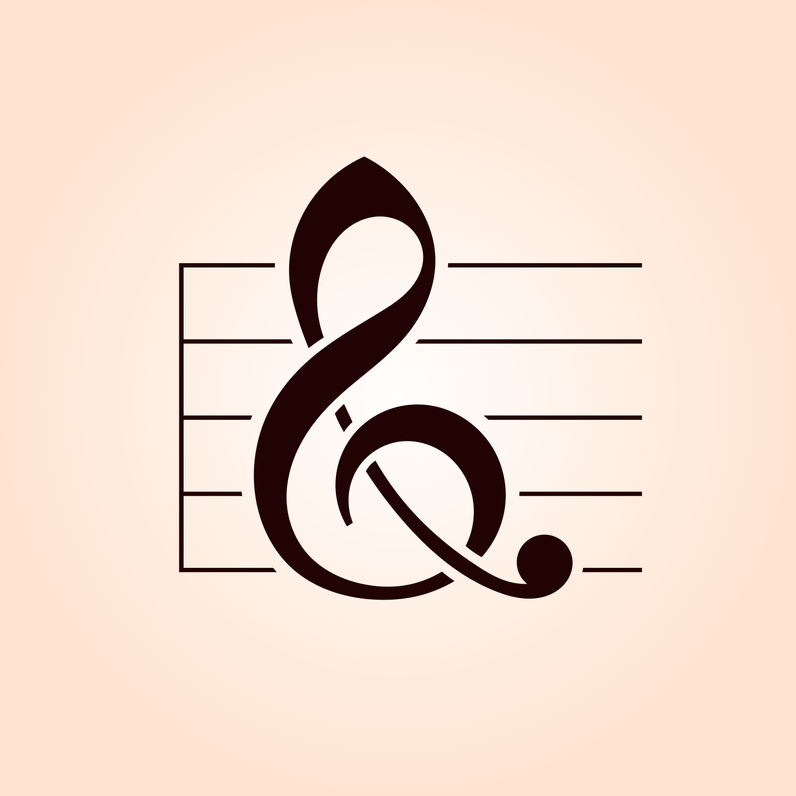
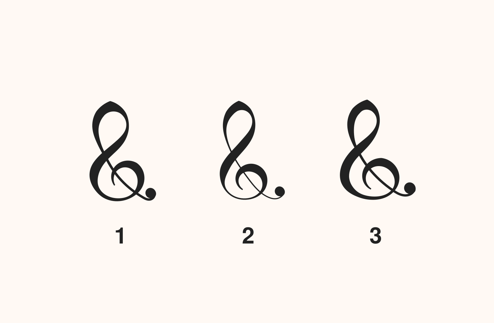
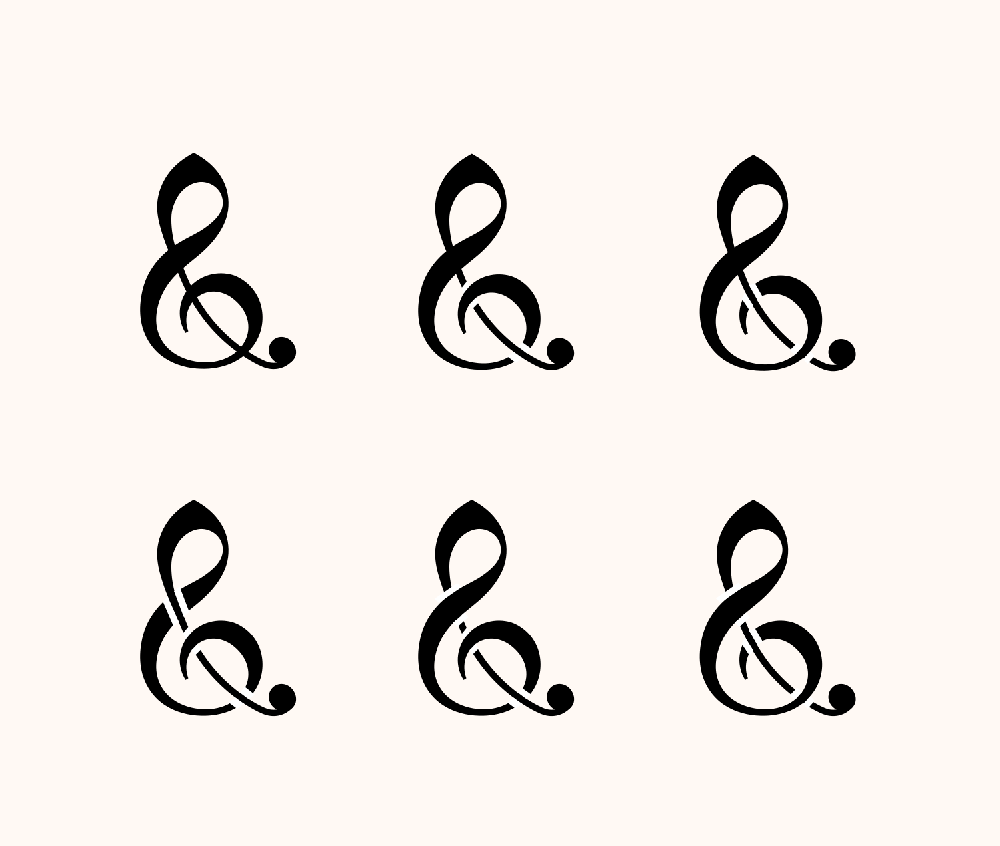
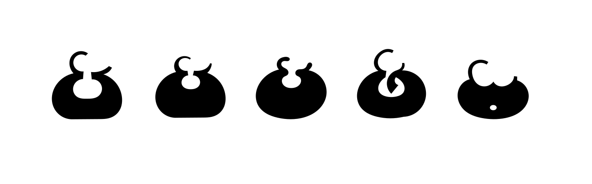
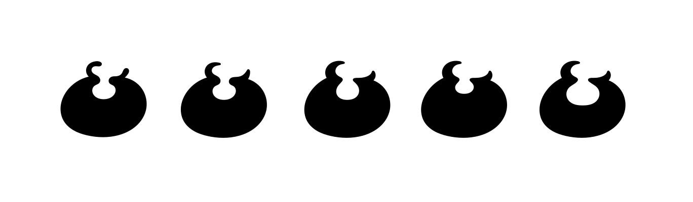
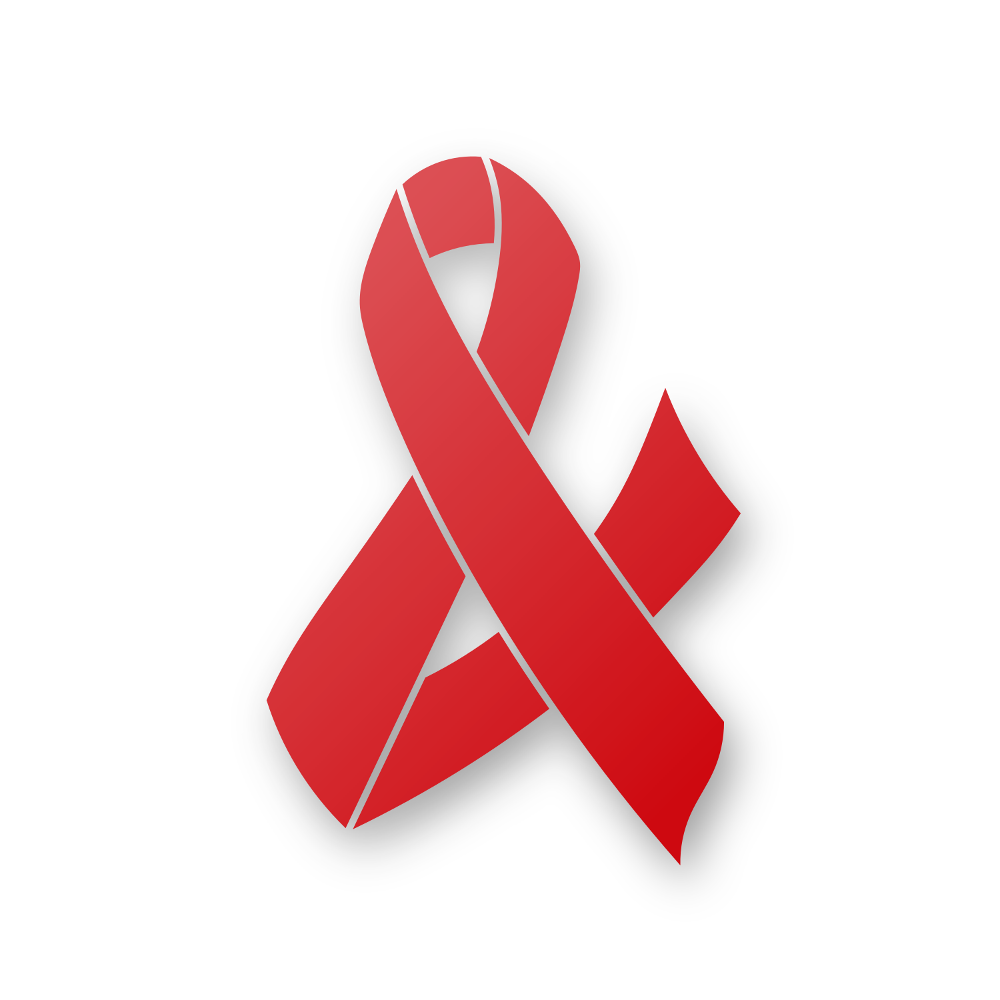

TQ **&** [Pecca](https://twitter.com/pecc0r) made me aware of the [Saint J&an](http://velvetyne.fr/saintjean/) event hosted by the open source foundry [Velvetyne](http://velvetyne.fr/). It was both a workshop held in Paris, as well as a location-independent design event, where participants could create **&** submit their "contemporary ampersand" designs.

You can click on the images below to download a clean SVG of each design.

## Clef

Inspired by the [treble clef](https://en.wikipedia.org/wiki/Clef) used in modern music notation. This one definitely took the longest **&** I found it rather hard to get all the curves right. A huge help was Inkscape's "pattern along path" effect, which allowed me to vary the thickness the stroke, while being able to modify its positioning at the same time. Oh, **&** [Spiro splines](http://levien.com/spiro/), of course. I couldn't have done any of this without Spiro splines.

## Buddha

The idea here was to create an extremely bottom-heavy shape. Already early on, I had to think of the [Body Positive Movement](https://en.wikipedia.org/wiki/Body_Positive_Movement) **&** some variations literally depicted a huge belly. The final design stayed rather abstract, but the name still transports the idea! :)

## Ribbon

Inspired by the [awareness ribbons](https://en.wikipedia.org/wiki/Red_ribbon). This was a fast one, because two thirds of the design were already given. Few design choices had to be made.

