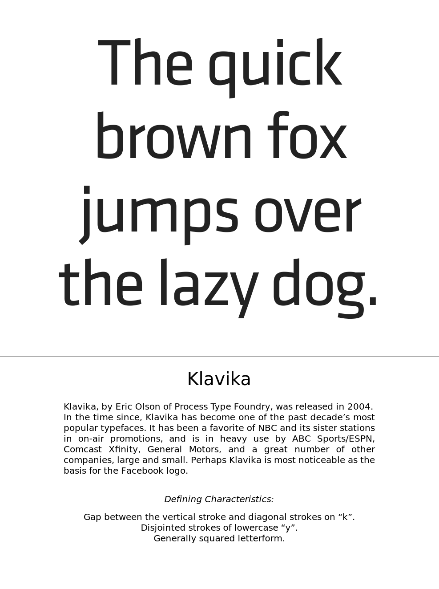

This is a set of flashcards for the popular open-source spaced repetition software [Anki](https://apps.ankiweb.net/), which will teach you to identify the most popular typefaces. It showcases **over 45 fonts**, each with a short *history* and a list of *defining characteristics*.

Here is an example card:

The basis for these flashcards is the now-defunct FontSpotting deck developed by Dustin de Souza and Jessica Witt. Their content is used with their kind permission.

## Installation

To get started, simply download the current release [from the AnkiWeb page](https://ankiweb.net/shared/info/1770056221). Then, in Anki, use `File -> Import` and select the .apkg file. This works in the desktop client as well as on smartphones.

## Contributing

This deck is maintained [on GitHub](https://github.com/blinry/anki-fonts), using the [CrowdAnki](https://github.com/Stvad/CrowdAnki) add-on. If you find a mistake, or have other ideas on how to improve the deck, please don't hesitate to [open a new issue](https://github.com/blinry/anki-fonts/issues)!
