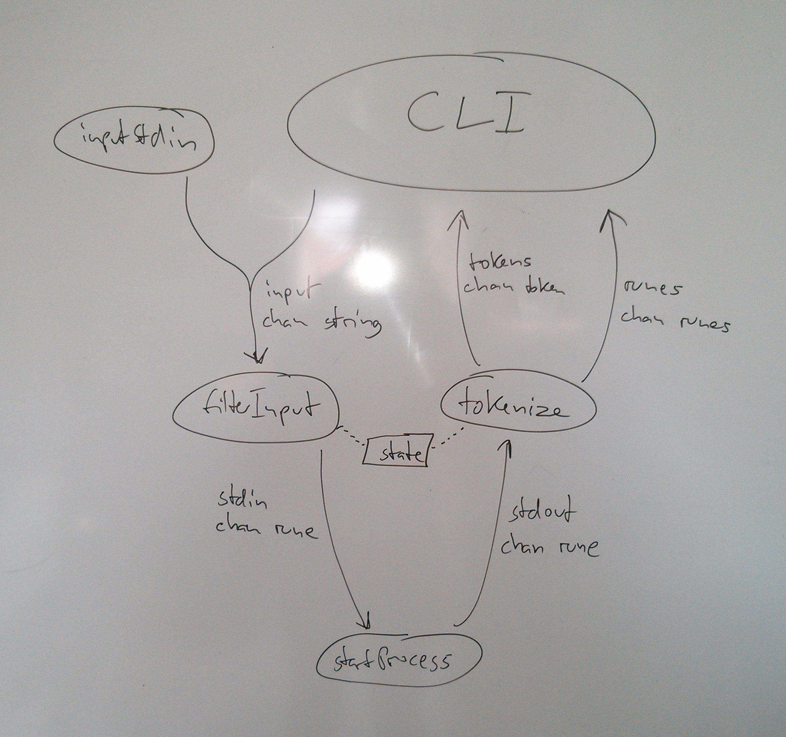
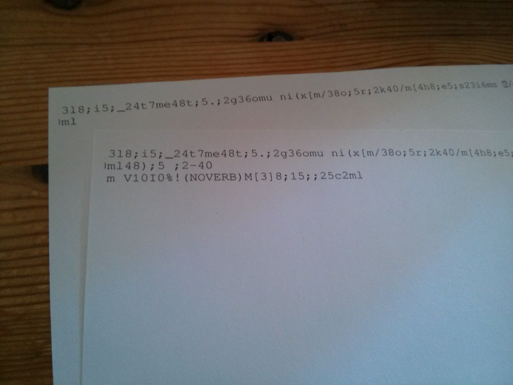

*Heute mit Kommandozeilen-Tokenizern, Test Driven Development und Bytes auf Papier.*

Ich habe mich während der letzen zwei Wochen weiter intensiv mit Strategien beschäftigt, bei normaler, möglichst unverfälschter Kommandozeileninteraktion die Bestandteile "Befehl" und "Ausgabe" herauszulesen und bin jetzt an einem Punkt angekommen, an dem das ganz ordentlich funktioniert.

Da diese Komponente die allerunterste, schmutzigste Schicht sein wird, war es mir wichtig, damit anzufangen, denn sie ist Voraussetzung für alles Folgende.

Ziel der Command-Line-Interface-Komponente ist Bereitstellung einer solchen Schnittstelle:

    // Start a new command line process and initialize it
    c := cli.Spawn("bash")

    // Repeat the following forever
    for {
        // Display the prompt and wait until the user enters a command
        cmd := c.ReadCommand()

        // Post-command, pre-execution logic

        // Wait for the command to terminate, return the output and
        // whether it was interactive
        output, wasInteractive := c.ReadOutput()

        if (! wasInteractive) {
            // Post-execution pre-output logic

            // If it wasn't, the user hasn't seen any output, print it
            fmt.Print(output)
        } else {
            // Otherwise, the output was already printed to the user
        }

        // Post-output logic
    }

## Interaktiver Modus

Bei der "Interaktivität" geht es um Programme, die im *Vordergrund* laufen, also auf Eingaben des Benutzers warten und darauf reagieren. Beispiele sind Texteditoren oder *Pager*, Programme, die einen langen Text anzeigen, in dem man dann hoch- und runterscrollen kann. Bei dieser Art von Programmen kann man nicht auf die Ausgabe warten, sondern muss sie dem Benutzer schon anzeigen bevor der nächste Prompt kommt.

Bisher löse ich das über Timer: Wenn ein Befehl länger als *x* Millisekunden läuft, schalte ich in den "interaktiven Modus", der die Ausgabe direkt ausgibt. Man verliert dadurch die Möglichkeit, zwischen Terminierung des Befehls und Ausgabe des Befehls etwas zu tun, beispielsweise Bedinungen zu überprüfen oder Text auszugeben.

## Aufbau des CLI-Moduls

Der Prototyp ist ja in Go geschrieben, was Nebenläufigkeit sehr einfach macht. In der folgenden Abbildung ist jedes Oval ein Thread (genauer: eine Go-Routine), die Kommunikation läuft über *Channels*, die man sich so ähnlich vorstellen kann wie UNIX-Pipes.

*startProcess* ganz unten kommuniziert mit dem Kommandozeilen-Prozess. Über zwei Channels gehen *Runen* (Unicode-Zeichen) rein und raus. Die Ausgabe wird von *tokenize* gelesen, wo sie in Tokens zerlegt wird (Zeichenketten mit Typ, die Token-Typen sind "command", "output" und "prompt"). Über den "runes"-Channel gehen die interaktiv geschriebenen Zeichen hoch. Die *CLI* macht damit dann High-Level-Kram. *inputStdin* pumpt vom Benutzer geschriebene Zeichen nach *filterInput*, auch von der CLI kommen Strings (z.B. Befehle, die Bedingungen überprüfen). *filterInput* macht schließlich die beschriebene Enter-Ersetzung und gibt das Resultat an den Prozess weiter. Es gibt eine zentrale "state"-Ressource (States sind "cmdinput", "cmdecho", "output" und "prompt").

## Erkennen des eingegebenen Befehls

Dazu habe ich [letztes Mal](/bachelorarbeit-woche-0/) schon etwas geschrieben: Ich fange ab, wenn der Benutzer *Return* drückt, und sende stattdessen *"Ctrl-E Space Ctrl-U ☃ Backspace Ctrl-Y ☃ Backspace Backspace Return"*. Das setzt den Cursor ans Ende der Zeile, fügt ein Leerzeichen ein (damit es, falls die Zeile vorher leer war, etwas zu löschen gibt), löscht die Zeile und kopiert sie in die Zwischenablage, schreibt ein spezielles Unicode-Zeichen als Marker, löscht den Marker wieder, fügt die Zwischenablage ein, sendet den zweiten Marker, und löscht diesen Marker und das Leerzeichen und sendet den Befehl. Auf diese Weise steht das eingegebene Kommando sauber zwischen den beiden Markern.

Das mit den Schneemännern ist natürlich nur eine vorläufige Lösung.

## Erkennen des Prompts

Auch um den Prompt zu erkennen, benutze ich momentan Unicode-Marker am Beginn und am Ende des Prompts. Das führt zu Problemen, wenn der Benutzer den Prompt ändert oder ihn ausgeben will, ich weiß noch nicht, wie ich das lösen könnte. Aber diesen Ansatz behalte ich halt erst mal bei, bis mir etwas besseres einfällt.

## Umgang mit mehrzeiligen Eingaben

Es gibt einige CLIs, die erkennen, dass ein Befehl beim Drücken von Enter "unvollständig" ist, und diesen dann noch nicht senden, sondern dem Benutzer die Möglichkeit geben, ihn fertig zu schreiben. Dabei wird ihm üblicherweise ein zweiter Prompt angezeigt, der sich vom normalen unterscheidet. Momentan schreibe ich andere Marker in diesen zweiten Prompt, machte nach dem oben beschriebenen Enter-Verfahren einen Lookahead, gucke mir also das nächste Ausgegebene Zeichen an. Ist es ein zweit-Prompt-Marker, wiederhole ich den Eingabeprozess und hänge am Schluss sämtliche so eingegebenen Zeilen zusammen.

Das funktioniert soweit gut, setzt aber natürlich Konfigurierbareit der Prompts voraus.

## Versteckte Befehle

In den Tutorials werde ich später ausführlich Gebrauch von Befehlen "im Hintergrund" machen, die Bedinungen überprüfen, oder Trainingumgebungen einrichten. Dabei ergibt sich das Problem, dass diese in der Befehlsgeschichte auftauchen, wenn man sie an den Prozess sendet, mit dem der Benutzer auch arbeitet. Hier weiß ich noch nicht, wie ich die wieder daraus entferne/verberge. Befehle, die nicht auf den internen Zustand des CLI zugreifen, könnte man vielleicht in einer zweiten Instanz ausführen?

## Test Driven Development

Ich mache stets gute Erfahrungen mit "Testgetriebener Entwicklung". Dabei geht es darum, automatisierte Tests zu erstellen, die eine korrekte Funktionsweise des eigenen Codes sicherstellen. Der eigentliche Trick dabei ist, diese Tests *vor dem Code* zu schreiben, dadurch macht man sich selbst sehr gut klar, welche Anforderungen es gibt.

1. Test schreiben. Der Test will Code benutzen, den es noch nicht gibt, er lässt sich deshalb nicht in ein Programm übersetzen.
2. Gerade so viel Code schreiben, dass sich der Test übersetzen lässt. Der Test sollte nun fehlschlagen (dieser Schritt ist wichtig, um zu überprüfen, ob der Test korrekt geschrieben ist und tatsächlich fehlschlagen *kann*).
3. Den einfachsten Code schreiben, der den Test erfolgreich sein lässt.
4. GOTO 1.

Mich hat damals dieser Text zu TDD stark beeindruckt: [An Extreme Programming Episode](http://www.objectmentor.com/resources/articles/xpepisode.htm).

## Planung

Diese Woche möchte ich hautpsächlich zwei Dinge tun: Zum einen Literaturrecherche nach Themen rund um Kommandozeilen, Sprachentwurf und Compilerbau, Didaktik. Zum anderen Schreiben einiger Beispiel-Tutorial, um genauere Anforderungsanalyse für die *nutsh*-Sprache machen zu können.

Und zum Schluss noch: Das passiert, wenn man zu sehr auf seinen Bytes herumkloppt und irgendwie einen "Drucken"-Befehl dabei erzeugt, der versucht, die Steuerzeichen einer Vim-Sitzung auszudrucken:

