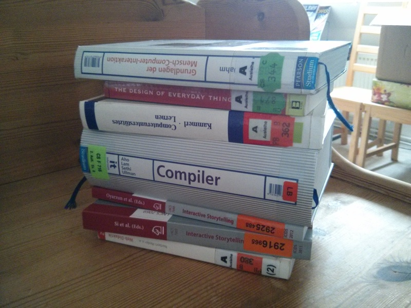

## Literatur

Ich war letzte Woche in der Unibibliothek. Wissen ist Macht!

Coole Entdeckung waren insbesondere die Tagungsbände der *International Conference on Interactive Digital Storytelling*, von der ich noch nie etwas gehört hatte. Außerdem das klassische "Drachenbuch" über Compilerbau sowie Grundlagen über Mensch-Computer-Interaktion und Computer-Didaktik. Wird mich bestimmt alles auf die ein oder andere gute Idee bringen.

## Erste Skripting-Versuche

Ich habe um die `cli`-API von [letzter Woche](/bachelorarbeit-woche-2/) eine dünne Schicht von Methoden gelegt, die es mir ermöglichen, einfache Tutorials zu verfassen. Dabei entstand eine primitive *interne* domänen-spezifische Sprache, das heißt, sie ist Untermenge einer "normalen" Mehrzwecksprache. In meinem Fall heißt das, ich kann ein Programm in der Programmiersprache Go schreiben, wobei ich nur ganz bestimmte Methoden und bestimmte Sprachelemente benutze, und mich dabei meiner Vision der *nutsh*-Sprache, in der die Tutorials verfasst werden sollen, langsam annähere.

Hier ist ein Beispiel:

    func main() {
        Spawn("bash")

        gotoJail()

        bash.Execute("mkdir schuhkarton")
        bash.Execute("mkdir schrank")
        bash.Execute("touch schrank/jacke")
        bash.Execute("touch schrank/hut")
        bash.Execute("touch linker_schuh")

        Say("Hallo! Willkommen in der Nut-Shell! Ich möchte dir zeigen,
        wie du mithilfe der Kommandozeile schnell und einfach mit
        Dateien und Verzeichnissen umgehen kannst.")

        Say("Legen wir gleich los: Tipp mal `ls` ein und drück Enter.")
        for Prompt() {
            Output()
            if Command("^1s\n$") {
                Say("Das ist ein kleines L, keine Eins! Probier's
                nochmal!")
            }
            if Command("^ls\n$") {
                Say("Genau. `ls` steht kurz für \"list\" und zeigt dir
                die Dateien und Verzeichnisse an, die sich in deinem
                \"aktuellen\" Verzeichnis befinden. Die Verzeichnisse
                werden dabei blau dargestellt.")

                Say("Du bist gerade in einem Verzeichnis namens
                `/tmp/nutsh` - das steht auch in dem blauen Text, den
                wir \"Prompt\" nennen.  Der Prompt endet mit einem
                Dollarzeichen, das heißt soviel wie: \"Du kannst jetzt
                ein Kommando eingeben!\"")

                break
            }
        }

        Say("Du hast vielleicht gesehen, dass sich hier ein Verzeichnis
        namens `schrank` befindet. Um dieses zu deinem aktuellen
        Verzeichnis zu machen, tippst du `cd`, dann ein Leerzeichen und
        dann den Namen des Verzeichnisses, in das du möchtest. Begib
        dich doch mal \"in den Schrank\" und sieh dich darin um!")

        for Prompt() {
            Output()
            if bash.Test("$(pwd) = \"$ROOT/schrank\"") {
                if Command("^ls\n$") {
                    Say("Genau. Hast du bemerkt, wie sich der Prompt
                    geändert hat?")

                    break
                }
            }
        }

        Say("Und wenn du wieder aus dem Schrank herausmöchtest? Die
        Abkürzung für das Verzeichnis oberhalb des aktuellen ist
        \"`..`\"!")

        for Prompt() {
            Output()
            if Command("^\\.\\.\n$") {
                Say("`..` ist der Name des Verzeichnisses, du musst noch
                dazusagen, was du damit machen möchtest. Um
                \"hinzugehen\", schreib `cd` davor.")
            }
            if Command("^cd\\.\\.\n$") {
                Say("Da fehlt noch ein Leerzeichen zwischen `cd` und
                `..`!")
            }
            if bash.Test("$(pwd) = \"$ROOT\"") {
                break
            }
        }

        Say("Gut. So, nun brauchen wir ein wenig Magie... *pling*")
        Say("[Der Schrank rumpelt und ächzt]")
        bash.Execute("mkdir -p $ROOT/schrank/magische_tür/tür{1..3}")
        bash.Execute("touch $ROOT/schrank/magische_tür/tür2/rechter_schuh")

        Say("Im Schrank hat sich nun etwas verändert. Geh hinein und
        such den rechten Schuh.")

        for Prompt() {
            Output()
            if bash.Test("$(pwd) = \"$ROOT/schrank/magische_tür/tür2\"") {
                if Command("^ls\n$") {
                    Say("Du hast ihn gefunden! Nun komm wieder zurück!")
                    break
                }
            }
        }

        for Prompt() {
            Output()
            if bash.Test("$(pwd) = \"$ROOT\"") {
                break
            }
        }

        Say("Gut! So, das war eine Einführung in `ls` und `cd`. Hier ist
        das Tutorial erstmal zu Ende! Danke!")
    }

    func gotoJail() {
        bash.Execute("ROOT=/tmp/nutsh")
        bash.Execute("rm -rf $ROOT")
        bash.Execute("mkdir $ROOT")
        bash.Execute("cd $ROOT")
    }

`Prompt()` zeigt den Prompt an und liest Kommando und Ausgabe in spezielle globale Variablen. `Output()` gibt die Ausgabe aus, falls noch nicht geschehen. `Say()` gibt Text aus, `Command()` prüft, ob ein bestimmter String im letzten Befehl enthalten ist.

Es gibt noch zwei Bash-spezifische Funktionen: `bash.Execute()` führt eine Zeile Code aus und stellt sicher, dass er erfolgreich ausgeführt wird (der Rückgabewert ist dann Null). `bash.Test()` überprüft eine Bedingung mithilfe des `test`-Befehls.

Ähnliche Experimente habe ich mit Ruby als unterliegende Sprache gemacht und werde damit auch noch ein wenig weiter herumspielen, um herauszufinden, wie man das dahinterliegende semantische Modell später am besten organisiert. Was zum Beispiel noch gar nicht geht, sind "globale" Trigger, die sich über mehrere Zustände erstrecken (und hier zum Beispiel verhindern könnten, dass der Benutzer die Lektion über den `nutsh`-Ordner verlässt.

Zur Illustration folgt jetzt noch eine Nutsh-Sitzung, die aus oben stehendem Code resultiert. Die Farben gingen hierbei leider verloren, und mir fällt keine einfache Möglichkeit ein, sie hier in den Blog zu übertragen...

        Hallo! Willkommen in der Nut-Shell! Ich möchte dir zeigen, wie
        du mithilfe der Kommandozeile schnell und einfach mit Dateien
        und Verzeichnissen umgehen kannst.

        Legen wir gleich los: Tipp mal ls ein und drück Enter.

    /tmp/nutsh $ ls
    linker_schuh  schrank  schuhkarton

        Genau. ls steht kurz für "list" und zeigt dir die Dateien und
        Verzeichnisse an, die sich in deinem "aktuellen" Verzeichnis
        befinden. Die Verzeichnisse werden dabei blau dargestellt.

        Du bist gerade in einem Ordner namens /tmp/nutsh - das steht
        auch in dem blauen Text, den wir "Prompt" nennen. Der Prompt
        endet mit einem Dollarzeichen, das heißt soviel wie: "Du kannst
        jetzt ein Kommando eingeben!"

        Du hast vielleicht gesehen, dass sich hier ein Verzeichnis
        namens schrank befindet. Um dieses zu deinem aktuellen
        Verzeichnis zu machen, tippst du cd, dann ein Leerzeichen und
        dann den Namen des Verzeichnisses, in das du möchtest. Begib
        dich doch mal "in den Schrank" und sieh dich darin um!

    /tmp/nutsh $ cd schrank
    /tmp/nutsh/schrank $ ls
    hut  jacke

        Genau. Hast du bemerkt, wie sich der Prompt geändert hat?

        Und wenn du wieder aus dem Schrank herausmöchtest? Die Abkürzung
        für das Verzeichnis oberhalb des aktuellen ist ".."!

    /tmp/nutsh/schrank $ ..
    bash: ..: command not found

        .. ist der Name des Verzeichnisses, du musst noch dazusagen, was
        du damit machen möchtest. Um "hinzugehen", schreib cd davor.

    /tmp/nutsh/schrank $ cd ..

        Gut. So, nun brauchen wir ein wenig Magie... *pling*

        [Der Schrank rumpelt und ächzt]

        Im Schrank hat sich nun etwas verändert. Geh hinein und such den
        rechten Schuh.

    /tmp/nutsh $ cd schrank
    /tmp/nutsh/schrank $ ls
    hut  jacke  magische_tür
    /tmp/nutsh/schrank $ cd magische_tür
    /tmp/nutsh/schrank/magische_tür $ ls
    tür1  tür2  tür3
    /tmp/nutsh/schrank/magische_tür $ cd tür1
    /tmp/nutsh/schrank/magische_tür/tür1 $ ls
    /tmp/nutsh/schrank/magische_tür/tür1 $ cd ..
    /tmp/nutsh/schrank/magische_tür $ cd tür2
    /tmp/nutsh/schrank/magische_tür/tür2 $ ls
    rechter_schuh

        Du hast ihn gefunden! Nun komm wieder zurück!

    /tmp/nutsh/schrank/magische_tür/tür2 $ cd ..
    /tmp/nutsh/schrank/magische_tür $ cd ..
    /tmp/nutsh/schrank $ cd ..

        Gut! So, das war eine Einführung in ls und cd. Hier ist das
        Tutorial erstmal zu Ende! Danke!

Bis nächste Woche! ;-)
