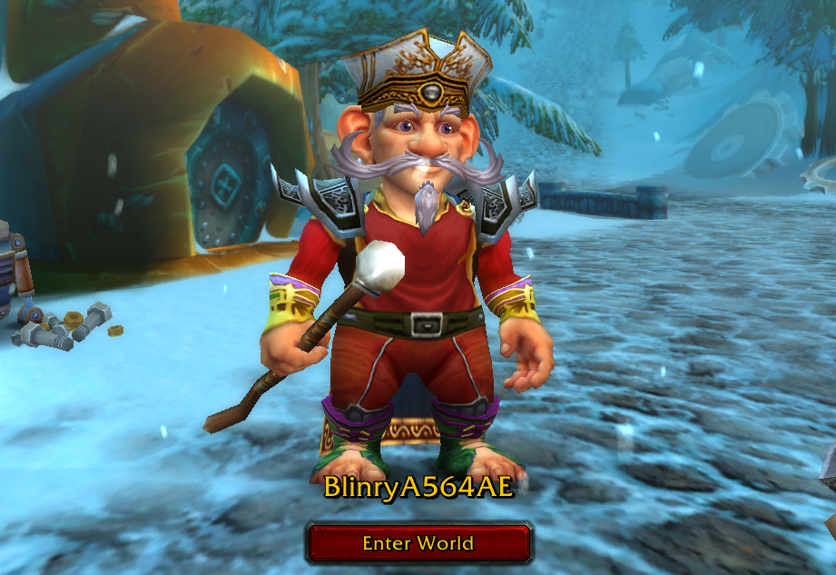

## The origin of the name "blinry"

Around 2005, I started playing the online fantasy role-playing game *World of Warcraft*. When you first launch the game, it guides you through a character creation process – I picked a gnome, because they seemed cute, and chose to be a mage. I gave the character two bushes of gray hair, sticking up from the sides of the head, and a wrinkly face. The last thing I needed was a name for the character.

Naming things is hard, so I turned to a website that generated random fantasy names. You could even specify that you wanted a name that sounded Gnomish! I don't remember which site I used, but it was similar to [this one](https://www.fantasynamegenerators.com/dnd-gnome-names.php), spitting out names like Tonan, Farrick, or Raswin. I think it generated a name starting with "Blin", and I modified the second syllable a bit to get "Blinry"!

I just checked: the character is still there! Even though it's now called, uh, "BlinryA564AE". Guess that's what happens when you don't log in for 15 years.

When I stopped playing about one year later, I kept using the name whenever sites asked me for a nickname! I think my [Wikipedia account](https://de.wikipedia.org/wiki/Benutzer:Blinry) was probably the first site where I used it. And so many sites after that, like [Twitter](https://twitter.com/blinry)! When I started meeting people in German hackerspaces who I had met online for the first time, they just kept using "blinry". It didn't take long before I started introducing myself that way.

I spell "blinry" in lowercase, because it's an identifier, like a variable or a hostname.

At this point, consider any other names deprecated. I have no strong feelings against any old names, and some old friends still use them, but I'd invite everyone to call me blinry. :)
