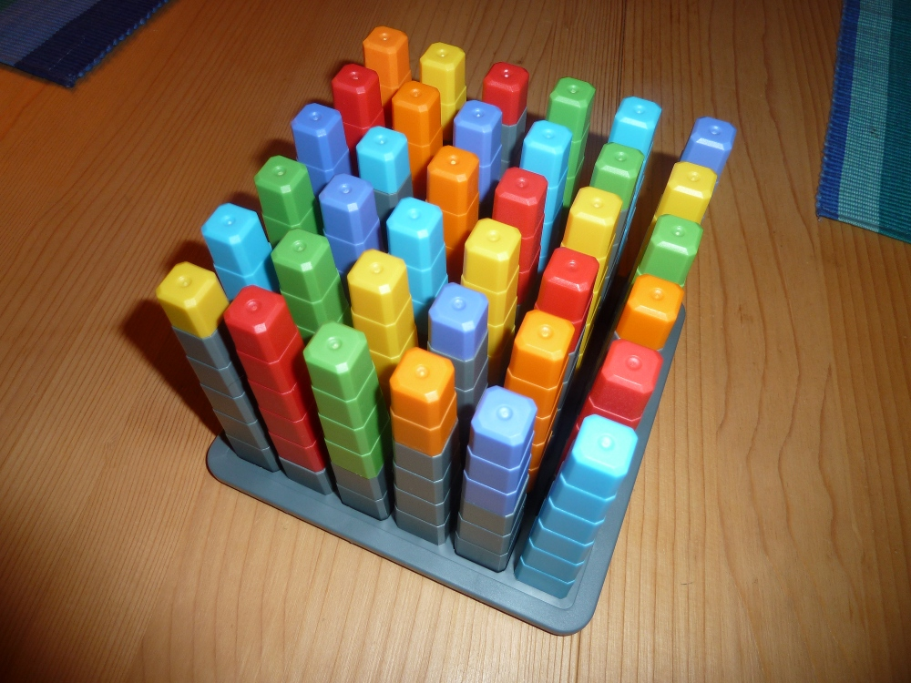

Gestern Abend habe ich mit Jan den *36 Cube* gelöst. Es geht darum, 36 Plastik-Türmchen in verschiedenen Farben und Größen so auf einem Brett anzuordnen, dass in jeder Reihe und Spalte jede Farbe genau einmal vorkommt - und die Türmchen auf der gleichen Höhe abschließen (es gibt eine [Online-Version](http://www.thinkfun.com/flash/36Cube/) davon).

Wir begannen etwas planlos, merkten schnell, dass uns das nicht zum Ziel führen würde, und entwickelten ein stupides, mechanisches System, dass uns sicher zur richtigen Lösung führen müsste. Eine halbe Stunde später saßen wir vor dem Plastikdämon und weinten. Wir hatten keine Lösung gefunden, im Gegenteil, wir hatten (scheinbar) alle möglichen Lösungen ausgeschlossen - oder irgendwo einen Fehler gemacht.

Wir sahen uns an. "Let's try *math*!" Naja, ich schrieb dann ein Programm, dass im Grunde genau das machte, wie wir vorher: "Darf dieser Turm in die erste Zeile? Nein. Darf dieser Turm in die zweite Zeile? Ja. Kann der nächste Turm noch irgendwo hin? Nein. Nimm den letzten Zug zurück. Darf der Turm in die dritte Zeile?" Es stellte sich heraus, dass es Lösungen gab, in denen alle Türme richtig saßen - bis auf zwei. Eine komplette Lösung fand auch das Programm nicht. Ich wurde misstrauisch.

Google. *"has 36 cube a solution?"* ... Ja, der Cube könne gelöst werden, aber "Your assumptions are probably wrong". Mehr möchte ich an dieser Stelle auch nicht verraten. Es gibt da... einen Trick.

Wenig später (ich untertreibe, wir waren beide schon ziemlich müde) stand er vor uns. So sieht Stolz in seiner reinsten Form aus:

Hab gerade mein Programm nochmal angepasst und durchlaufen lassen, es gibt sogar 96 verschiedene Lösungen!
