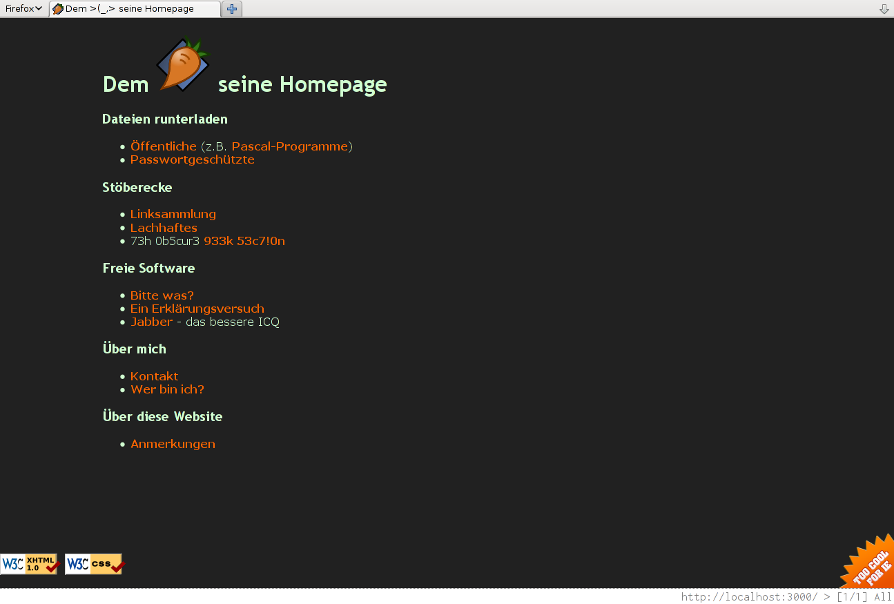
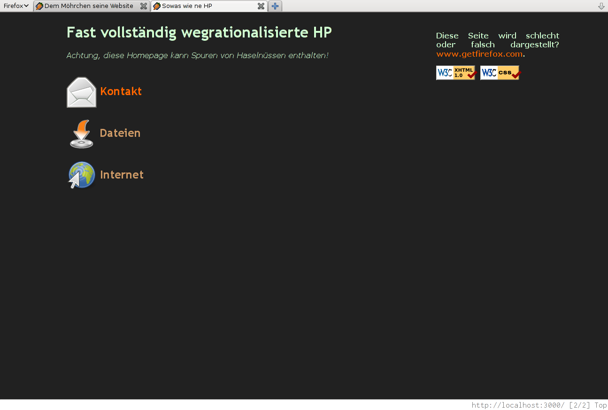
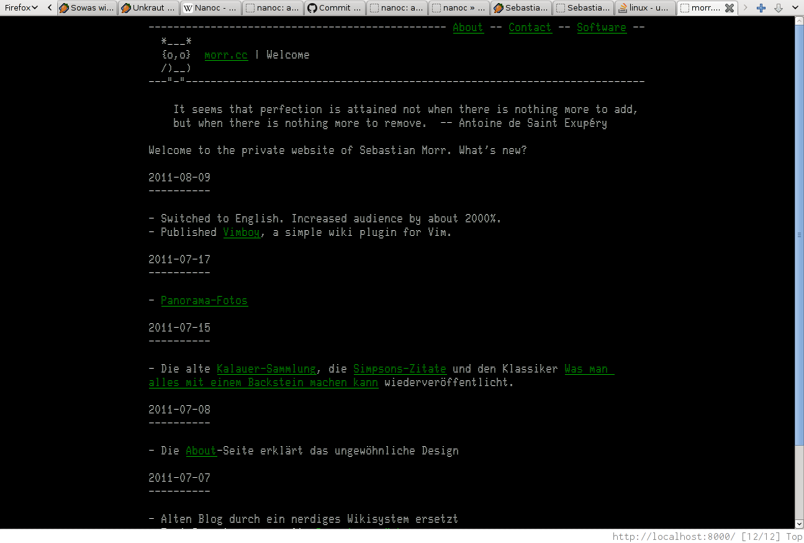
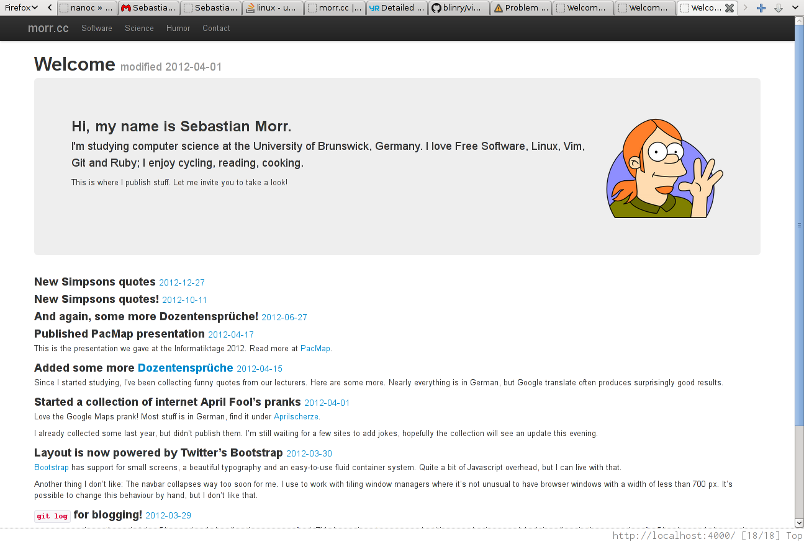

## 2005: Plain HTML

Sometime about 2005, I tought myself HTML (with the formerly great site [SELFHTML](http://wiki.selfhtml.org/wiki/Startseite)) and created my first home page, with lots of `` tags and primary colors... It had very premature content and I remember it displaying a "construction site" GIF the whole time it was online. I used the webspace we were given at my school.

## 2006-2007: CSS, XHTML and m4

From the second iteration onwards, I have backups. In 2006, I learned CSS and XHTML and created this site that borrowed heavily from the [W3C's "Chocolate" Core Style](http://www.w3.org/StyleSheets/Core/stylebot.html?family=6&doc=XML). The "0b5cur3 933k 53c7!0n" contained things like forkbombs, a Geek Code and UNIX russian roulette. It was created by hand.

I got annoyed copying stuff around, and started using Makefiles and m4 macros for including the header and footer automatically. The content mainly remained the same, the main page displayed a *cool* CSS unfolding effect when you hovered over the categories.

The end of 2007 saw a redesign:

## 2008-2010: Iwahn

In 2008, I wrote a Ruby script called *Iwahn* ("I want a homepage NOW!") that compiled Markdown files to XHTML. It understood nested folder structures and created appropriate navigation menus.

Up to this point I didn't care much about stable URLs as I disallowed any bots on my site.

## 2010-2011: Ruby blog

In 2010 came two big changes: I migrated to a new domain, *morr.cc*, and to a new structure, a blog! It was powered by a heavily [nanoc](http://nanoc.ws)-inspired Ruby script and featured a lot of new content! It had an RSS feed and did quite a lot of SEO.

## 2011-2012: attoc

I was quite happy with this setup, and I'm not sure why I moved away from it. But in 2011, I switched to a "nerdy wiki", powered by [Vimboy](https://github.com/blinry/vimboy) and the simplest compiler I could think of: A 40-line shell script called *attoc* (get it? It's smaller than nanoc ;-)

This system saw a redesign to avoid ASCII art in Google snippets (which could have been done with CSS3, too, but meh), using Twitter's Bootstrap and using `git log` as a blog on the frontpage, an idea I still like very much.

But in the end, it was too unflexible, so I build something different again.

## 2012-2013: Almightree

I wrote a piece of JavaScript that transformed a nested tree of `<ul>`s to a foldable, searchable and zoomable website, and called it *Almightree*. Neat thing about this was that the URL equaled the search term, and the page refolded itself to display the search results as good as possible.

Downside included slow loading on old mobile devices and the *inability to be crawled by robots*, as they don't interpret JavaScript. Maybe could have been solved with caching.

## 2013: Nanoc

And finally, this is my second attempt to do proper, neat blogging. I decided to push it down into the `blog` subdomain, to hopefully keep it alive there when I'll want a different kind of site in the future...
