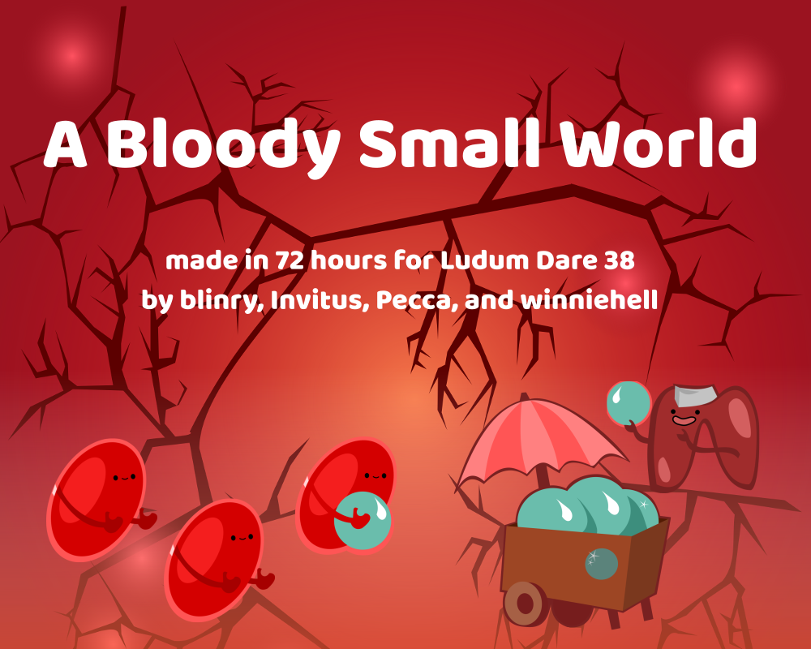
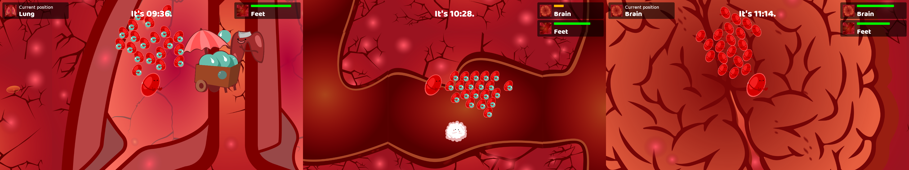
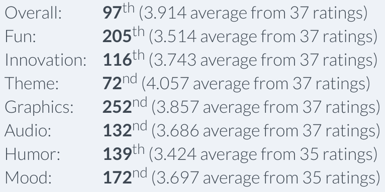

This is our contribution Ludum Dare 38. This time, I was part of a four-person team together with [Pecca](https://twitter.com/pecc0r), Winnie, and Moritz. We built a little, hectic racing game!

Only an event like Ludum Dare gets me into a flow-like state which allows me to work on something without interruptions for 16 hours straight...

You can download the game [from the Ludum Dare website](https://ldjam.com/events/ludum-dare/38/a-bloody-small-world)!

## Recordings

The Button Masher Bros did a hillarious playthrough, you should definitely watch it:

<%= youtube("lyjpYj0-yLU") %>

Also, Jupi covered it in her ongoing mission to play ALL THE indie games:

<%= youtube("6dPr-ubTa3k") %>

## Comments

*Such a great game! The design is very well done, from the blood flow encouraging you in the right direction to the visuals, everything is well thought out. The music was nice and fitted well with the rest of the game. The intestines were quite livery, but I’m guessing it’s the LD time constraints showing there :P* --bobsleigh

*Hot damn, that’s very cool! The sounds is cute, the art is good, and the whole idea behind it makes for a great educational game.* --Ellian

*Wow this game is really great and i enjoyed it a lot! The game feels very polished with the cute art style, sound effects and music complimenting each other really nicely. The game mechanics are pretty fun, I enjoyed the ‘flow’ mechanic and thought it was an interesting game element that sometimes worked against you and other times worked with you. The humor and dialogue was well done and a nice touch. I also thought the challenge progression was well done, as you get used to the mechanics and the map it would up to challenge. Really great job!* --Colm Eccles

## Results

The ratings were generally rather good. But especially the "Fun" category could have been better... we learned our lesson.

