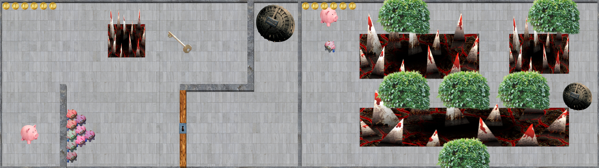

A game for Ludum Dare 44, made with [byshiny](https://twitter.com/byshinyy), [pleekman](http://pleek.net), [thechutrain](https://alanchu.tech), and [Tim](https://github.com/tvieregge) at the [Recurse Center](https://www.recurse.com/).

It's a game about fast reactions, planning, and cute piggies! You play as a piggy bank that wants to escape a real bank, guarded by cute, but rather dangerous banker piggies.

You can download the game from [the Ludum Dare website](https://ldjam.com/events/ludum-dare/44/capitalist-piggies).

## Development

The theme for this game jam was "your life is currency", and we quickly settled on the idea of linking the life of little piggy banks to their coins. Instead of a fast-paced action game where you can shoot enemies with your coins, we decided to go for a more puzzly game mechanic, where you need to lure your enemies into traps.

## Coverage

Joshua McLean did a quick (very distracted) playthrough:

<%= twitch("427560061", start: "00h35m54s") %>

For this game, we didn't take the time to rate other people's games, so we didn't get enough ratings ourselves to get a placement.
