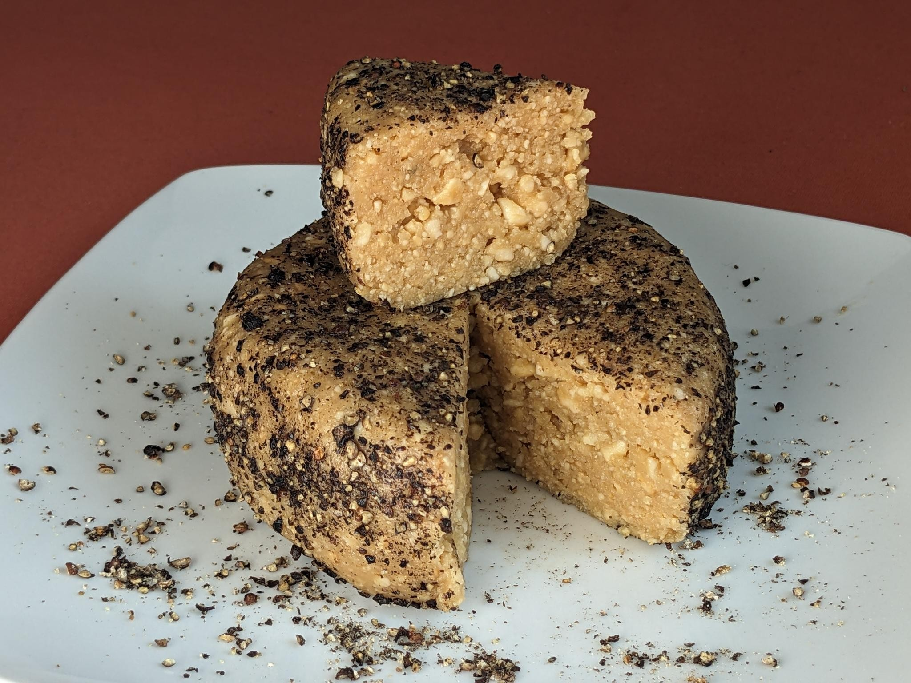
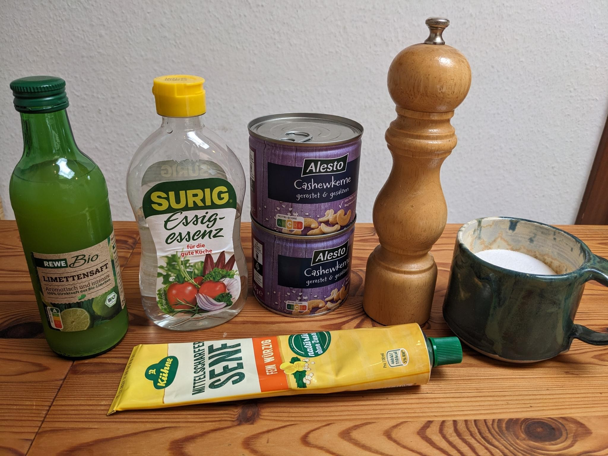
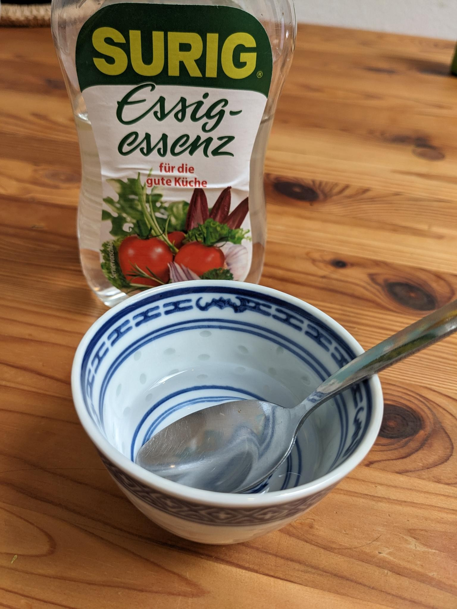
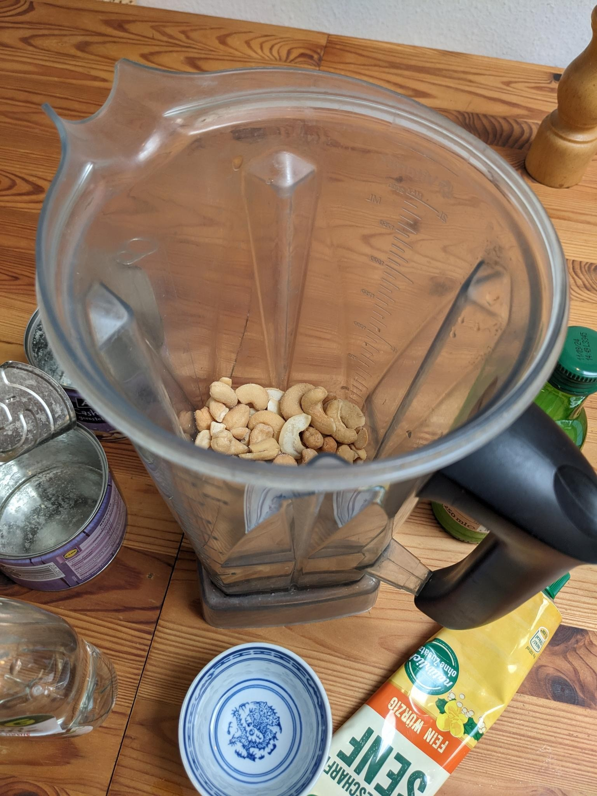
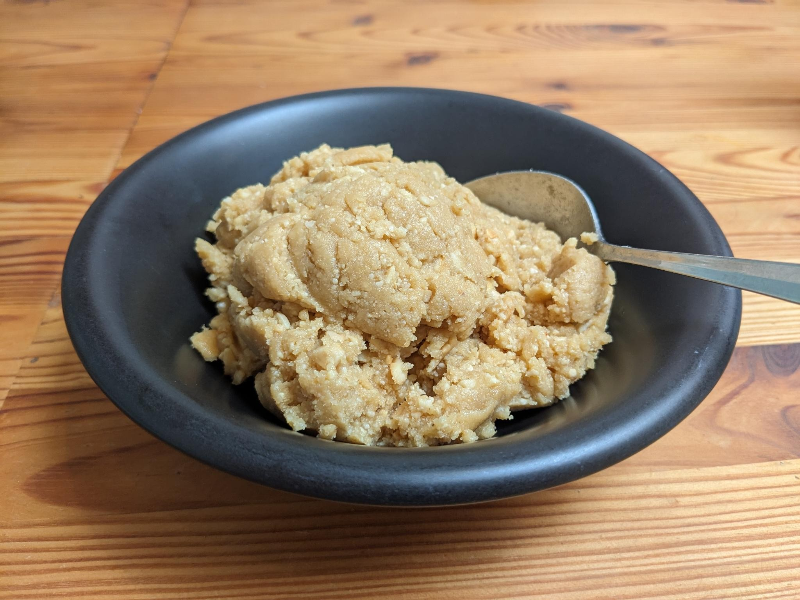
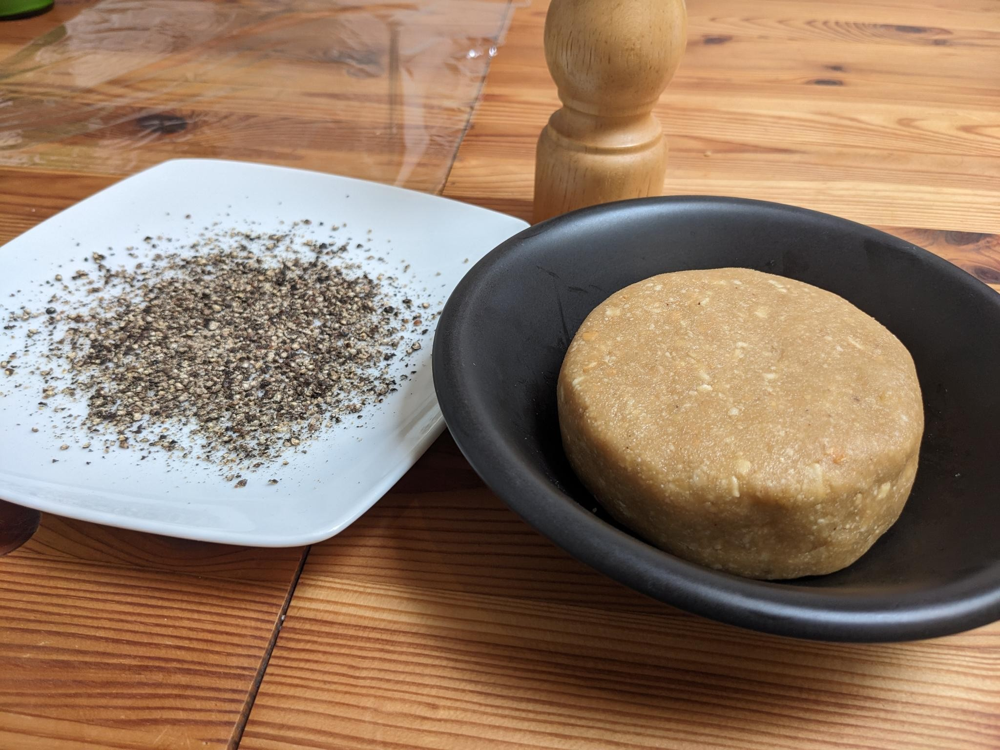
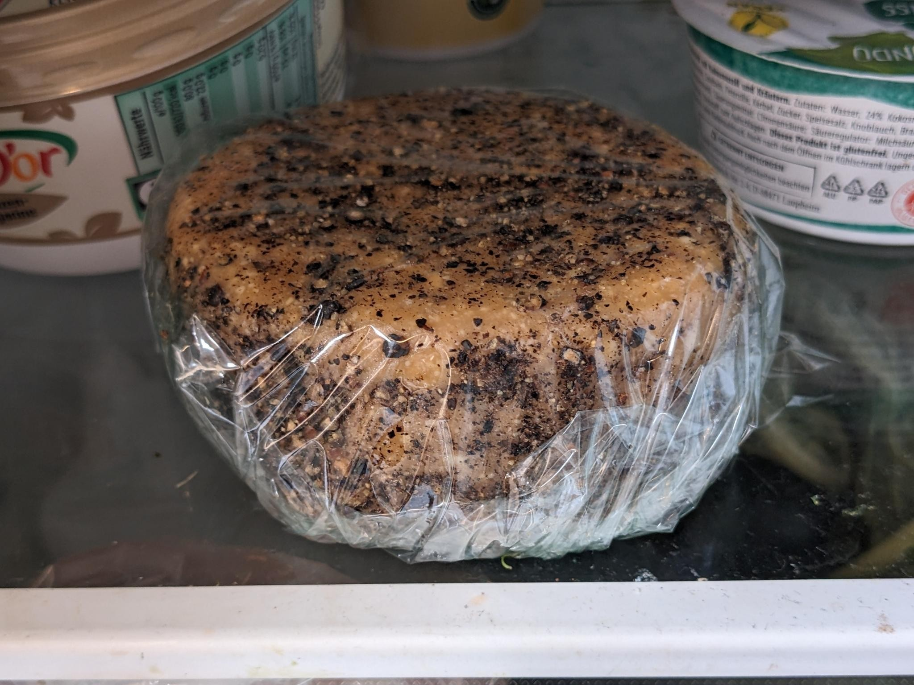

You might've heard this concern about veganism: "I couldn't live without cheese!" 🧀

And indeed, the vegan cheese that's available in supermarkets is often… not great so far.

So I wanted to show you how to make a simple, quick & cheap cheese from cashews! It's tangy, savory, and has lots of protein!

This is what we'll need:

- 300 g roasted, salted cashews    
- 1.5 tbsp lemon or lime juice    
- 1 tbsp vinegar    
- 1 tsp salt    
- 0.5 tsp mustard    
- black pepper

This time, I used distilled vinegar concentrate, with you need to dilute 1:4 with water to get to an acid content of 5%.

But I've also used rice vinegar in the past. Any other vinegar should work, as well.

Put all ingredients (except the pepper) in a blender.

You could also use an immersion blender, maybe you'd need to stir it up a couple of times with a spoon.

Blend until you get a consistency like crumbly ice cream with chunks! :D

The trick here is not to blend too much, or let it get too hot – otherwise, the result will be more like a cream cheese.

So put the blender on a rather slow speed, take breaks, or stir it in between.

Almost done! Shape it into a wheel, and try not to snack to much, because it's already so delicious at this stage!

Finally, I like to roll the cheese in roughly-ground black pepper, which adds an extra kick to it!

If you'd like a less intense version, you can use other herbs or spices – I've once used dill, and that was very tasty! Oregano could also be nice.

Put the cheese in plastic wrap, and chill it in the fridge for a few hours – it will firm up quite a bit.

Done! :) If you try it, let me know how you like it, and send pictures!

This is a style of cheese alternative that I first found in Spain. It doesn't try to imitate cheese made from animal milk, and instead does its own (delicious) thing.

