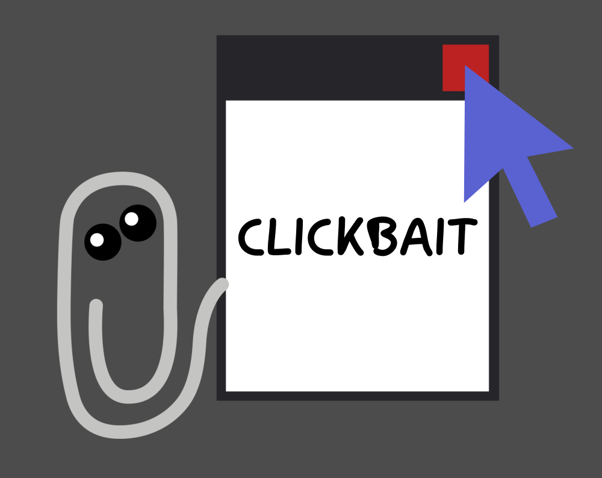

An action game where the goal is to **close all popups!** But your mouse cursor might have other plans...

Play it [in your browser](https://blinry.itch.io/clickbait)!

## Some early praise

*"god I hate this game so much <3 <3 <3"*

*"Loved and hated this!  Playing it on a laptop trackpad was an experience, would highly recommend."*

*"So good! This is a 10/10 for me!"*

## Story

The *GMTK Game Jam* is organized by a team around the British video game journalist Mark Brown, and has grown into one of the largest online game jams! It focuses on clever game design and mechanics, which I really like!

This year's theme was "Out of Control"! [Bleeptrack](https://bleeptrack.de) and I made an action game involving a lot of popups, a very disobedient mouse cursor, and a paperclip that's definitely not helping! :P [Winnie](https://winniehell.de) composed an original score for us, which is released under CC BY-SA: [Windows 9001](https://7.5bits.winniehell.de/windows-9001/). Thanks to Winston for playtesting!

This is also my first game that comes with a silly trailer:

<%= tweet("1282407324712394754") %>

We made the game using the open-source game engine *Godot*, which I've really grown fond of this year! You can find the source code [on GitHub](https://github.com/blinry/clickbait).

## Development

The GMTK Game Jam is 48-hour jam, and whew, after doing a lot of 72-hour jams, I really felt the difference! You need to start playtesting and polishing much earlier, at the beginning or in the middle of the second day.

We spent quite some time brainstorming. Some alternative ideas:

- A game where you play as a dog, who is out of control (or wants to get out of control?) while being on a leash, on walk through the park with its owner. You'd bark a lot, pee on everything, and if you poop somewhere, your owner would have to come pick it up, allowing you to control *them* a bit. :P I thought this might've been a fun toy, but we didn't find a good angle on what the actual goal of the game could be.
- A game with random time travel. You'd play Pacman or something, and at random points, the game would jump back into the past, or even ahead into the future. I'm really intrigued by the question how the future should look like if you haven't played until that point yet - would we simulate all characters? Overall, without other gameplay elements to balance this, it might become frustrating quickly.

But we also had several ideas involving an out-of-control mouse cursor. Initially, we thought you would need to lure the cursor somewhere by putting down little food pellets or something. But when we started collecting ideas on how the cursor might misbehave, we quickly realized a fun and chaotic action game where the control mode changes a lot might be fun!

Some main challenges when developing this game was to implement our own UI system for the windows, and making sure that you can only click on the topmost one, and balancing the modes, making them not too easy and not too hard.

Two tweet from during development:

<%= tweet("1282293130734313472") %>

<%= tweet("1282357773930561544") %>
