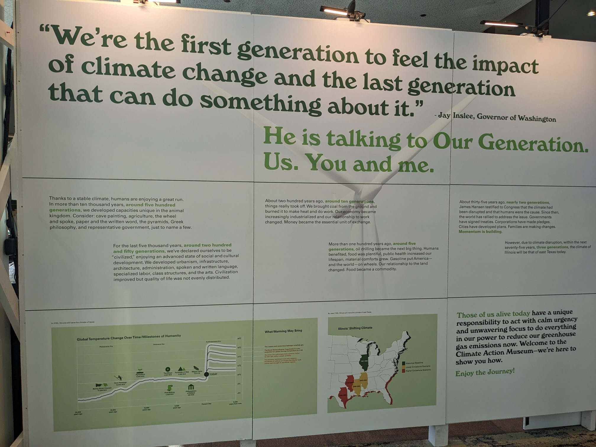
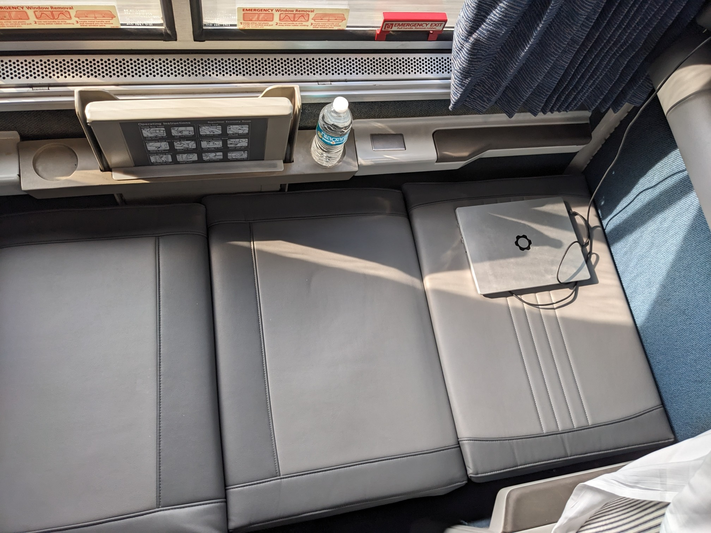
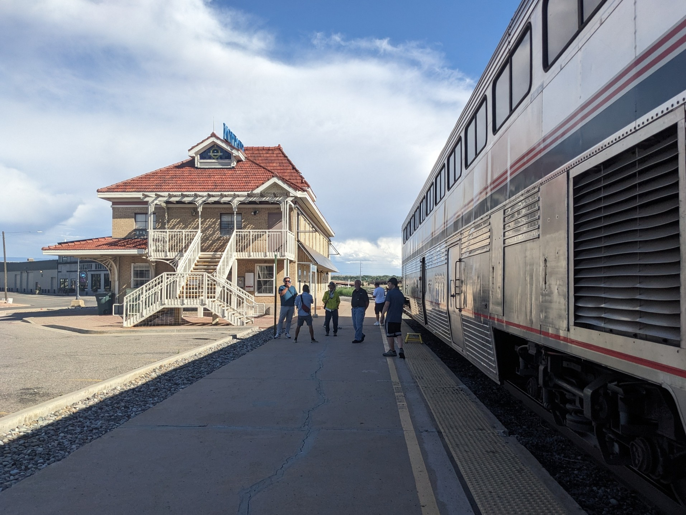
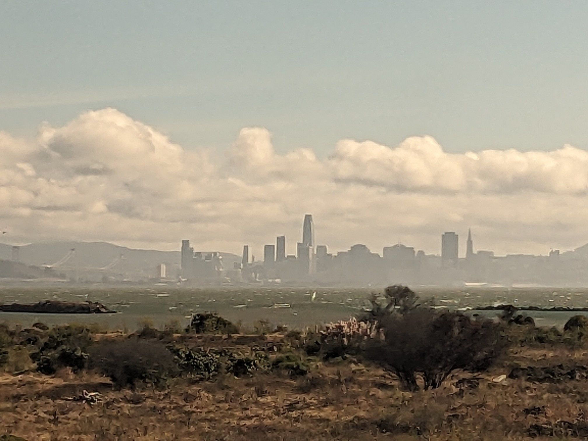

Today, I get to start a train trip I've always wanted to do: Going from New York to San Francisco!!

This map shows that first section of the trip. I'm taking the "Lake Shore Limited", an overnight train. Will arrive in Chicago in around 20 hours, and amazingly, that's the only time I'll have to change trains!

We're first going north, following the Hudson river.

The seats are big and comfy! But the train seems to be booked out.

A train attendant asked everyone where they'd get off, and put little notes over our seats – probably to wake up people who have to get off in thr middle of the night.

Another picture of the Hudson river! Pretty light!

Surprise: We're stopping in Albany for a full hour! Maybe to connect with a train from Boston?

So now I can show you my train from the outside:

The connecting train was delayed, so now we also are! 🙃

Making our way out of Albany, now heading westwards!

I just realized that the entire trip from coast to coast will be 5000 kilometers long.

That's a lot of kilometers.

You could also say: Five megameters!

(3150 miles, for you folks with non-SI units :P)

It'll take three nights overall. I'm sooo hyped! 😆

When I told [@piko](https://chaos.social/@piko) about this trip, they reminded me of the time I got that book about hypersonic trains from the library, a hypothetical train system designed for 7200 km/h:

 [https:// chaos.social/@blinry/111495370 153260987](https://chaos.social/@blinry/111495370153260987) 

Good morning!

Oof, didn't sleep much... the AC in the train is set ridiculously cold, the ride is very shaky, and there's nothing to lean your head against...

But we made it through a brief section of Pennsylvania and through Ohio, and are about to cross over to Indiana!

Hello Chicago! :)

Most important thing to do during the stopover: Get more vegetables for the second stretch of the train trip!

But not these. One is not a vegetable, and I'm not sure if I can prepare the other one?

Visited Chicago's Climate Action Museum, and one of its central messages is: "Stay home!"

As someone who loves to travel, who takes so much joy from immersing myself in places, cultures, landscapes I'm not used to, this leaves me confused and conflicted... :/

I've gone though a similar process when I started eating a vegan diet.

The last question it came down to was "Is my personal enjoyment of the taste of animal products more important than the suffering of those animals?" – and my personal answer was "no". Especially when it's as easy as it is these days to replace those products.

Maybe I could substitute travel experiences, as well? 🤔

Anyhow. Here's the route for the second part of my trip!

Seat61 calls the California Zephyr "one of the great train rides of the world".

It'll take 51 hours, over the course of two nights, and, eventually, bring me to [@bangbangcon](https://mastodon.social/@bangbangcon) !

Here we go!! Boarding!

I'm treating myself to a "roomette" with an actual fold-down bed on this train.

Here's my little home for the next 2.5 days!

Leaving Chicago! 👋

Here's a tour of all the features of my li'l roomette!

There's two seats like this, opposite of each other. Using the handlebar below it, you can recline the back a bit, like in an overnight bus.

A plastic table between the seats fold out. It seems to have an integrated chess board! :O

Control panels next to the head rests allow you to set the air temperature, and the volume of the announcements.

Sadly, the other "music channels" are silent. You can also set the ceiling lights to bright, dim, and off. Very handy.

I also have been granted the power to summon a train attendant!  Haven't used it yet.

Speaking of lights, there are at least 5, which can be controlled individually, for a very customizable lighting experience!

There's a trash can, a mirror, coat hangers, and tiny cute corners for tiny cute towels! 😆

I didn't notice this at first, but under the ceiling, there's a ready-made fold-down bed, with straps to make sure you don't fall out!

And the lower seats also can be collapsed flat, and there's an extra mattress to put on top; so this room can be used by two people!

~ End of the room tour ~

I feel a bit like in a space ship! The room is compact and functional, but I really like it.

What I don't have here is a toilet – there are shared toilets and showers in the hallway. I'll report! And I also have the rest of the train to explore!

We have just crossed the Mississippippi River, which marks the state border between Illinois and Iowa! The train went extra slow, not sure whether for safety reasons or for photo op reasons! :P

Slept really well! Woke up in Denver, Colorado, where we're making an hour-long refueling stop!

Took a shower in one of the little shower cabins!

And decided to go on a little walk. You can already see the Rocky Mountains from here!!

Let's hope that I don't miss my train! 😅

Headed into the mountains now!

Impressive to see how quickly the Great Plains gave way to this very different kind of landscape! :O

We've passed the Moffat Tunnel, and are now snaking our way alongside some very pretty creeks!

We made another li'l stop earlier, so I can show you my train from the outside! :)

And here's more of the interior! Coach section, panorama lounge, and diner!

The diner car is where passengers with sleeper tickets get three free meals per day! And they do have vegan options! \o/

It's interesting to meet different kinds of people on the train:

Yesterday, I had dinner with a polite nurse and her mum yesterday, and we were joined by a French guy, who kept drinking wine and talking about his many great trips and friends... :/ Not the kind of conversation I'm into...

For lunch today, I had better luck: I was seated with a retired genetic researcher, whom I inmediately liked! He has a refreshingly positive perspective on scientific progress.

The landscape has changed yet again, and is now much more cliff-y and sandy.

That's Mt. Garfield on the last picture!

We've stopped at Grand Junction, on the edge of the Colorado Plateau, a "high desert". It's *hot* all of a sudden, 90 °F/32 °C!

Tumbleweed!!

And we encountered the California Zephyr going in the other direction! :)

Seing plenty of things for the first time on this trip! Amish people. A forest fire. Eagles that aren't in captivity. A desert!

Pictures of the Colorado Plateau! It's vast, much more than I had imagined.

What's going on at Green River? Wrong answers only!

By the way, I lied to you! I'm not going to San Francisco directly. This train ends in Emeryville, close to Oakland.

I'll then make my way South, to Santa Cruz, where [@bangbangcon](https://mastodon.social/@bangbangcon) takes place! (You can still get pay-what-you-want online tickets!)

It's only after !!Con that I'll explore San Francisco for a few days. It's my first time there! Any recommendations for what to see/eat/do there?

Also, does anyone of you live in San Francisco? I'll be around from Monday to Friday – if someone would enjoy (and have time) to meet up and do a little city exploration together, that could be really fun!

Feel free to drop me a DM! 📬

Whattt! Just when I thought it couldn't get any better! 🌈

(That was yesterday in Utah.)

At this point, we've made it through Nevada, and just entered California! Trees are starting to appear again!

First palm trees as we're descending Sierra Nevada!

Almost there!!

And there it is: The skyline of San Francisco!

And the Cloudy Gate Bridge! ✨

This is the final stop of my train.

I made it!! What an adventure!

Feeling a bit sad as I watch my train drive away... :/ It has been my home for the past days!

This was such a humbling, thrilling and inspiring trip! Thanks for following along, it was a huge joy to share it with y'all!

Might post some more reflections over the next days, but for now:

~ End of thread ~

