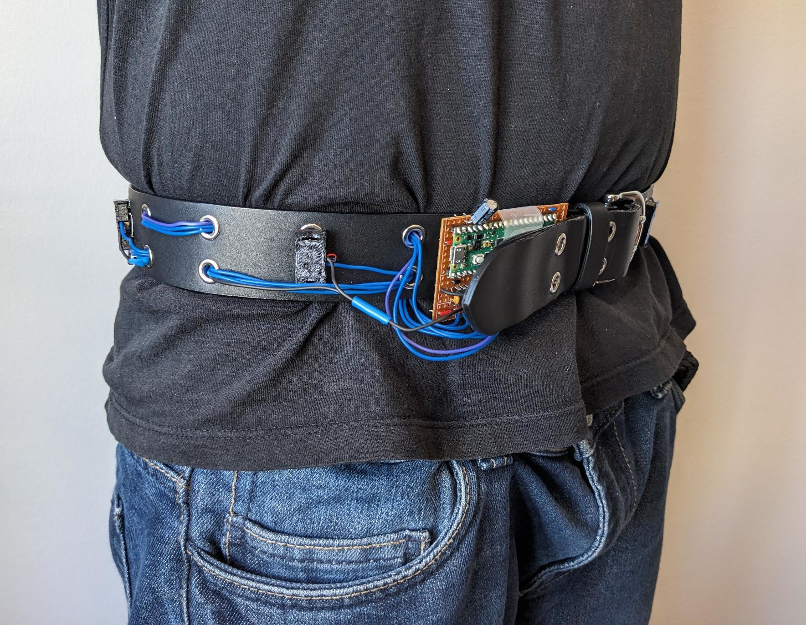
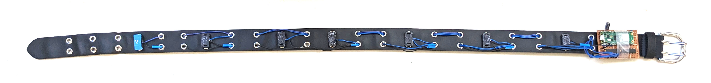
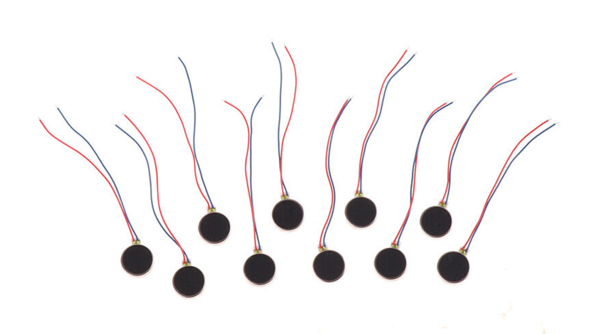
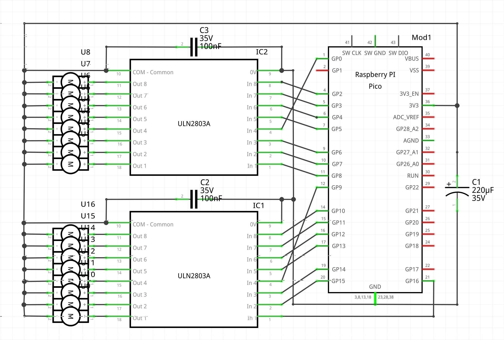
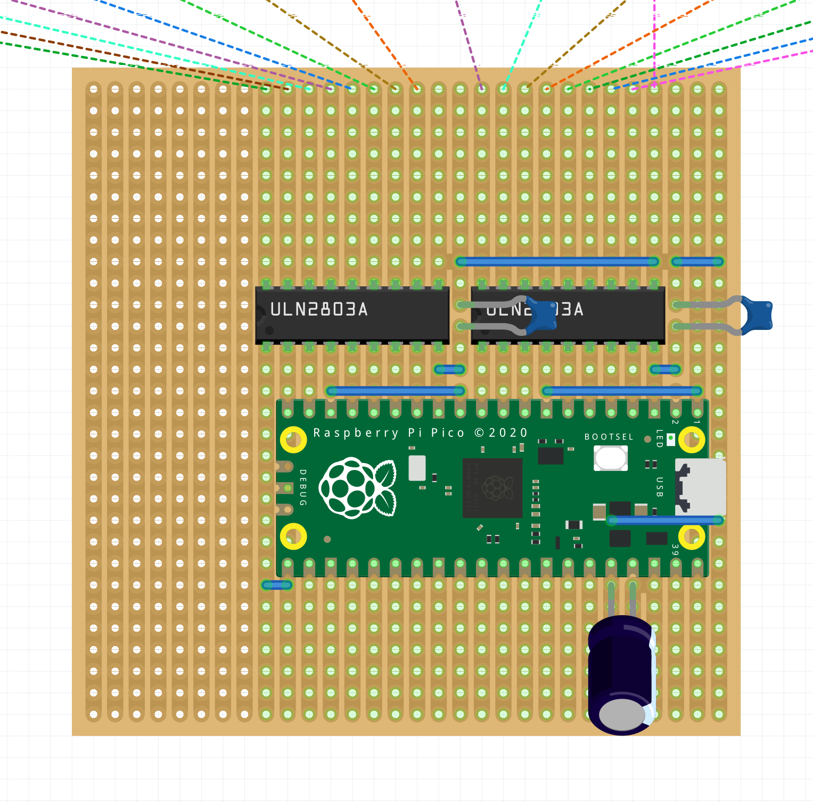
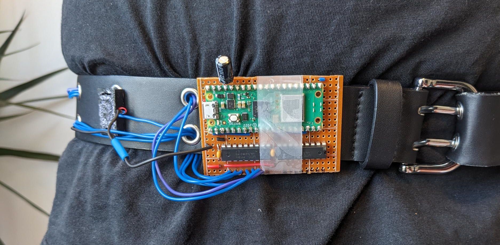
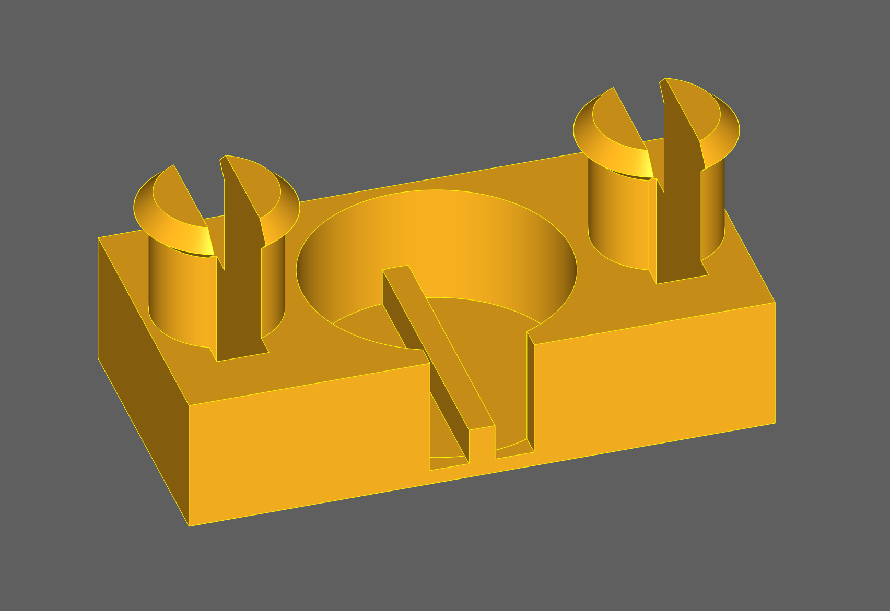
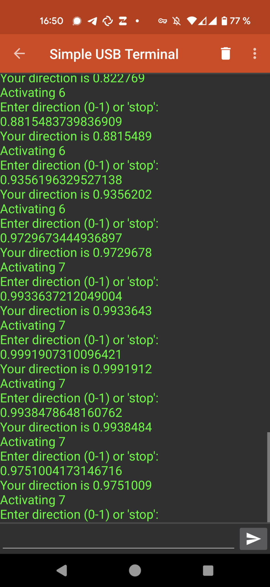

I've always wanted to build a compass belt! The idea is to attach a couple of vibration motors to a belt, use a compass sensor to find north, and then to let the motor that points north vibrate!

Wearing such a device seems to give some people a [new sense of direction](https://www.wired.com/2007/04/esp/), so I was super curious to try it!

In this post, I want to document how I built one, hoping to give other people who want to build one in the future a head start! My design is cheap (the parts cost around 15 EUR) and has a straightforward design.

## Overall design

The simplest implementation I could think of was to use a microcontroller to control the vibration motors, and then connect it to a smartphone via USB, to receive commands.

This means that we don't an extra magnetic sensor, and no battery pack, because we can use the smartphone as a power supply. This is the finished compass belt in its current form:

## Hardware

### Belt

I found [this belt](https://www2.hm.com/de_de/productpage.0907409001.html) at a clothing store a couple of weeks ago, and immediately thought that it might be a neat basis for this project! Any belt with double rows of eyelets all the way along the belt should work. If you don't find such a belt, you'd need another way to mount the motors, and to route the cables.

### Motors

I used coin vibration motors with a diameter of 10 mm, a nominal voltage of 3 V, and a nominal current of 70 mA. These "closed" motors have the advantage that they don't have external moving parts you need to look out for.

### Board

The electronics of the belt are based on a *[Raspberry Pi Pico](https://en.wikipedia.org/wiki/Raspberry_Pi#Raspberry_Pi_Pico)*, a tiny, cheap microcontroller with lots of output pins.

It's not a good idea to attach the motors to the output pins of the Pico directly, as they are not designed to provide enough current.

So I asked around a bit, and [Kenneth](https://chaos.social/@kwf@social.afront.org) and [Electronic Eel](https://chaos.social/@electronic_eel@treehouse.systems) suggested using a transistor array chip called the *ULN2803a* (which is similar to the [ULN2008A](https://en.wikipedia.org/wiki/ULN2003A), but has 8 input and output pins). The ULN can be used to connect and disconnect the motors to the ground on demand. They also already contain a "flyback diode", which will prevent the transistors from being damaged when the motors wind down.

Electronic Eel also helped me with finding suitable capacitors: One 100 nF capacitor acting as a bypass capacitor per ULN, and a bigger one (I used 220 µF) for stabilizing the voltage of the Pico itself.

I used the software *Fritzing* to design this circuit:

Fritzing also allowed me to translated the circuit into a design for [stripboards](https://en.wikipedia.org/wiki/Stripboard), which gave me a much more stable result, compared to a solderless breadboard:

You can find the Fritzing file for both designs here: <https://github.com/blinry/compass-belt-hardware>

This was the first time I used a stripboard, and overall, it was a good experience! :) I was super anxious when putting it together, because it seemed easy to make mistakes, but in the end, it worked flawlessly on the first try!

### Motor clip

To attach the vibration motors to the belt, I designed parts which would house the motors and their thin cables, and clip to two of the belt's eyelets. I used the Python library [CadQuery](https://cadquery.readthedocs.io) to model this part in a parametric way. Quite neat!

I then printed one clip for each motor on a 3D printer.

I published the source code for the motor clips here: <https://github.com/blinry/compass-belt-clip>

## Software

### Firmware running on the belt

The Picos can be programmed using MicroPython or CircuitPython. Both would work for my prototype, but I picked MicroPython to be able to use the Picos' Bluetooth features at a later point. To communicate with the attached Android phone, it suffices to use Python's `input()` function, which will read text from the Serial connection via USB.

The firmware is pretty simple: It reads numbers between 0 and 1 from the serial connection via the USB cable connected to the Android phone, and then activates the matching motor. 0 means "at the front of the human", 0.25 is right, 0.5 is back, 0.75 is left. Essentially, the angle is a clockwise "factor of [tau](https://en.wikipedia.org/wiki/Turn_(angle)#Tau_proposals)".

The MicroPython code has a list of motor positions and pin assignments baked in – if you want to use it with our belt, you have to modify the array at the top: <https://github.com/blinry/compass-belt-firmware>

I copied the firmware to the Pico using the following Linux command. Naming it `main.py` on the controller makes it auto-start this program after booting:

    ampy -p /dev/ttyACM0 put firmware.py main.py

To test the firmware with my computer, I connected to it using this command (but other serial terminal emulators like `picocom` or `minicom` would also work):

    python -m serial.tools.miniterm ACM0 115200

### Android app

To send serial data over USB with Android, I originally envisioned a simple solution like "write a bash script and run it on [Termux](https://termux.dev)". There is a [`termux-usb`](https://wiki.termux.com/wiki/Termux-usb) command which passes a file descriptur under which the USB device can be accessed to another program, and with a bit of work (like started by [Querela](https://github.com/Querela/termux-usb-python)), it seems possible to write software which uses this to write serial data. But [I couldn't get Querela's code to work](https://github.com/Querela/termux-usb-python/issues/6).

For testing purposes, I was already using Kai's [Simple USB Terminal](https://play.google.com/store/apps/details?id=de.kai_morich.serial_usb_terminal), and I was delighted to find that Kai published a [simplified open-source version](https://github.com/kai-morich/SimpleUsbTerminal) of it, published under the MIT license.

So I forked it, and added a bit of code to the `SerialService` class, which permamently calculates the desired vibration angle (currently assuming the device is held upright in front of the person), and sends it to the board.

{: style="max-width: 20em"}

This seemed like the fastest way to get the job done. With more time, it'd be nice to write a cleaner app with additional features (like allowing the user to enter a GPS coordinate to guide them to). But because this was a [weekly project](/weekly-projects/), I needed something fast.

You can find my modified app here: <https://github.com/blinry/compass-belt-app>

## My experiences

I've just built the belt this week, and taken a short walk with it, so I don't have tons of experiences to share.

But I'm surprised by how strongly the vibration can be felt through the belt!

Also, I thought I might attach 16 motors to the belt – but I don't think I could differentiate between them. The current 8 seem enough.

Here's some things I'd try next:

- Extending the app to guide me to a certain GPS coordinate.
- Changing the calculation so that I can put the smartphon in my pocket (at a fixed, known angle?), instead of having to hold it in front of me.
- Later, maybe experimenting with an on-board magnetic sensor, so that I can twist the attached smartphone however I want?
- And it'd be great to get rid of the USB cable. If I attach a small battery to the Pico, I could probably communicate over Bluetooth.

