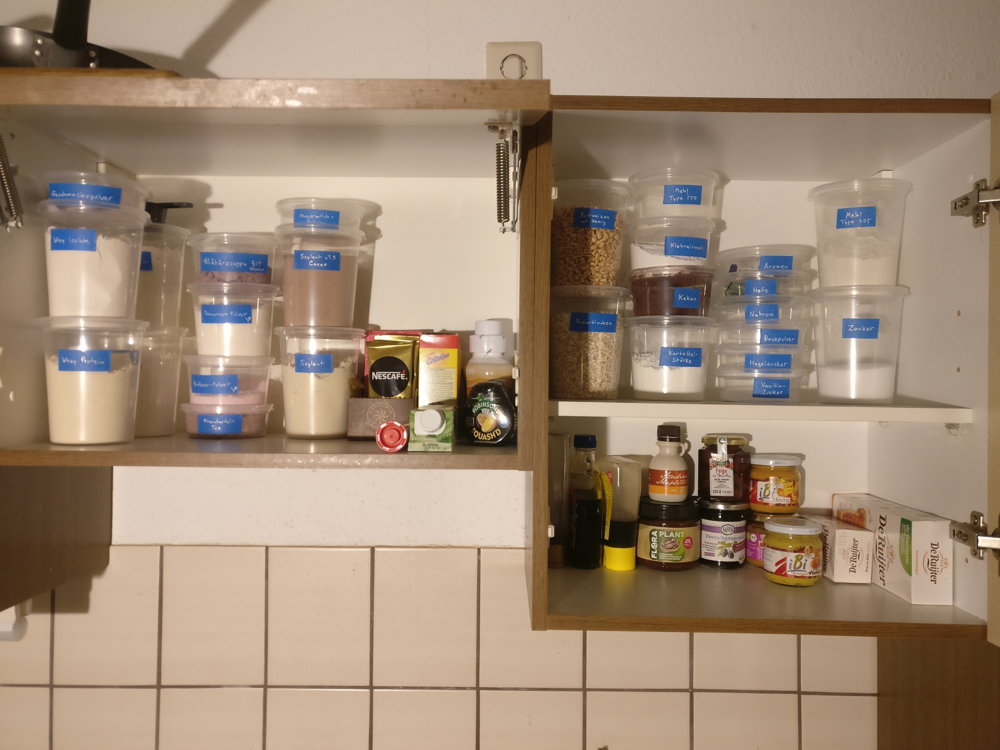

    Kitchen Organization Group                                        blinry
    blinry-quest for Comments: 1                                  April 2023
    Category: Standards Track

                      Blinry Container Standard version 1.0

    Status of This Memo

       This document specifies a standard for the Home Cooking community,
       and requests discussion and suggestions for improvements.
       Distribution of this memo is unlimited.

    Abstract

       This document describes a system for storing kitchen ingredients.
       The containers allow versatile stacking, are translucent and have a
       single lid size.  They can be put in the dishwasher, the microwave,
       and the freezer.  The containers are readily and cheaply accessible.
       Labelling is done in a uniform and highly visible way.

    Table of Contents

       1. Introduction ................................................... 2
          1.1. Purpose ................................................... 2
          1.2. Range of application ...................................... 2
          1.3. Intended audience ......................................... 3
          1.4. Compliance ................................................ 3
       2. Containers ..................................................... 3
          2.1. Material .................................................. 4
          2.2. Shape ..................................................... 4
       3. Labelling ...................................................... 4
       4. Usage .......................................................... 5
          4.1. Initial adoption .......................................... 5
          4.2. Supply of empty containers ................................ 5
          4.3. Physical layout ........................................... 5
       5. Security Considerations ........................................ 6
       6. Suppliers ...................................................... 6
       7. References ..................................................... 6
       8. Acknowledgements ............................................... 7
       9. Author's Address ............................................... 7

    blinry                      Standards Track                     [Page 2]

    BFC 1                  Blinry Container Standard              April 2023

    1. Introduction

       1.1. Purpose

          The purpose of this specification is to define a system for
          storing cooking ingredients that:

              * Provides home cooks with a good overview of their available
                ingredients, in an elegant and minimalist way;

              * Is affordable, and can be implemented quickly;

              * Uses shelf and appliance space efficiently and flexibly, due
                to stackability and lid-compatability;

              * Is suitable for the large temperature range required for
                storing and preparing ingredients in a kitchen;

              * Allows different implementors to easily exchange ingredients
                and prepared meals, and integrating them into their own
                systems.

          The system is designed to be an alternative to other storage
          standards, like Gastronorm containers [1], which only provide
          big volumes of 1 litres and more, which is not suitable for most
          home applications.

          Other plastic containers are often much less affordable, or not as
          easily stackable.

       1.2. Range of application

          The described system can be used to store all dry, paste-like and
          liquid substances in a kitchen.

              * On the shelves, the containers can store dried legumes,
                flour, sugar, all kinds of spices, pasta, rice, baking
                ingredients, or nuts.

              * In the fridge, they can store leftovers, pre-cooked or
                pre-cut vegetables, condiments, or dough.

              * In the freezer, they can store prepared dishes, vegetables,
                bread, herbs, or ice cubes.

              * During preparation, containers can be put in the microwave,
                or receive boiling water.

    blinry                      Standards Track                     [Page 3]

    BFC 1                  Blinry Container Standard              April 2023

       1.3. Intended audience

          This specification is intended for home cooks who need to store a
          small to medium amount of ingredients.

       1.4. Compliance

          Unless otherwise indicated below, a compliant home cook must be
          able to accept and integrate any container from other implementors
          that conforms to the specifications presented here; a compliant
          home cook must produce containers that conform to all the
          specifications presented here.

    2. Containers

      Containers used in this system are cylindrical, lidded containers
      made from translucent polypropylene.

      2.1. Material

         Polypropylene is a thermoplastic polymer with a combination of
         convenient properties: With a melting point of 160 °C (320 °F), it
         can withstand applications like microwaving, which produces a
         maximum temperature of 100 °C (212 °F), dishwashing, and filling
         directly with boiling water.

         Below 0 °C (32 °F), Polypropylene becomes brittle, and
         occasionally, a container might crack.  But handled with care, this
         seldomly poses a problem.

         Polypropylene withstands acids and bases, and is a good barrier
         against fat.

         Translucency is important for being able to see the containers'
         contents easily.

    blinry                      Standards Track                     [Page 4]

    BFC 1                  Blinry Container Standard              April 2023

      2.2. Shape

         The most important property of the containers' shape is the lid
         interface, which is the same for all containers: Containers have an
         inner diameter of 110 mm, and an outer diameter of 119 mm.  The
         lids have dimensions that fit the resulting rim.  While in theory,
         commercially available "deli containers" often seem very close to
         each other in dimension, care has to be taken to make sure that
         they are, in fact, lid-compatible.  It can be wise to pick a single
         manufacturer, and stick to their products.  Recommendations are
         listed in section 6.

         The lids have an outer rim that secures containers that are stacked
         on them from sliding off to the sides.

         The containers are cylindrical, and taper towards the bottom, to
         fit the lid of the container underneath.

         While the lid diameter of all containers is the same, they come in
         different heights, ranging from 145 mm to 44 mm, resulting in
         volumes between 250 and 1000 mL (8 to 32 fl oz).

    3. Labelling

        In the absence of other packaging, most containers should be
        labelled, to identify their contents.  Exceptions can be made when
        the content is clearly and unmistakably recognizable (as is the case
        for walnuts or pasta).  But especially for white powders (which
        could be salt, sugar, flour, citric acid, or monosodium glutamate),
        labelling is important.

        This specification prescribes using blue tape as labels, which can
        be spotted easily (deep blue is a very uncommon food color).  Using
        painter's tape with a width of 24 mm (0.94 in) is recommended.

        For optimal visibility, a white paint marker should be used for
        writing on the tape.  Recommendations for both products are given in
        section 6.

        Often, writing the name of the stored content is enough, but
        sometimes, adding some crucial preparation detail from the original
        package can be helpful.  Examples include water ratios for cooking
        rice.

    blinry                      Standards Track                     [Page 5]

    BFC 1                  Blinry Container Standard              April 2023

    4. Usage

       4.1. Initial adoption

          Implementors should screen their existing ingredients first,
          regard their volumes, and thus, estimate how many containers of
          which size are required.  Adding at least 30% to each count is
          recommended to avoid running out of supply later.

          Converting to the containers should be a straightforward and fun
          process.  For ingredients which implementors expect to re-fill
          frequently, it makes sense to pick a container size that will fit
          an entire new package of the ingredient.

          Note that the Blinry Container Specification is highly compatible
          with zero waste shops, which sell ingredients without packaging.

       4.2. Supply of empty containers

          Implementors MUST have an easily accessible stash of empty
          containers available in their kitchen.  Not having that stash will
          lead to sluggish and incomplete adoption of the specification.

          Storing the containers in upside-down stacks is preferred for
          hygienic reasons.  Lids are to be stored in an extra stack.

       4.3. Physical layout

          When distributing the containers in your kitchen, make use of the
          "first-order retrievability" rule: Don't cover container stacks
          with other stacks, because doing so will prevent you from seeing
          all available ingredients at a glance.

          Stacking is highly encouraged to make use of the available space.
          Stacks higher than eight containers have proven to be ineffective.

          As for which algorithm to use to sort the containers, this is a
          highly subjective matter.  We recommend trying one first and
          changing it later on demand:

              * Categories: Group ingredients by type; possible categories
                could be: legumes, baking, spices, nuts.
              * Color: Sort ingredients by color, so that you know where
                white ingredients will be stored, for example.

    blinry                      Standards Track                     [Page 6]

    BFC 1                  Blinry Container Standard              April 2023

    5. Security Considerations

       This speficiation is mostly limited to storing ingredients in a
       stationary environment.  While dry and paste-like ingredients can also
       be transported between homes, the described containers are not
       fully safe for transporting liquids.  While technically, some
       leak-proofness has been observed, in practice, it seems like too much
       of a risk tradeoff to just put salad dressing in the containers and
       throw them in your backpack.  Containers with more sturdy lids or
       bottles with screw-on caps should be preferred for this purpose.

       For ingredients which decay quickly under sunlight (fats and
       preserved products), the containers' translucency can be a problem.
       It is recommended to store those in a dark cupboard.

    6. Suppliers

       6.1. Containers

          At the time of publication of this specification (April 2023),
          suitable containers can be found under the name "deli containers"
          for around 0.50 EUR per container.  A reliable brand is Solo's "PP
          Deli Container" [3].

          A good distributor of Solo's products is the company Monouso,
          which has multiple online stores in Europe, and the
          WebstaurantStore in the USA.

       6.2. Markers and tape

          A recommended paint marker is the "edding 780 paint marker" in
          white [4].

          Good blue painter's tape is sold by 3M under the brand name
          "ScotchBlue Painter's Tape (2090)" [5].

    7. References

       [1] https://www.en-standard.eu/bs-en-631-1-1993-materials-and-articles-in-contact-with-foodstuffs-catering-containers-specification-for-dimensions-of-containers/
       [2] Jonah Reider's YouTube video: "These Are The Only
       Kitchen Containers You Need" https://www.youtube.com/watch?v=y-dGZXAi1vc
       [3] https://www.dartcontainer.com/products/foodservice/containers/plastic/microgourmet-plastic-deli-containers-and-lids
       [4] https://www.edding.com/en-us/products/edding-780-paint-marker/
       [5] https://www.scotchblue.com/3M/en_US/scotchblue/products/catalog/~/ScotchBlue-Original-Painter-s-Tape/?N=4336+3294340635&preselect=3293786499&rt=rud

    blinry                      Standards Track                     [Page 7]

    BFC 1                  Blinry Container Standard              April 2023

    8. Acknowledgements

       The author gratefully acknowledges the work that Jonah Reider [2] has
       done to promote the use of deli containers in home kitchens.  The
       author hopes that providing this document to the Home Cooking
       community will help to promote a style of cooking that's diverse,
       spontaneous, and reduces wasted resources.  Many thanks also for the
       the typo correction that Ithea Piko Nwawa provided as feedback to
       this BFC.

    9. Author's Address

       blinry

       EMail: mail at blinry dot org
       URI:   https://blinry.org
