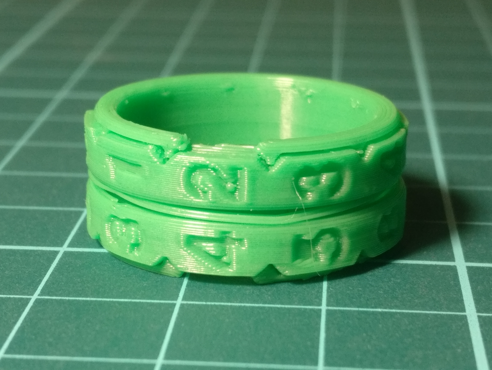

This is the replica of a "knitting row counter ring" that I like. It has two rotating number rings, which you can use to set numbers from 0 to 99.

Between the number rings, there is a thin, slightly bent "tension ring", which holds the number rings in place.

## Print your own!

I designed and tweaked the ring using a Prusa Mini+.

1. Download the [.stl file](counter-ring.stl), and open it in PrusaSlicer.
1. It seems important to activate the "Detect thin walls" option under Print Setting -> Layers and perimeters -> Quality. Without it, the thin walls of the inner and outer ring would consist of multiple extrusions, and they wouldn't fit together. Other than that, I used Prusa's standard 0.20mm QUALITY print profile, with an extrusion width of 0.45 mm.
1. Slice and print! This will take around 20 minutes.
1. Cut off any blobs or stringing from the parts.
1. Bend the thin tension ring into a zig-zag shape. Three upward zigs and three downward zags seem to work well. Strongly crease them!
1. Put the pieces together in this order:
    1. Outer ring (the wider of the high, thin rings)
    2. A number ring, with the dents facing outwards
    3. The bent tension ring
    4. Another number ring, with the dents facing outwards
    5. Inner ring
1. Align the outer cutouts in the inner and outer rings, and carefully push them together all the way. Done!

## Make modifications!

If you want to make changes to the models (like changing the inner diamete), you can find the OpenSCAD source file [on GitHub](https://github.com/blinry/counter-ring). It has a lot of comments! :)
