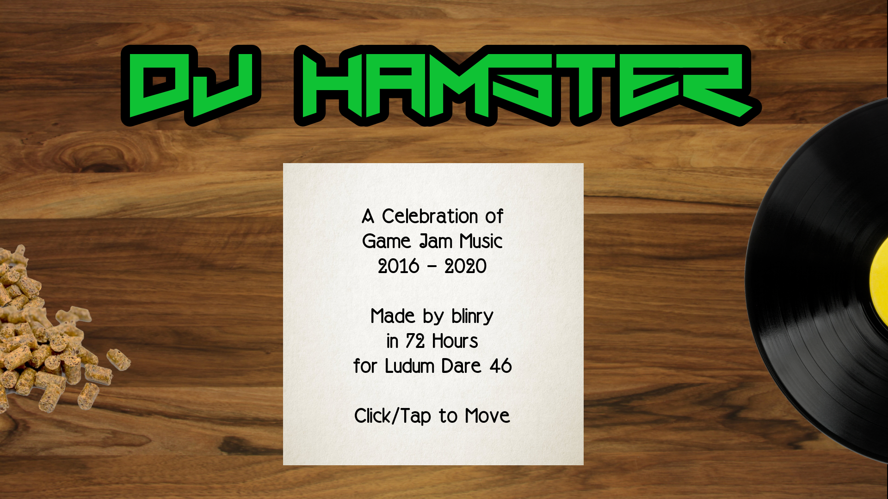
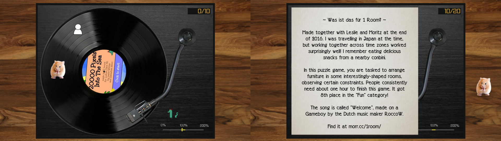

At this point, I've lost track of how many games I've made for Ludum Dare, but I've been doing it [since 2016](/floor-lamp/)! For Ludum Dare 46 (with the theme *Keep it alive*), I made a "music game" for the first time: you're **DJ Hamster**, and it's your job to keep some old-fashioned records spinnig!

The game looks back on the soundtracks of the games I've worked on in the past, and it's a declaration of love to the people who made them with me: Agustín, Alan, Byung, Kiki, larkinia, Lena, Leslie, Mai, Moritz, Pecca, rohieb, Steffi, Tim, and Winnie! <3

**Play the game [in your browser](play/)!** The submission page on the Ludum Dare website is [here](https://ldjam.com/events/ludum-dare/46/dj-hamster).

## Development

When brainstorming, I thought I had a strong initial idea, but I dropped it after half a day, and I think this was a good decision!

<%= tweet(1251451904904871938) %>
<%= tweet(1251453057637941252) %>
<%= tweet(1251492741407805440) %>
<%= tweet(1251553361758957568) %>
<%= tweet(1251587166163042305) %>
<%= tweet(1251611039327760384) %>
<%= tweet(1251980957789421568) %>
