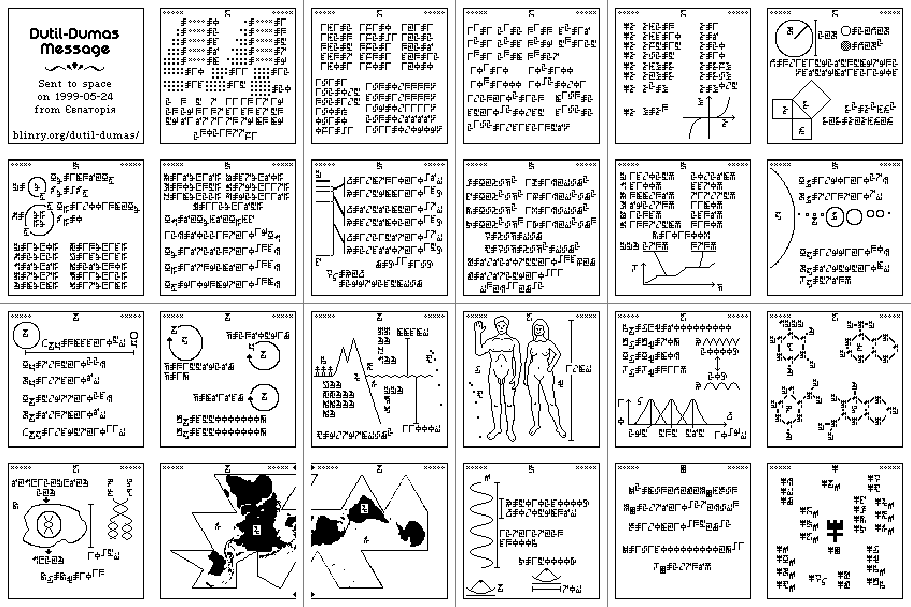

A talk for INLAWS - International Negotiations on Love, Art, Wizardry, and Science.

- [Slides (on Google Docs)](https://docs.google.com/presentation/d/1zuat385rsgymjwu1I8VeD2tenQHguzBTUGBv1v-2n24/edit#slide=id.gf4208470b8_0_131)

- [A detailed interpretation of the message](https://blog.plover.com/aliens/dd/intro.html)
- [About the Cosmic Call as a whole](http://www.cplire.ru/html/ra&sr/irm/CosmicCall-2003/index.html)

## Zine

Print, cut, and staple your own zine!

## Message Data

The binary message (reconstructed by me from [this document](https://www.plover.com/misc/Dumas-Dutil/messages.pdf)): [message.txt](message.txt)
