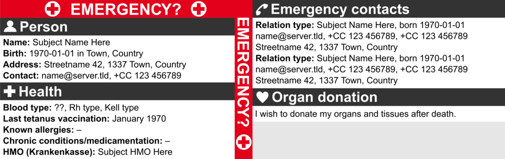

I originally created this emergency and organ donation card in 2012. Recently, I gave it an update to translate it to English and make it as international as possible otherwise. I figured it might be useful for other people, so I'm providing a template here. Click on the image to open the SVG, you can edit it using a vector graphics program like [Inkscape](https://inkscape.org).

Note that this template uses the Arial font, to be instantly usable as widely as possible. Personally, I use [TeX Gyre Heros](http://www.gust.org.pl/projects/e-foundry/tex-gyre/heros), a Helvetica clone.

The gray bar on the back side is for your signature. Let me know if you have any other suggestions!
