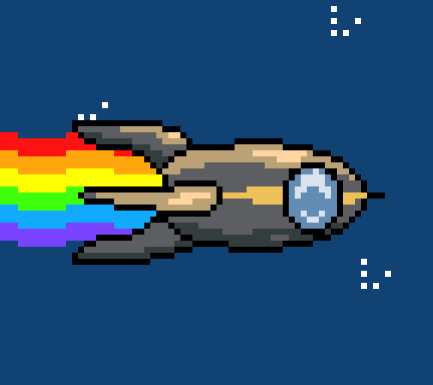

*Hackerspaces: the final frontier. These are the voyages of the rocket Fairy Dust. Its one-year mission: to explore strange new technology, to seek out new life forms and new convention centers, to boldly go where no congress has gone before.*

The visual style of this animation is a reference to [Nyan Cat](https://en.wikipedia.org/wiki/Nyan_Cat), but the subject is one of the Chaos Computer Club's logos, the rocket *Fairy Dust*.

**In case you'd like to create your own Nyan Cat-style animation, you can use [my Aseprite file](fairy-dust.ase) as a basis.**

I posted this animation on twitter:

<%= tweet(816026921393881088) %>

And when I suggested that someone could create a soundtrack for the animation, an amazing piece of Internet collaboration happened: Winnie extracted samples from Peter Marquardt's amazing video [Electromagnetic Sounds of a Chaos Communication Congress](https://www.youtube.com/watch?v=BtFYSkJQMyw) and put together a music loop. He called the result *Fairy Dub*:

<%= youtube("guKTEeFkGKs") %>

