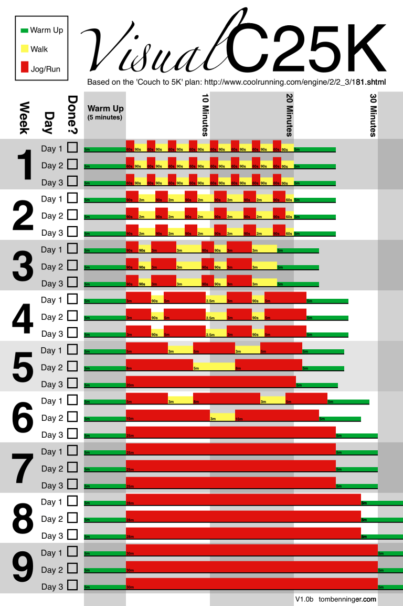
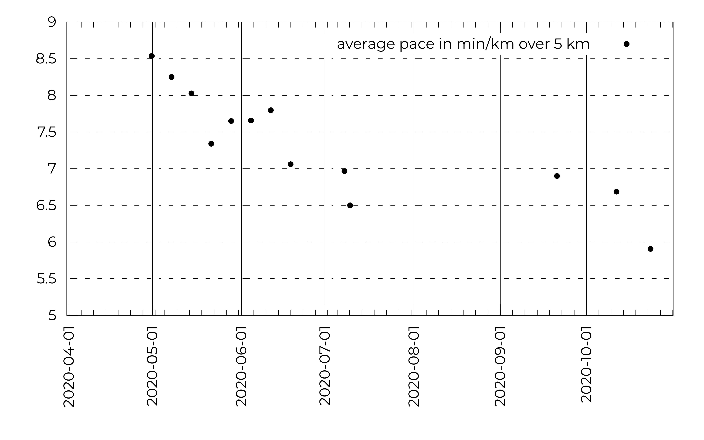
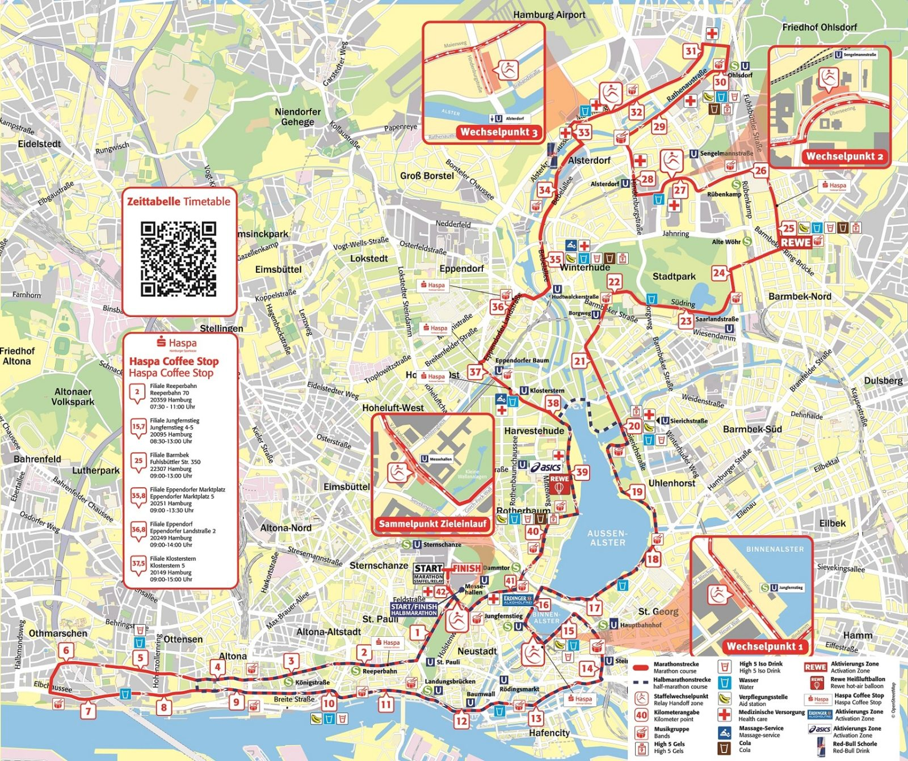
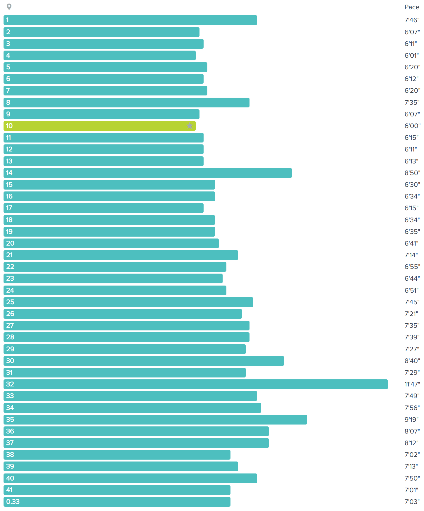
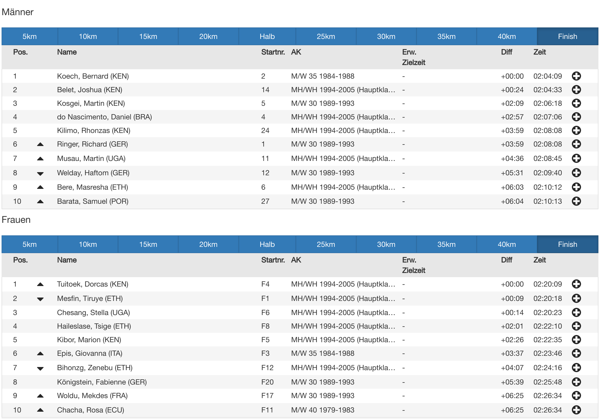

In the spring of 2023, I **ran my first marathon**, the Hamburg Marathon! 🏃

This is the story of how I got there: how I started running in 2020, to how I ran 42 km (26 miles) three years later.

## How I got started

When the Coronavirus pandemic hit in 2020, I was feeling restless and anxious, and was looking for an outlet.

Running seemed like an good choice. I didn't need a lot of equipment, and could do it outdoors. I found the *Couch To 5K* running program, that's designed to gently guide people towards running 5 kilometers. In the first week, you run only for 60 seconds, followed by 90 seconds of walking. In the eight weeks after that, the time you run is gradually increased.

My favorite overview is Tom Benninger's visual overview of the program:

I remember that initially, the 60 seconds of running were pretty exhausting! That's because I was running way too fast. When I slowed down, the program seemed more manageable, and after nine weeks, I ran 5 kilometers without stopping for the first time! It took me 42 minutes! I was mighty proud! :)

<%= toot("chaos.social/@blinry/104092481775408540") %>

I used a smartphone app that would keep track of the walk/run rhythm for me, I think it was [this one](https://play.google.com/store/apps/details?id=com.c25k&hl=en&gl=US). It worked pretty well for me.

After that, I just kept running 3 times a week, because I just... intrinsically enjoyed it a lot! I got fresh air and sun, and moving outside through nature is just really nice! For the first time since a long time, I paid a lot of attention to the changing seasons! I saw the first flowers in spring, and mushrooms in autumn. A site that's helpful for figuring out nice routes is [Strava's Global Heatmap](https://www.strava.com/heatmap).

I reached a number of other milestones:

### Running 5K in under 30 minutes

I sometimes tracked the time I needed to run 5 km, and noticed that I got faster! In October of that year, I ran that distance in under 30 minutes (with a pace of under 6 min/km):

<%= toot("chaos.social/@blinry/105089828816477775") %>

### Running 10K

One advice I found was that for running faster, you'd need to run longer distances. It seemed safe to increase the distance by 10% each week, so I did just that! I'd run 5 km two times a week, and for the third run, I'd gradually increase the distance. In June, I ran 10 km in 01:19:00!

<%= toot("chaos.social/@blinry/104307668788033508") %>

### Running a half marathon

I wanted to keep increasing distances! A marathon seemed like a huge goal, though.

In June 2021, I started seriously considered training for one, but thought that a half marathon would be a more suitable first step. In Braunschweig, where I lived at the time, there would be a small combined marathon/half marathon race at the end of October 2021.

I found a really in-depth [comparison of marathon training plans](https://fellrnr.com/wiki/A_Comparison_of_Marathon_Training_Plans), and one of the most beginner-friendly ones was [Jeff Galloway's training plan](https://www.jeffgalloway.com/training/half-marathon-training/)! I made a big spreadsheet with the required distances. Again, the rhythm would be to run 5 km (or 30 minutes) two times a week, and then do a "long run" as the third run.

I'd run along the "Ringgleis" in Braunschweig, a circular green track around the city, which has almost exactly the length of a half marathon. It was a nice feeling to know that eventually, I would be able run completely around it! But for shorter distances, I ran half of the distance in one direction, and the then back.

My training went pretty smoothly, and I completed the race without much trouble:

<%= toot("chaos.social/@blinry/107196349369813889") %>

## Training for the Frankfurt Marathon

In the summer of 2022, I was at a decision point for whether I wanted to train for a full marathon or not. I calculated that training for it using [Jeff Galloway's training schedule](https://www.jeffgalloway.com/training/marathon-training/) would require me to run a total distance of around 450 km. With a pace of 7 min/km, I'd need to run for around 50 hours in total. I thought that sounded okay!

So I made a training plan, which would end in November 2022 with the [Frankfurt Marathon](https://en.wikipedia.org/wiki/Frankfurt_Marathon)!

Well, turns out I hated running in summer. :/ On some days, it was so hot that I was afraid to get a heat stroke, and I just walked some distance. I sweated a lot.

And in addition, a surgery took me out of my training for two weeks, and I realized that I wouldn't be able to follow my schedule in September.

## Training for the Hamburg Marathon

So I picked another goal: The Hamburg Marathon, in April 2023! Again, following Jeff Galloway's training plan, I started training in December, and for motivation, actually signed up for it officially this time (which cost about 100 EUR). This gave me a lot of motivation!

One thing that was great about training for a spring marathon was the cold temperatures in winter! I ran 5 kilometers every Monday and Wednesday, and did a "long run" on Fridays, with gradually increasing distances.

<%= toot("chaos.social/@blinry/109761353088169457") %>

<%= toot("chaos.social/@blinry/109880612700341307") %>

<%= toot("chaos.social/@blinry/110129637257596310") %>

Following this went rather well, except for a two-week break I had to take in March due to unrelated heath reasons. The next long run after the break was supposed to be 35 km. Usually, runs would be exhausting, but would go smoothly. This time, after 30 km, my knees started to hurt so badly that I stopped running and walked the rest of the distance. This left me a bit anxious, because I didn't know whether or now I would be able to run the marathon distance of 42 km three weeks later!

## The day before the race

I was on a calorie deficit diet in the weeks before the marathon, but the day before the race, I decided to pause it, and just eat whatever I wanted. Among runners, "carb loading" is a technique to increase glycogen stores in the body in preparation for the race. I don't know much about how this worked, but getting a lot of energy seemed like a good idea.

It was an interesting feeling to allow myself to eat until I didn't want to eat more. After months of dieting, I very rarely got that sensation.

Also on the day before the race, I went to fetch my starting number. Close to where the marathon would start, the organizers had set up a "marathon expo", where other cities advertised their marathons, and companies advertised their clothing products.

I showed my national ID card and my registration, and was handed a big red bag, which contained a booklet with all important info, a map of the race track, deodorant, protein bars, and most importantly: the starting number! It's a big piece of thick paper, with my name and my racing number. Glued at the back, there's a passive electronic chip, which is used to track me during the race.

<%= toot("chaos.social/@blinry/110242713068654764") %>

There was also a stand where you could get official running shirts, if you had ordered one. I hadn't, but I found a shirt from last year – red, with the marathon route on the front, and with 42 tally marks on the back (as a reference to the marathon distance). I'm proud to wear it! I fixed the starting number to the shirt with four safety pins.

This Saturday there was another event: the "Long Museum Night" in Hamburg, and I explored a museum about food additives, and an astronomical observatory, and arrived back home pretty late. I packed the bag with fresh clothing and my running clothes.

I slept really badly this night, rolling around in bed and wondering whether I had forgotten anything...

## Morning of the race day

I woke up before my alarm at 7:30, ate a slice of bread and a protein shake.

I grabbed my bag, and, together with Piko, took a subway to the start of the track! Wow, there were *a lot* of people! In the starting area, the organizers had installed a big sound system, and an announcer entertained the crowd with fun facts about the race. I wasn't really focused enough to listen.

We found the entrance for runners, and hugged goodbye. I followed signs to a big hall inside of the conference center where you could change into your sports clothes. During winter, I had trained mostly in jeans and a warm fleece jacket. But on the race day, the weather report said it would get warm enough to run in a sport shorts, and my new red shirt!

I was also wearing the running shoes I had gotten after my half marathon 1.5 years ago, a running belt with a zipper pocket borrowed from Piko, and put my smartphone and a chocolate bar in it. I put on a bone conduction headphones, to listen to podcasts while running, and an Android watch to track my pulse and have an easy way to assess my speed.

Important preparation: Putting bandaids on my nipples! On long runs, this prevents chafing, which can hurt a lot. And as another precaution, I rubbed some vaseline on the place where my thighs would rub against each other, to reduce friction. Another runner approached me: "Hi, um, this is a bit awkward... but could we have some of your vaseline? We forgot it!" She pointed at her friend. "Sure, happy to help!", I said, handing it over.

After changing, I put all things I wouldn't need on the run in my red bag, and handed it in at the back of the hall. Teenagers were tasked with watching over them. My bag had the same number on it as my race number on my shirt.

I followed signs to my starting block. When signing up, you could specify your guess on how long it would take you to run the full course. My guess, 4 hours, had been a bit optimistic, and I knew it when I got in line: I was more likely to take around 5 hours, which I knew from the speed of my long runs. But this put me approximately in the middle of the field, which I was happy with.

The organizers had tasked several "pacers" to help people keep track of their current timing: these are people wearing signs announcing the time they'd take to reach the finish line: "4:00", "4:15", and so on.

It was a chilly morning, but according to the weather report, it would get sunnier and warmer later. Some people wrapped themselves in emergency blankets to stay warm.

When I reached my starting block, there were only 10 minutes or so left before the race would start! The announcer made some jokes, and instructed us to do a wave from the front to the back. Finally, there was a short countdown, a bang, and the race had started!

## The beginning of the race

The runners at the front were first to start, but they were so far away that I couldn't see them. It took a few minutes until we could start walking, then jogging slowly, then running over the starting line! Piko had texted me that they would sit in the first spectator's stands at the right, I spotted them and waved excitedly, happy to have them cheering for me!

A passive chip at the back of the starting number was used to track the time. At multiple places along the track, there were rubber mats, making beeping noises as people ran over them. They would be used later to calculate the official finishing time.

The course was marked with a dashed blue line, which I had already seen being painted all over the city in the weeks prior to the race. At first, it was barely visible among the running crowd, but it would be my guide for the next few hours.

## During the race

### Route

The 42 km of the marathon route started and ended at the Hamburg TV tower. It went alongside the Elbe and the harbour, and around the inner and outer Alster, which are artificial lakes in the center of the city. It then surrounded a big park, and went back to the TV tower.

In addition to the blue dashed line, which marked the officially measured marathon course, there were also markings on the ground for every kilometer. Sometimes, I saw signs alongside the street making those kilometer markings more visible. And especially every 10 kilometers, there were big, very visible signs, together with electronic mats for timekeeping.

### Speed

For the first couple of kilometers, the running crowd was so dense that it needed some navigating around others. I knew that I'd need to let myself fall back a bit – it's a common mistake to start out too fast. But for the first 10 km or so, I was surprised how much everyone pulled me with them. According to my tracking, I ran a speed of around 6 minutes per kilometer for the first 15 kilometers, with kilometer number 10 being my fastest one, with a pace of exactly 6'00"!

I took a pee break at kilometer 15, there were portable toilets all along the track. After this, I slowed down a bit, to a pace of 6'30". As I'll talk about later, I sped up quite a bit in the end again! :)

The pacers with the "4:15", "4:30" and "4:45" signs slowly passed me during the course of the track, often followed by a rather big crowd, who wanted to stick to that time!

### Crowd

The crowd alongside the race track was amazing! So many people were there to cheer on the runners!

Some held up signs. My favorite one simply read: "Remember: You paid for this!" Another good one: "The pain will pass, but the pride will stay!"

Multiple people had cardboard signs with a painted-on Super Mario mushroom on it, with a text like "Touch for power up!". I touched at least three of those, thankful for the support.

Many people cheered when runners passed them by, and because everyone had the sign with their first name fixed to their shirt, people in the crowd could actually call the runner's names! A couple of times, people actually dared to pronounce my name and shouted "Yay, blinry!!", which was a great feeling! :D

<%= toot("chaos.social/@blinry/110247251391893279") %>

A lot of children stretched out there hands, inviting high fives, which also felt like a nice, encouraging interaction. One child handed out flowers, but I was too slow to react to it. Others kindly handed out cups of water, or small salt pretzels! And one even offered sunglasses to people: "Look, they even have baseball caps attached to them!"

There also were music performances, like drumming bands. The music definitely pushed me forward, but I also had to pause my podcasts in those sections... At the beginning of the race, someone on the third floor of a building had put their speaker system next to their windows, filling the street with music.

### Food

Taking enough food had been a problem during my training. Sometimes, I had stopped at a gas station to get something to drink or a snack half-way. During this run, there were a lot of food and drink stations. I think the first food station was after 10 km, and repeated every 5 km after that. There were banana pieces, and later, energy gels. I didn't enjoy their taste, but I knew that they would be an ideal source of energy, so I ate at least 5 of those, as well.

There were also drinking stations, which always provided water in plastic cups, often isotonic drinks, and sometimes cola or energy drinks. I often used these to take a walking break, to drink my cup or eat my banana, happy to be able to give my legs some rest. A hundred meters after those drinking stations, there were big garbage cans, it was fun to aim at them and throw the cups! Nevertheless, hundreds of plastic cups also littered the ground around these stations, and made spectacular noises when people ran over them.

I saw a lot of runners who brought their own energy gels, and put a couple of them in their belt. Another option was to hand in your own snacks and drinks the day before, the organizers would then put them on special tables along the track.

### Pain

So... how did my body feel during the 42 km of running?

One thing I was afraid of was knee pain. During my training, when I was supposed to run 35 km, after 30 km, my knees hurt so badly that I had to stop running, and walked the rest of the distance. This was maybe overly cautious, but it was a few weeks before the race, and I didn't want to risk an injury. This time, I felt even more "locked in", determined to finish the distance. It would've been okay for me if that included some walking in the end, but also, it would've sucked a bit. Luckily, my knees never became a problem on the race day. I paid a bit of attention to them, and sometimes they would sting a bit, but the pain didn't last – maybe the adrenaline rush during the race also prevented me from feeling that a lot.

The thing that did start hurting after a couple of kilometers were my shoulders, surprisingly! With my arms swinging below them, maybe they got an unusual amount of force.

After the first half (21 km), my legs definitely hurt, and were feeling heavy. My body wanted to stop running. I felt similar to how I felt after my half marathon. But the crowd and the commitment kept me going. Especially in the second half, time seemed to pass more slowly. The kilometers felt really long, and I was happy about every food or drink station, where I allowed myself to walk for a few minutes. Starting to run again after those breaks didn't feel great, but I had enough motivation.

### Other runners

In addition to people who ran the full marathon, there were also people running a half marathon, who took a shortcut after going around the outer Alster.

And also, it was possible to run the 42 km distance as a team, as relay runners. The track was divided into four segments, and after each segment, there was a special "pit stop" for the runners, where they could pass on the task of running to the next person! Close before the finish line, there was such a section where all people in the team could then cross the finish line together. I hadn't heard of this system before, but it sure sounds like a nice way to run a marathon!

When new relay runners came in, they would often be faster than the rest of the crowd, and would surpass us. Fortunately, they had signs on their back telling others about their special role, so people wouldn't be too disappointed to be surpassed.

Some people ran in a costume! For example, I saw someone dressed as a chimney sweep, one as Scrooge McDuck, and one as a water carrier, carrying two buckets on their shoulders. According to the print on their shirt, they had been running the Hamburg marathon for 20 years in a row or so, and had completed over one hundred different marathons! Wow!

Some people seemed like they were dressed way too hot, with a warm jacket. And some were even still carrying their red cloth bag.

## Last kilometers

Along the course, there were several first aid stations, especially alongside the last kilometers. I saw one person lying on a stretcher, close before the finish line. :/ Another person lay next to the track, with a infusion bottle connected to their body. Maybe they drank to little? Medics were observing them, and seemed in a good mood.

Knowing that these first aid stations were there was a big relief for me. I knew that, in the event that I would hurt myself, I would be able to get fast help.

There were also two stations where you could get a massage along the last few kilometers! I briefly considered using their services; it would've been a fun experience, and would probably have felt good! But as I was approaching the finish line, I didn't want to spend too much time there.

I had brought a chocolate bar, and had eaten half of it after the first 21 km. To motivate myself, I made an agreement with myself that I would eat the rest when there were only 5 km left to go! This turned out to be a huge motivation! :D When the last 5 km rolled around, I happily gobbled it up, yum!

As I said, the last half of the race was especially tiresome. But when the track led us back into the city center after kilometer 31, there suddenly were a lot more people cheering us on, that was also a really nice motivation!

In the last 5 kilometers, I saw many people talking long walking breaks. And to be honest, it felt good to surpass them!

The professional runners at the beginning of the field finished the course in just over 2 hours, which I think is pretty amazing! They must've ran with an average speed of over 20 km/h!

Bernard Koech, a Kenian runner, ran the fastest time, with 02:04:09! For comparison, the official world record, as recognized by World Athletics (the international governing body for athletics), is 2:01:09, set by Eliud Kipchoge at the Berlin Marathon 2022! Here's the "top 10" places of my marathon:

The website said that the finish line would be closed after 6 hours, and I was confident that I would make that, even if I'd need to walk at the end of the race.

My mindset for this run was that I wouldn't care about my finish time at all, I was just aiming at making it the full distance. But at the end of the run, when it was only 5 more kilometers, and I already saw the TV tower where I knew would be the finish line, I got a bit ambitious! :D Looking at my watch, I realized that I could make it in under 5 hours, if I kept running at the pace in which I had trained. In my recording, you can see that I indeed sped up a bit when I realized that. I skipped the last water station, and just kept running. At the last water station, there were people with a water hose, offering to spray the water on people, which I definitely made use of!

The last stretch was coming up, covered with a red carpet. And there already was the finish line! I threw my arms in the air triumphantly. The electronic mat beeped one more time, and I slowed down to a walk. After running such a big distance, it felt wrong to stand still, my legs just wanted to keep walking!

I made it 04:56:51!

## Behind the finish line

Very close after the finish line, there were people handing out silver medals! As they put the band over my head, they remarked: "Well, someone's looking super happy!" I was! :D I snapped this picture:

<%= toot("chaos.social/@blinry/110248186441703193") %>

Walking further into one hall of the conference center, there was a big buffet with pieces of fruit, and chocolate cookies! I snatched a few cookies, but I wasn't very hungry. They also served alcohol-free beer, which I happily gulped down.

The sun had come out in the last hours of the race, and I had a bit of sunburn in my face.

I got back my red bag, and took a cold shower. At this point, I could only limp, and I observed many others doing the same. I had my name and finishing time engraved into my medal. The organizers also offered massages in the finish area, but when I went there after showering, they told me that, unfortunately, they had already closed. Piko would give me an extensive leg massage later at home, which felt great!

## The days after the race

So... how painful were the next few days? Would I ever walk normally again? Well, going down flights of stairs sucked in the first two days. I had to brace myself on the railing to take some weight off my legs.

But I'd been worse, after some of the long runs in my training! After 4 days, my legs were almost back to normal, and on the fifth day after the race, I was back to running in the morning (albeit carefully).

A friend asked after the marathon if I was now sick and tired of running, or if I wanted more of it. To my own surprise, I was already looking forward to doing this again! There's the Frankfurt Marathon in autumn, for example...

## Resources

- I can recommend the [C25K](https://en.wikipedia.org/wiki/C25K) for getting started with running!
- The [Fellrnr wiki](https://fellrnr.com) is a great, nerdy resource for everything related to running.
- I followed [Jeff Galloway's marathon training program](http://www.jeffgalloway.com/training/marathon-training/), and liked it!
