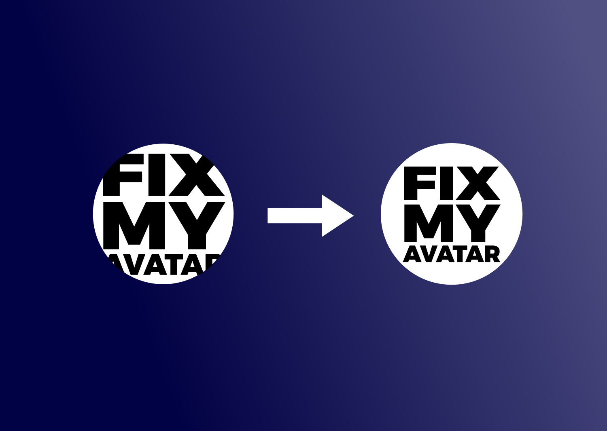

In June 2017, Twitter decided to change the format of its users' avatars from a square to a circle. This led to many avatars which contained text or rectangular logos being cut-off.

Because I'm annoyed by such things, I wrote a Twitter bot which can fix these problems: [@fixmyavatar](https://twitter.com/fixmyavatar). It analyzes the avatar's background color, and then scales down the motive until it fits into a circle, plus some small padding.

To use it, just write something nice to the account, like this: 

> @fixmyaccount Hi, please fix my avatar!

It will reply with a fixed avatar, which you can then save and re-upload to your profile.

To help fixing other accounts, send their names to the bot, like this:

> @fixmyaccount Please fix the avatar of @account_name_here

As the Twitter API limits the number of tweets per hour to 100, you might need a little patience! :)
