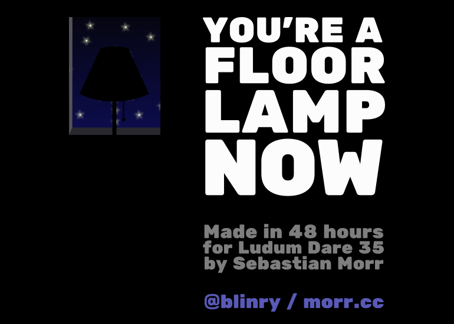

This is my contribution to Ludum Dare 35, the world's largest game jam. You get a theme, and have 48 hours to create a game around this topic, from scratch, including artwork and sound effects. This was my first time ever I participated in such an event, and I don't think it will be the last! :-)

This contest's theme was "Shapeshift". *You're a Floor Lamp Now* is a strategic skill game with surprising mechanics. You can play it [on the Ludum Dare website](http://ludumdare.com/compo/ludum-dare-35/?action=preview&uid=64665).

## Development

I wanted to do a web-based game, so I chose the JavaScript game engine [*CreateJS*](https://createjs.com). It worked quite well, and I certainly learned a lot!

I had a lot of fun recording sounds for this game – everything you hear was created by recording sounds in the apartment, or by making funny noises with my mouth.

## Comments

*I'm happy with my first day as a floor lamp. It's good to be of service to mousekind.* -- Hectigo

*One of the most memorable and unique games I've seen in Compo so far, good job overall. Hilarious concept with great theme interpretation. Graphics are eye-candy, audio is simple but funny and fits the game well and the mood is just awesome. I enjoyed it a lot and appreciated the amount of polish you put in it.* -- Pietro Ferrantelli

## Results

Reviewers praised the game as very original, and many enjoyed the sound effects ;) I was really proud of the "Humor" rating!

