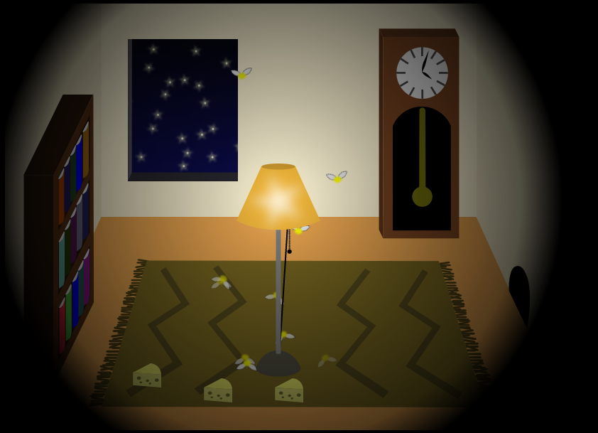
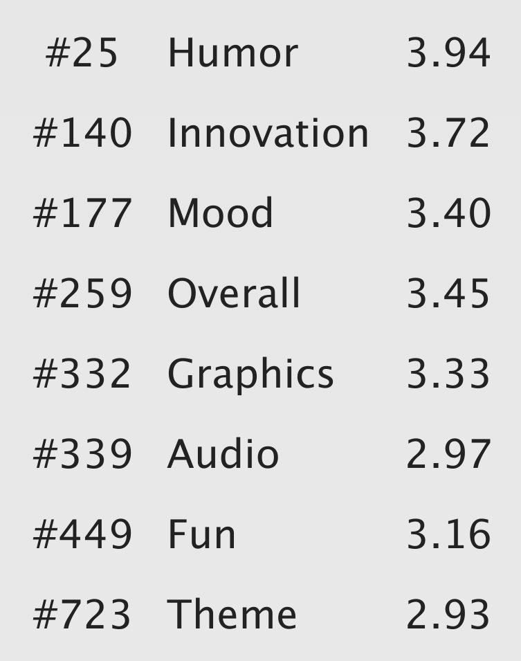

This is my contribution to Ludum Dare 35, the world's largest game jam. You get a theme, and have 48 hours to create a game around this topic, from scratch, including artwork and sound effects. This was my first time ever I participated in such an event, and I don't think it will be the last! :-)

This contest's theme was "Shapeshift", you can play the resulting game [on the Ludum Dare website](http://ludumdare.com/compo/ludum-dare-35/?action=preview&uid=64665).

## Results

Reviewers praised the game as very original, and many enjoyed the sound effects ;) I was really proud of the "Humor" rating!

