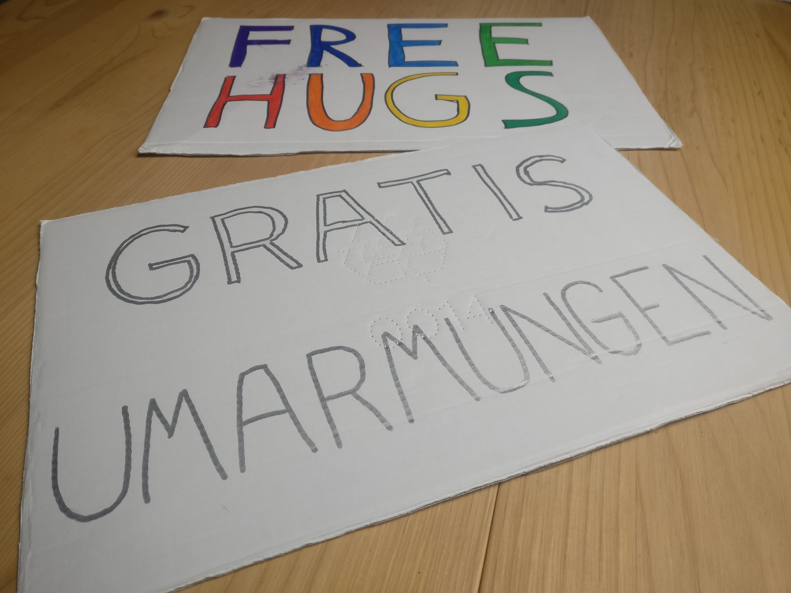

How do people react when you hold up a sign labelled **"Free Hugs"** in public?

A friend and I wanted to find out. We had both heard of Juan Mann, who started his [Free Hugs Campaign](https://en.wikipedia.org/wiki/Free_Hugs_Campaign) in 2004. Also, we had already encountered other people doing this, and we discovered that we both had wanted to try it ourselves ever since.

So we wrote two cardboard signs, one in English ("Free hugs"), one in German ("Gratis Umarmungen"). As we walked toward the city center of Brunswick, I started looking at the people passing by and tried to guess whether or not they would accept a hug. To be honest, I was pretty nervous, because the whole thing was so unpredictable. Doing this this was definitely part of my ongoing efforts to leave my comfort zone every now and then.

We selected a busy crossroad in a pedestrian zone, stood at one corner of it, and raised our signs.

Nervously, we waited. Would anyone actually come up to us, or would we simply be ignored?

Our initial anxiety disappeared quickly. It turned out to be quite fun to watch people's reactions: Some kept a straight face, some looked surprised or narrowed their eyebrows, but the overwhelming majority smiled and talked about us when they realized what we were doing.

Then, after about five minutes, the first two people came running into our arms, tourists from an English-speaking country. In retrospect, these were some of the most heartfelt hugs of the day. "How long can I hug you?" one of them asked. My friend chuckled. "As long as you want!" They hugged each of us, then hugged each other.

After this, we couldn't stop smiling.

Most of the time, we wouldn't offer our hugs very aggressively, and let the people come to us instead. We watched many groups hesitating whether or not to approach us. Often, one member would try to convince the others to come with them. Soon, when we spotted this behaviour, we tried to invite them in by opening our arms and waving and nodding. Some groups literally changed direction four or five times (toward us, away from us, toward us), before finally deciding on whether they would do it.

Some woman pointed at her companion. "He wants a hug, he's just too shy!" He smirked. "Yeah, you know, my social phobia..." "Oh, we're totally introverts, too!" we replied. "Well, obviously you don't have to do this. But maybe you'll come back here again later today?" He didn't.

A teenage girl walked by, gaping at us, looking so offended that I couldn't help but burst into laughter. Sorry!

Some older women gave us very tender and long hugs. "This feels good," nodded one of them.

After hugging, a man with an Italian accent walked away, then quickly turned around again: "Oh, you don't want any money, right?"

Some dude, walking up to me: "Okay, I'll hug you. But only 'cause it's you!" He came back a few minutes later for a selfie.

Many people asked for our motives. "Why are you doing this?" "Did you lose a bet?" "So, who made you stand here?" My default answer was "We just think the world could use more hugs!" I don't think everyone understood.

A woman with a group of small kids: "Sooo... explain what are you doing?" "We can hug you if you want!" "And then?!" "That's all there's to it!" She came back a few minutes later and all apparently had instructed all four kids to hug us. Cute!

My friend told me beforehand she was a little afraid of creeps. Fortunately, the whole thing was a mostly creep- and asshole-free experience. Even though, there was one rather awkward guy who came to hug (just) her, without any facial expression, and then left, all without speaking a word.

A middle-aged couple came for hugs. "We saw people doing this some time ago in another city! We didn't use the chance back then, but now we had to!"

A rugged-looking man with bad teeth watched from a small distance. "Do you want a hug?" I asked. "Nah, I'm fine, I get 10 per day! I'm just glad there are still good people out there!"

Guessing which people would come for a hug turned out to be rather difficult. We noticed that most couples wouldn't, and most kids and elderly people wouldn't, either.

The waitress of the café across the street came over: "I've been watching you the whole time, and I wanted a hug myself!"

A boy of about 7 years sneaked up on us. "Do you want a hug?" He beamed with joy. "Yeah!!" I wondered where his parents were, but then he also walked back to the café, his parents smiling at us from there.

A 12-people bachelor party group came roaming about, and we wiggled our signs, hoping to score a group hug. But they were focused on selling stuff to raise money for the wedding. None of them wanted a hug, one of them even asked for money. I pointed at the word *free*: "Sorry, this is not how this works."

One of the most surprising reactions came from a young man: "Can *I* hold the sign for a few minutes?" A group of his friend watched him from a distance. He seemed a little nervous and withdrawn, and I tried to brief him with some best practises: "Offer the sign up to people coming from *that* direction, so they have time to decide whether they want to do this. Try to look at them, and smile!" He did none of these things, it didn't really work out, and he left after a few minutes. I encouraged him to try it again sometime, and I thanked him for the idea of bringing some spares signs in case people wanted to join in.

We mostly stayed stationary, except when the infamous Preacher of Brunswick turned up ("Let! Jesus! Into your heart!"). We really didn't want to be associated with him, so we temporarily changed our location. Walking around with our signs (very slowly) also worked great, and I would like to try more of that in the future.

When the shops closed, and the amount of people passing by decreased, we decided to break camp. About two hours had passed in a flash. Some people had asked for our experiences – how long we'd been here, how much response we were getting. Truth be told, we got *a lot* more reaction than I had expected. I'd estimate we hugged about 50-60 people. Hugs definitely came in clusters, I guess because it's easier for people to come up to us after they've already seen others to do the same. Overall, the feedback has been incredibly positive!

Some minutes after we put away our signs, my brain was still in hugging mode, and I was surprised that nobody came up to us. So, yeah, I would love to do this again. Soon.

## Lessons learned

Should you ever want to offer Free Hugs yourself (and I think you definitely should try!), here are some hints and pointers to improve your experience:

- A mixed-gender two-person group seemed to work pretty well. It's not as creepy as a single guy, not as intimidating as a larger crowd, and people can chose whom to hug. (Although most people hugged both of us!)

- It's a good idea to write multi-lingual signs, where applicable. We noticed people who couldn't read our English one ("Könnten Sie mir die Bedeutung des Wortes *Hugs* verraten?"), and there were also people who didn't speak German and laughed about the ridiculous length of the word "Umarmungen".
- Bring more signs than you need, in case people want to join in.
- Our signs were made from thick white cardboard, a little larger than A4. This worked well, but I'd probably make larger ones next time. Write on both sides of the signs, so people behind you can read it when you hold it up.

But really, there's not much you can do wrong. Go! The world does need more hugs, now more than ever.
