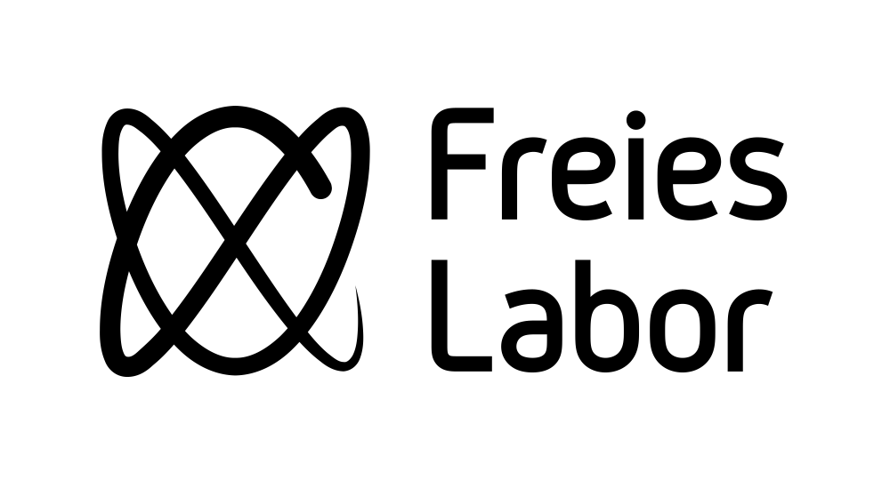

A hackerspace in a neighboring city, the *Freies Labor* in Hildesheim, contacted me and asked if I could design them a new logo.

Well, absolutely! :) After brainstorming with some of the hackerspace's members, we ended up with an idea involving [Lissajous curves](https://en.wikipedia.org/wiki/Lissajous_curve), a family of curves created by sending two sine waves on the x- and y-axis of an oscilloscope. The concrete logo depicts a Lissajous curve with a frequency ratio of 2:3.

Here's the basic form of the logo, for use on dark and light backgrounds:

## License

The creator, blinry, allows free use of the logo for everything and everyone, as long as the usage is related to the hackerspace *Freies Labor* in Hildesheim.

## Typeface

The font is [*Gidolinya*](http://www.1001fonts.com/gidolinya-font.html), a modern DIN by Andreas Larsen, dual licensed under the MIT License and the SIL Open Font License 1.1. I added some weight to the individual glyphs.

The logo would also go well with [*Gidole*](http://www.1001fonts.com/gidole-font.html) by the same author.

## Variants

There is an extra-fancy version for special occasions:

A header for the blog:

A square avatar for use in social networks, which snuggly fits inside a circle, and a square version for the wiki:

And finally, there's a multi-resolution [favicon](favicon.ico).
