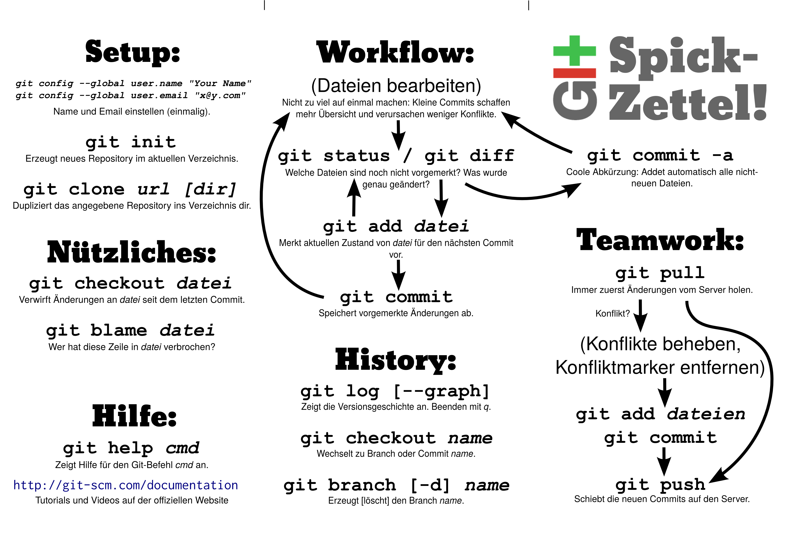

I originally made this to introduce some fellow students to Git for a group project, and updated it in 2014 for a Git introduction I gave to freshman students.

Want the SVG to modify it for your own purposes? [I've got you covered!](git-cheat-sheet.svg) The fonts are Bevan and Courier New.
