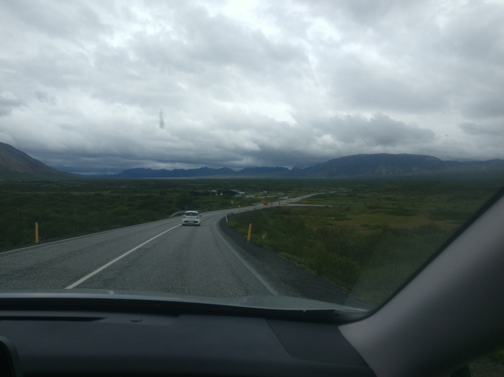

[Rohieb](https://rohieb.name) and me just spent 10 days in Iceland! When we initially planned this trip, we realized that Iceland is an expensive country, so we figured that, instead of renting a car, or booking apartments, like many people seem to do, we could bring a tent, and hitchhike around! The two of us had already hitchhiked for a short section of our trip in the Scottish Highlands last year, which was the first hitchhiking experience ever for both of us. That had been exciting, and also went reasonably well, so we agreed to try that again in Iceland. We didn't really know what to expect, of course. Here's what happened.

## From Reykjavik to Mosfellsbær

For the first three nights, we booked an AirBnb in Reykjavik (or, as we abbreviated it, R7k, because we're lazy and have no manners). I slept pretty badly the night before we had to leave our apartment, and was nervous all morning. What would happen? Where would we end up? Would we actually be able to find a place to put our tent, and find water and electricity? And would people actually stop when we put out our thumbs?

Adding to that, it was raining that morning, not ideal conditions for trying this for basically the first time. We sighed, put on our rain jackets, pulled rain covers over our backpacks, and headed outside. We had a destination in mind: Þingvellir (the Þ is pronounced like the th in "thing"), which is of historical importance to Icelanders - an early form of democratic assembly met there for hundreds of years, and it's also where the independence was declared in 1944. To get there, we knew we had to get to the Ring Road (Road 1) that goes all the way around Iceland, follow it a bit to the north, and then head east. We walked up to a somewhat traffic-heavy street in central Reykjavik, found a bus stop, and raised our thumbs.

We had written a sign (on a sheet of A4 paper) that said "[1] North / Þingvellir", that we showed to cars that passed by. Of course, the sign got wet and soggy, and people didn't really seem to notice us. We tried another section of that street, a bit further down the road, but didn't really notice a difference. A man who lived in a nearby building stepped outside and approached us, and recommended to take a bus to a better traffic hub. We thought that seemed like a good idea; positioning ourselves closer to the edge of the city in the right direction would make it more probable that cars would go our way. So we paid 440 Icelandic króna each (about 4 USD/3 EUR), and actually took a bus to one of the last towns inside Greater Reykjavik - Mosfellsbær (the æ is pronounced like the i in "icy"), which also already was located on the Ring Road.

## From Mosfellsbær to Þingvellir

We figured that Þingvellir might be a popular destination for people passing through Mosfellsbær, so approaching tourists at a gas station might work. We spent 15 minutes or so asking people who stopped for gas "Excuse us, are you going to Þingvellir?" Not a single soul did. A friendly-looking man with an Icelandic accent recommended we should position ourselves next the street that went alongside the gas station. We decided to also take that advice, and soon realized that was a pretty good spot: that section of the street came out of a roundabout, so people were driving slowly, and actually had time see us and our sign. There also was a conveniently placed lay-by, where cars would be able to stop safely.

It was here where we first got some reactions from the drivers: some shrugged apologetically, because they had no room left (either because their car was filled with their own luggage, or with kids riding in the back seats). Some seemed to applaud our valor, and cheered us on with various gestures - shaking their fist, flexing their biceps, or putting up their thumb in response to ours. Some waved very friendly, a reaction that was not very helpful for us. Many people just seemed to be delighted and amused by the idea of people trying to hitchhike along the Ring Road, and we exchanged many smiles with people, which was always nice. Standing in a spot like that was actually a lot of fun for me! By far the most common reaction, though, was no reaction at all.

Very quickly, though, after at most 10 minutes, an older lady stopped in the lay-by. For a second, we were unsure whether she actually stopped for us, but after she waved at us, we approached the car and opened a door. "I can take you in the right direction!", she said. She allowed us to put our luggage (two large backpacks, two small backpacks, and a tent) in the trunk of her car, and we got in. She told us that she lived a bit behind the intersection where we needed to turn east, but kindly offered to take us a bit into the correct street, to a place where other people would be able to pick us up again. We mentioned that we were from Germany, and, after maybe half a minute of consideration, she said "Wir können uns auch auf Deutsch unterhalten!" Which we did for the rest of the short trip! She dropped us off at a campsite on the road to Þingvellir, and recommended to check out the nearby farm, where they would grow delicious vegetables!

We decided we wanted to keep going instead. Figuring out the best place to stand always took some guessing – we wanted to be seen by as many cars as possible, with many of them going in the right direction. They had to drive pretty slowly, and it had to be safe for them to stop. In this case, we stood next to the street to Þingvellir, in front of another bus stop, on the corner to the road to the campsite, so we would catch both streams of traffic. The road to Þingvellir was very straight at this point, so people could see us from far away – plus, all cars heading east were going in the right direction!

It took maybe 15 minutes for another car to stop, which was large and fancy. We introduced ourselves, and the driver introduced himself as Omar. He was headed for a place well behind Þingvellir, where he was going to spend the next weeks in his summer house with his family, which was already there. He enthusiastically described landmarks as we passed them – Þingvallavatn, the largest lake in Iceland, and Hengill, a nearby, prominent volcano. "You're not scared of the car, are you?", he asked, as he stepped on the gas pedal. "The speed limit is 90 km/h here, so we can drive 140!" He strongly stepped on the brakes again, as the car he wanted to overtake pulled out. "Tourist...", he sighed. "Uh, I trust you!", I said. We chatted a bit about our impressions of the country so far, and how there were so few trees. Omar told us a joke: What do you do when you get lost in a forest in Iceland? – You stand up! He also told us that all sheep in Iceland were roaming freely during the Summer, and that the owners would find them by their markings later in the year. Omar also spoke some German, because he had worked in Stuttgart many years ago, but he didn't feel very comfortable using the language. He dropped us off at the Þingvellir Tourist Information Center, which was also where the campsite we wanted to go to was located. We were so excited after that, seeing that our plan had actually worked out, and getting there had been so much easier than we expected!

## From Þingvellir to Mosfellsbær

Two nights later, we were ready to leave Þingvellir again. This section of Iceland has no bus network whatsoever, so we knew that hitchhiking *had* to work somehow. But, given how well getting there had worked, we were not too worried. Our destination for the day was Húsafell, a small town with a charming campsite, about 90 minutes to the north. There was a road directly going there, but we knew it passed through mountainous terrain, and we were not sure how many cars would take that route. We gathered our things, found a good spot to stand at the side of that road, and waited. We started the habit of using a timer on our phones, to know how long we had been there. This road indeed seemed to have very, very little traffic. We counted maybe 7 or 8 cars in the 30 minutes we waited there. One driver made a gesture to signify he wasn't going very far. He stopped in the picnic parking spot opposite to us, got out with another person, they walked up a nearby path, and disappeared. When they returned 10 minutes later, we approached them. "If you're trying to hitchhike there, you're going to wait for three days", he said with that distinct Icelandic accent, "few people take that road, because it's so mountainous. Going back to the Ring Road and heading north would be your better option." We nodded, as that was indeed our backup plan. "We don't assume you're going there?", we asked. "No, I'm actually working, I have to safe a company bus. Uh, also, if you walk up that path, you'll find a pretty creek! No tourists there, at all!" Again, we decided to take both pieces of advice. We quickly checked out the creek (it was indeed very pretty!), and then found another spot by the street going back to the Ring Road.

I think we waited for another 20 minutes, before someone stopped. Again, the person behind the wheel was an Icelander who was driving by himself. He introduced himself as Helgur. I had gotten into the habit of asking people about their experiences with hitchhikers, because we started to see a pattern: all people who picked us up told us that they often would see hitchhikers on the road, and would take them whenever possible. Helgur was no exception. He was just returning from a stay at his summer house, and was on his way to Reykjavik, where he lived. Getting to casually chat with locals was something I really enjoyed; we asked about Hákarl, the fermented shark that we had seen in the supermarket. At least Helgur didn't like it at all, but had some family members who did. His hobbies included skiing, and he said that he would sometimes do that after work, half an hour away from Reykjavik. He also mentioned that, close to his summer house, there would be a geothermal area with hot water in the ground. His family had made a special bread there called hverabrauð ("hot spring bread"): you put a special bread dough in a container and bury it in the ground for 24 hours, after which it is done. As we stopped at the intersection with the Ring Road, he got a large package of that bread from his trunk and let us try it – it was delicious, very dark and sweet and dense, almost like cake. "Here, you can have it all!" We couldn't thank him enough. This seemed worth the long wait!

We scouted around for the next location to stand. We needed to go north, and Helgur had dropped us off at a traffic-heavy, almost highway-like street coming out of another roundabout, with no buildings in sight whatsoever. In the direction we needed to go, the best spot we found was next to an emergency lane, but we soon realized this was a bad location to hitchhike: cars were going too fast, and they were busy watching the road, and where they needed to go. To make things worse, two tracks of the street merged into one at that point, so drivers were focusing on that, as well. We first sat down in the middle of the roundabout for lunch, and then headed in the direction of the closest village, which was a few kilometers away. This was one of the things we learned that day: try to get dropped off at a good location, definitely not at busy highway-like intersections, and preferably, close to some civilization... The village we reached was, again, Mosfellsbær, where we had started our first hitchhike. We stocked up one some food in a nearby supermarket, and stood at exactly the same place as the first time, this time only showing the half of the sign that said "[1] North".

## From Mosfellsbær to Borganes

We had luck again: after 15 minutes or so, a woman stopped. "I'm not going far", she said, "only to Grundarhverfi". We looked it up on the map, it was mabye one fourth of the way to Borganes, where we would have to leave the Ring Road again. But we thought that going in the right direction was a good idea. The woman seemed quiet and a bit shy, but while I was careful not to annoy her with too much conversation, she was the one that kept asking questions and finding things to talk about. She was driving back from work to where she lived. Interestingly, Grundarhverfi still belongs to Reykjavik, even though it is seperated from the city center by 10 kilometers of water, and there are no bridges or ferries, you have to drive all the way around a fjord. We told her that we were interested in the Icelandic culture and the language, and that we had installed Icelandic keyboards on our phones, which she found hilarious. Because of Iceland's history, all school children learn Danish, and I asked about how that language compared to Icelandic from her point of view. "It's so bad! Ughh!", she spat out, and imitated some cawing noises, "all that *chhh* and *tchhhh*! I don't like it!"

As we approached Grundarhverfi, we realized we might run into a problem: the village was tiny, and there were definitely no good places to stand - cars would move way to fast along the Ring Road. So our only option was to stay on the town's gas station, and hope that someone of the few people stopping there would take us with them. A bit worried, we showed our sign to the few cars leaving the gas station. Incredibly, after at most 5 minutes, a driver lowered his side window. "Hi, I can take you!" Another Icelander. Of course. "Are you afraid of dogs?" We told him that we would be fine, and he made some room for our luggage in his little bus. One of us had to squeeze in next to a cage on the back seat row, which contained a calm, 1-year-old dog, which was sleeping pretty much all the time. The driver, Ivar, was a young, athletic person with a short beard and a restless energy. His bus was old, but seemed to be cared for well. Ivar turned on the radio. He was actually going through Borganes, and then was headed into the backcountry, to go to… his summer house. Well, what else did we expect. He showed us some pictures on his phone, which was mounted next to the steering wheel. They showed an aerial view of a large house next to a lake, built into a thick forest, unusual for Iceland, and also some jets skis. "Yeah, it's fun there! We also have snow mobiles!" "And camera drones, apparently?" He smiled. "Yup!" Ivar was going to meet a friend, who would stay in the house the next weeks, and in exchange, Ivar would borrow his caravan.

The way to Borganes was long, and we got to touch on many different topics. Ivar also had been in Germany, "to train with GSG 9." "Are you working in security, then? Or for the police here?" "Yeah, police." I asked about Icelandic names, and if people would ever use someone's last name. "No, never. I'm just Ivar, the second part of the name is not important." He told us that a recent law had allowed people to take on arbitrary first names, independent of their gender identity or presentation. "Times are changing", he remarked, but from what I could tell, he rather liked that change, and thought it was progressive. "And the second part of the name is derived from the father's name, most of the time. My son is called 'Ivarsson', for example. But that doesn't have to be the case." I asked how he had experienced the financial crisis of 2008, which had hit Iceland especially hard. "Oh yeah, I lost a lot of money back then… that was not a good time." We drove through one of Iceland's longest underwater tunnels, and passed a long fjords, which housed two aluminium smelters, and a whale hunting company – a touchy subject for many Icelanders, so I bit on my tongue, not to ask any more questions about that. Ivar also remarked on how he thought Icelandic politicians were corrupt and not telling the truth most of the time. While my impression of Icelandic politics had been pretty positive, I guess the internal perspective can be quite different...

"We'll be in Borganes soon! I'm going to take you over the bridge, into the city, so you can go to another gas station." That was really thoughtful. Ivar even recommended a specific gas station, and dropped us off there. We said our heartfelt thanks, and he went on his way. At this point, it was already pretty late, and it had been a long, exhausting day, so we decided to stay in Borganes for the night. That's one of the great things about Iceland: it has a really extensive network of campsites! There's one in practically all larger towns, and also in some of the very small ones, which gave us a lot of flexibility.

After that night, we changed plans. The final leg of the journey we now had in mind was getting to the peninsula Snæfellsnes, all the way in the west of Iceland. (A friend remarked that Icelandic place names all sound like little dragons :3) That day, we spent many hours at gas stations and bus stops trying to get a hitchhike, but this time, it didn't work out at all. Granted, the road there was long and lonely, and doesn't have a lot of traffic. So in the evening, we concluded our hitchhiking adventures in Iceland, and just took a bus there.

## Lessons learned

The only people who took us were Icelanders driving on their own, and we sometimes wondered why that was. Maybe Icelanders felt more obliged to help people visiting their country? Maybe the tourists travelling along the Ring Road had a lot of luggage of their own, and were not sure we would fit in? Maybe they were anxious about what would happen if they took us with them (I certainly would be!), or maybe couples wanted to spend their time alone? Another hitchhiker we met on the campsite in Borganes told us that some tourists had stopped for her, and that two guys would probably have a harder time.

Our A4-sized sign was definitely too small, it was only readable from a distance of 15 meters or so. We thought that getting a large piece of cardboard from a supermarket, and using a felt pen instead of a pencil would be a good idea. During our fruitless wait in Borganes, we looked around online for tips and tricks. Some people recommended holding the sign upside down, so people would stop out of pity. :P Or writing something silly on it, like "I DON'T STINK!" or "Runaway bride"...

The location makes all the difference. Like mentioned, places where drivers go slowly, don't have anything else to focus on, and are headed in the right direction anyway, seem optimal, but they can be hard to find. Talking to people at gas stations didn't work for us, but that's maybe also because we had rather obscure destinations in mind. Taking locals' advice on where to stand or on how to behave, however, worked well for us.

Doing this trip definitely gave me a strong sense of self-efficacy, the feeling that I'll be able to deal well with similar situations in the future. Travelling as spontaneously and flexibly as we did was exactly what I needed, and I can't wait to do more of that!

Maybe hitchhiking is also something you could try? :)

## Further resources

While writing this post, I found [Hitchwiki](https://hitchwiki.org), which is a brilliant, extensive resource. Wikivoyage also has a [short site about hitchhiking](https://en.wikivoyage.org/wiki/Hitchhiking).
