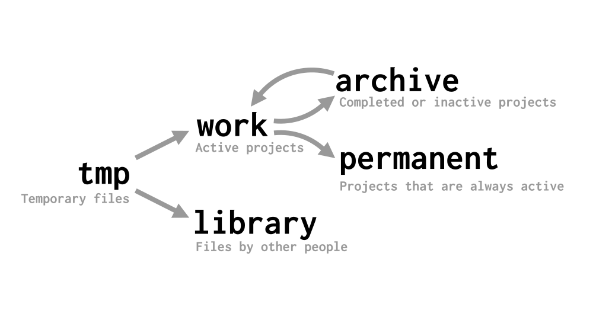

I'd like to describe how I organize my home directory, because I have tried a few different things in the past, and found an approach which works for me exceptionally well. It has a relatively flat hierarchy, doesn't require much categorization, and makes it unambiguously clear where files go.

## Motivation

For many years, I've kept my files in the following way: On the top level, I had directories which specified the file type of its contents, like `videos`, `text`, `code`, `svg` or `templates`. This is the default structure suggested by operating systems like Windows and macOS, which even create folders like *Documents*, *Music* or *Pictures* when creating new user accounts.

I was unhappy with this structure for a number of reasons. For starters, I couldn't tell the status of my files. I had no overview of what I was working on, and which projects were finished. And I couldn't tell which projects were decades old, and which were really recent. Also, there was no separation between random files I found on the Internet, and my own work.

Relatively fast, I settled on "project directories", that is, I kept each project in its own directory. This was partly because I like to use Git to version control software and text, but also because it seemed to give better modularity and isolation - it made it unambigiously clear which files belonged together, and which project they belonged to. Project directories are always moved as a whole. Even small "projects", like a letter or a single drawing, are put into their own project directories.

## High-level structure

I have five base directories, which have different purposes, and I'll go over each of them in detail in the following sections. To give you an overview, here is how files can be moved between them:

And here's the structure of their contents:

- **work** (projects I am working on right now)
    - project1
    - project2
    - ...
- **permanent** (projects that are always active)
    - wiki
    - homepage
    - mail
    - ...
- **archive** (completed and inactive projects get moved here)
    - 2017
        - code
            - project1
            - project2
        - art
            - ...
        - texts
        - uni
        - photos
    - 2016 (same structure as above)
    - ...
- **library**
    - music
    - books
    - papers
    - ...
- **tmp** (temporary files)

## **tmp**

This is where most files start their life. Downloads go here, and if it's worth keeping them, they get moved to **library** later. Sometimes, I also start experimental projects here, before they get moved to **work**. The idea is that this folder can be wiped regularly, without losing anything of value.

If this seems to simplistic to you, Leah has a [much more advanced setup](http://chneukirchen.org/blog/archive/2006/01/keeping-your-home-clean-with-mess.html) for managing her "mess".

## **work**

Each currently active project is a subdirectory of **work**.

I used to call this directory **projects**, but changed the name later so that it doesn't start with the same letter as **permanent**, to make tab completion faster. :D

When I'm bored, I simply look around in **work**, choose one of the projects inside, and start working on that. When I see a project that I haven't worked on for a few days of weeks, or when a project is finished, I move it into **archive**.

## **permanent**

This directory contains projects that are always active. Currently, these are the following:

- `wiki`: My personal wiki, [based on Vimboy](/keeping-a-personal-wiki/)
- `homepage`: This site, [based on nanoc](/how-to-blog-with-nanoc/)
- `nom`: My personal [caloric intake tracking and weight loss assistant](https://github.com/blinry/nom)
- `mail`: All ingoing and outgoing mail, synced with [offlineimap](http://www.offlineimap.org)
- `pkgbuilds`: Software packages for the *Arch User Repository*.

## **archive**

Completed or inactive projects get moved here. This is the most structured directory in the system; its hierarchy has two layers:

On the top level, everything is ordered by year of last modification. This makes it easy to tell what's really old and what's recent. This also allows me to move older years to external drives, but until now, this hasn't been necessary.

And inside each of these year directories, I sort the projects by type, like `code`, `art`, `texts` or `photos`.

## **library**

This directory has a strict rule: It must not contain anything I created. It's a loose collection of files I like to have around for entertainment or information purposes. This directory is structured like default home directories: It has subfolders, classifying files by their type. Examples: `books`, `music`, `papers`, `wallpapers`, `pics`, `sounds`.

## Summary

Here's a one-table overview of my system:

name          | structure                 | created by | status
--------------|---------------------------|------------|---------
**tmp**       | (chaotic)                 | everyone   | temporary
**work**      | `project-name/`           | me         | active
**permanent** | `project-name/`           | me         | permanent
**archive**   | `year/type/project-name/` | me         | done or inactive
**library**   | `type/(subtype/)`         | others     | reference

To find old projects, I have a script called **archive**, which lists project directories with matching names:

    find ~/archive -maxdepth 4 -type d -iname "*$1*"

## Future

I'm pretty happy with this system, and I've been using it for about 5 years now. One thing I've considered changing is to remove the year-type classification inside the **archive** directory. Having a flat structure would make it even easier to retrieve old projects. The downside is that photo projects can no longer clearly be differentiated, and that there could be name collisions – what is now `archive/2016/photos/japan` would need to become `archive/japan-photos-2016` or something. For all other projects, it would probably work better.
