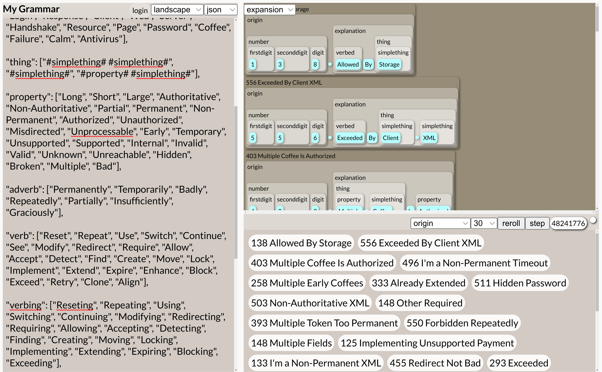

For some reason, this bot is consistently funny to me! 😂 

This bot is powered by the text generation engine [Tracery](https://tracery.io), and hosted on *Cheap Bots, Done Quick!*, where you can also find its [source code](https://cheapbotsdonequick.com/source/httpcodesbot)! To read it, start from the "origin" text at the bottom, and work your way up through the tokens which are expanded recursively!

- Twitter version: [@httpcodesbot](https://twitter.com/httpcodesbot)
- Mastodon version: [@httpcodesbot@botsin.space](https://botsin.space/@httpcodesbot)
