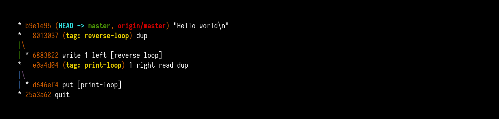
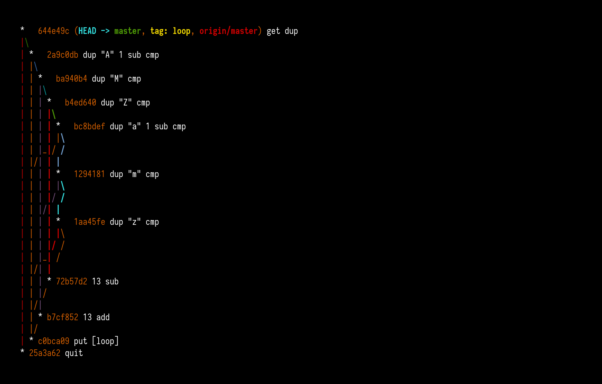

Ever since I gave [that talk](/esolangs/) about esoteric programming languages, I wanted to create my own one. Well, some years later, at the [Recurse Center](/rc-month-1/), I wanted to learn how to build compilers with LLVM, so that seemed like a good opportunity to try that! Presenting:

Programs written in *legit* are defined entirely by the graph of commits in a Git repository. The content of the repository is ignored.

*legit* is designed so that all relevant information is visible when running `git log --graph --oneline`. For example, here is "hello world":

Thanks to [rohieb](http://rohieb.name) for the original idea! Influences for the design of this language include [Folders](https://esolangs.org/wiki/Folders), [Befunge](https://esolangs.org/wiki/Befunge), [Brainfuck](https://esolangs.org/wiki/Brainfuck), and [Elymas](https://github.com/Drahflow/Elymas).

A fun consequence of programs defined by a Git history is that you can't properly track versions, because they already *are* Git repositories. All you can do is force-push a new version to GitHub.

You can find implementations of *legit*, as well as some example programs, on GitHub: <https://github.com/blinry/legit>. The entry in the Esolang wiki is at <https://esolangs.org/wiki/Legit>.

Here's how the language works:

## Memory

In each *legit* program, two data structures are available: A stack, and a brainfuck-like endless tape, with a head moving on it. Both hold signed integers.

## Control flow

Execution starts at the commit pointed to by the master branch. Commit messages can contain a series of instructions, seperated with spaces, which are executed one by one. Only the first line is considered, so lines after that can be used for comments.

- If a commit has only one parent, execution will continue there after executing all instructions in the current commit.
- If a commit has multiple parents (numbered 0, 1, 2, ...), the top stack element will be popped. If that element is n, to go n-th parent, or to the last one, if n is outside of the available range.

## Instructions

For all instructions, popping from the empty stack will return a value of 0.

Control flow:

- `[<tag>]`: jump to the specified Git tag. For example, `[loop]` will jump to the tag *loop*.
- `quit`: stop the program.

I/O:

- `get`: read a char from standard input and place its ASCII value on the stack. On EOF, push a 0.
- `put`: pop top stack value and write it to standard output as a char. The value is always truncated to an unsigned byte.
- `<Number>`: push the specified integer on the stack. For example, `42` will push the value 42.
- `"<Letters>"`: unescape string, then push the individual ASCII characters on the stack. For example, `"Hi\n"` will push the numbers 72, 105, and 10.

Stack operations:

- `dup`: duplicate top stack value
- `pop`: pop top stack value and discard it
- `add`: pop two topmost stack values, add them, push result on the stack
- `sub`: pop two topmost stack values, subtract top one from bottom one, push result on the stack
- `cmp`: pop two topmost stack values, pushes 1 if bottommost one is larger, 0 otherwise

Tape operations:

- `read`: place value of current tape cell on the stack
- `write`: pop top stack value and write it to the current tape cell
- `left`: pop top stack value, move tape head left for that many places
- `right`: pop top stack value, move tape head right for that many places

## Examples

I'll be honest with you: I got tired of writing Git commands by hand to create *legit* programs. One consequence of the execution going top-down is that you have to write your programs backwards, and each time I'd make a typo, I'd have to start all over, because the commits above that would be invalidated. So... I started to write shell scripts, which would then generate my *legit* programs. You can generate the examples like this:

    make -C examples

Alternatively, you can also clone them directly from GitHub:

[`hello`](https://github.com/blinry/legit-hello), a simple hello world program:

[`rot13`](https://github.com/blinry/legit-rot13), a [ROT13](https://en.wikipedia.org/wiki/ROT13) implementation:

[`brainfuck`](https://github.com/blinry/legit-brainfuck), a fully-functioning [Brainfuck](https://en.wikipedia.org/wiki/Brainfuck) interpreter, conveniently proving that *legit* is Turing complete!

## Implementations

[The repository](https://github.com/blinry/legit) provides both an interpreter (better suited for development and debugging purposes) and a compiler (which produces highly efficient binaries).

For both, you'll need Ruby, and the "rugged" Gem:

    gem install rugged

### Running the interpreter

To execute a program, run

    ruby interpreter.rb examples/hello/

### Running the compiler

The compiler compiles a *legit* program to [LLVM IR](https://llvm.org/docs/LangRef.html). You can then use LLVM tools to build binaries for all plaforms where you have a C standard library available (*legit* will be linked with `exit`, `getchar` and `putchar`).

First, run the compiler to create a *.ll* file:

    ruby compiler.rb examples/hello/

And then, run a tool like `clang` to optimize it and produce a binary:

    clang -O3 hello.ll -o hello

As an alternative to the second step, you can use the provided Makefile and simply run `make hello`.

## The final challenge

So, after I had written that Brainfuck interpreter, I thought would be the final milestone for my language. But then, Kate-Laurel sat down next to me and asked: "Could you write a quine?"

So this is the challenge I now give to you, dear reader: Write a *legit* program that prints the Git commands required to create itself! Good luck.
