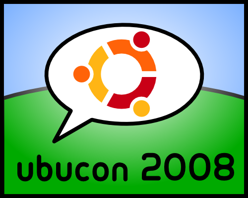
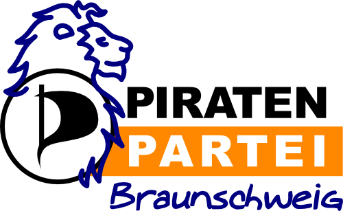

*Ich gestalte gerne Logos, für Wettbewerbe und für den Eigenbedarf. In dieser Gallerie stelle ich vier davon vor.*

Die Logos habe ich mit dem Vektorgrafik-Programm [Inkscape](http://www.inkscape.org/?lang=de) erstellt.

Zwei Logos für die Ubucon 2008. Die Ubucon ist eine Konferenz über *Ubuntu*, eine Linux-Distribution. Entstanden im August 2008.

Logo für das Abi-Shirt meines Jahrganges. Und nein, das Motto war nicht meine Idee. Entstanden im Mai 2009.

Mein Vorschlag für das Logo der Braunschweiger Piraten. Entstanden Ende Juli 2010.
