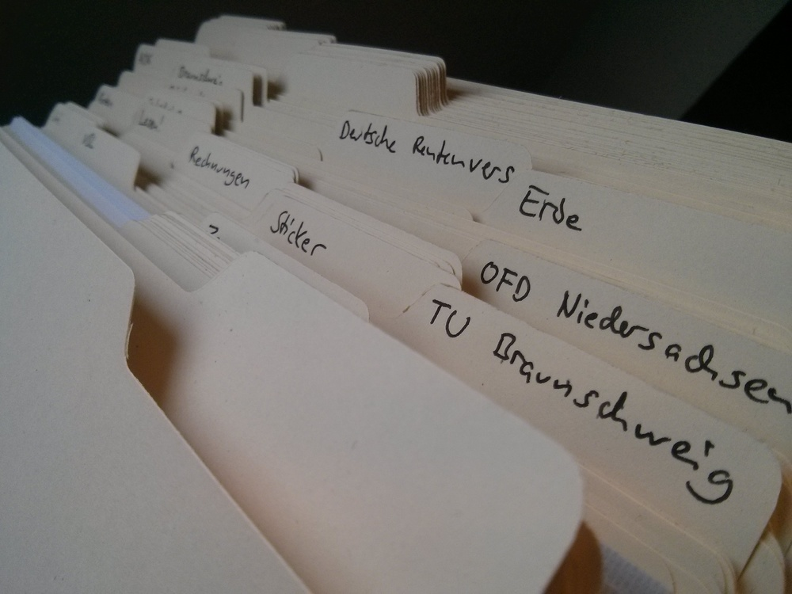

*I've previously written about [how I manage digital notes](/keeping-a-personal-wiki/). This article is about my approach to organizing and storing physical paper documents.*

Granted, this sound like an incredibly boring, bureaucratic topic, but this is a personal story of disentanglement and simplification. Wait and see :-)

Approximately two years ago, I got really into minimalism. The principle of only owning things which are useful, beautiful or important resonates with me strongly. After all, one of my favorite quotes is the following by Antoine de Saint Exupéry:

> It seems that perfection is attained not when there is nothing more to add, but when there is nothing left to remove.

My occupation with minimalism (last but not least via the lovely [minimalism subreddit](https://www.reddit.com/r/minimalism/)) led to simplifications in various parts of my daily life. At one point, I decided it was time to evaluate different approaches to storing paper documents. So, what's there?

## Ring binders

In Germany, it's very common to store documents in *ring binders* ("Aktenordner"). You punch some holes in your documents (or put them in punched pockets), tug them away in the binders, and fixate all pages with a clip.

For many years, I did exactly that. I adopted this system from my parents, and put my documents into four different binders, categorized by labeled separator sheets with tabs.

I always hated this system. Here's the workflow to file a new document:

1. Find the correct binder, heave it out of the shelf, put it on a free surface.
2. Open the binder, remove the clip which holds the pages at the bottom of the binder, open the correct section.
3. Flip a lever to open the rings.
4. Punch holes into your document (or fumble it into a pocket) and put it on those rings.
5. Do steps 3.-1. in reverse.

This process sucks: It takes a lot of time, is boring and repetitive, and often led to me not filing documents at all (which then accumulated in the most durable structure in the known universe: *stacks*). So, let's look for better alternatives.

## Suspension files

Yeah, suspension files are the way to go, right? Turn your ring binders by 90 degrees, split the documents into separate vertical folders, and hook them onto a pair of rails! You can them access the individual folders directly from the top and insert new ones as needed. 

This system was often suggested to me in various self-management books I read in my childhood, I even tried such a system for a few weeks. I didn't like them for two reasons: Their whole construction seems unnecessarily complex; and their plastic tabs take away a lot of space, even when there's just one document inside. Your mileage may vary, but they are not for me.

## Manila folders

In [The Power of Less](http://thepowerofless.com/book/) (a book whose content, in my opinion, is so trivial that I gave it away immediately after reading it - quite ironic ;-), Leo Babauta recommended "manila folders" for filing documents. They also seem to appear a lot in the context of the *Getting Things Done* method. I had never heard that term before, but for everyone who has used a graphical computer file managers, manila folders look very familiar:

They are open at the sides and at the top, and are designed to hold a collection of loose papers. You can label the tabs, and then put many of them in a box (the German term is "Einstellmappen").

I present to you: The manila folder workflow for filing a new document:

1. Find the correct folder and hold it open.
2. Drop your document into it. (I usually insert new documents at the front, so they are mainly chronologic, but I don't care that much.)

That's it! Not much room for improvement, and it could hardly get any simpler - mission accomplished!

## My concrete implementation

In Germany, there are two commercial distributors for similar folders: [MAPPEI](http://www.mappei.de) and [Classei](http://www.classei.eu/). Their systems cost a fortune, but might suit you. I knew I wanted cheaper, simpler folders with fixed tabs like those depicted above.

After searching for manila folders in virtually all office stores in my home city to no avail, I finally turned to Amazon Germany, and found the [Leitz 2434-00-11 folders](http://www.amazon.de/Leitz-Einstellmappe-2434-00-11-chamois-Inh-100/dp/B000KT6WI0/), which seemed pretty, durable, and currently cost about 31 ct per piece. They have five slots for fixed tabs, and come in batches of 100 pieces, 20 of each tab position.

Ready for some technical details? The folders are 304 mm wide and 200 mm high (210 mm with tabs). The paper weighs 205 g/m² (the description on the Amazon page is contradictory there), which seems like a good compromise between robustness and thickness. One folder is about 0.8 mm thick.

As I couldn't find a matching box to put the folders into right away ([this one](http://www.amazon.de/Karteibox-SAMMELBOX-AUFBEWAHRUNGSBOX-Semikolon-Qualität/dp/B005D9FVES/) turned out to be too small :-S), I temporarily settled on a shipping box, cut to a width of 31 cm, a height of 16 cm and a depth of 17 cm. This works perfectly for me. I'm ashamed to admit that this temporary box is still in place after more than a year ;-)

I sort the folders alphabetically, following the schema below. The alphabet starts at the back, so that the beginning of a label is never covered by a neighboring tab. A disadvantage of this ordering is that the frontmost folder covers all other tabs starting with the same letter. But it has the (bigger) advantage that you get a good overview of the full alphabet, in contrast to a "chaotic tab position", where, with some luck, you can see each label, but lose a sense of linear alphabetical ordering.

## Long-term experiences

One year later, I'm still very happy with this system. I don't own ring binders anymore, and never looked back. Over the months, I've added some folders, and removed others. It's quick, easy, and simple and works exceptionally well for me.

I currently use 32 folders. The system contains all important documents; after throwing away many documents I knew I'd never need again, the folders in use are now about 10 cm thick in total. The thickest folder contains about 3 cm of documents, which the system can integrate okayishly, I assume that it gets hard to handle with thicker folders.

These are the things I store in the folders: *certificates, stamps (which is handy!), small gifts, bills, coupons, uni stuff, contracts, menus of delivery services, stickers, recipes, health-related documents, tax/insurance stuff, maps, address lists, photos, ...*

Two things to look out for are rain and sunlight. The open system is vulnerable to both, so I'd suggest putting it some distance away from windows. (Maybe you can see the small smudges on the labels ;-)

When I have to take documents with me, I use folders [like this](https://en.wikipedia.org/wiki/File:Yellow_folder.JPG).
