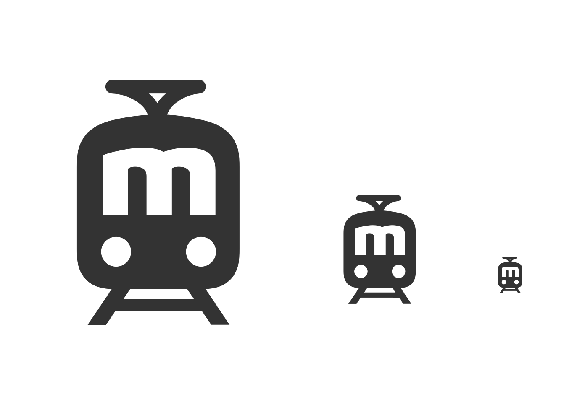

[Marudor](https://twitter.com/marudor) wanted a custom logo for [marudor.de](https://marudor.de), a website providing a plethora of information about trains in Germany!

Here's the logo we ended up with:

Clean SVG [here](marudor.svg), PNG [here](marudor.png), multi-resolution favicon [here](favicon.ico).

## Development

I usually start a logo design with some sketches with ink on paper. Here are some directions I came up with:

We settled on the "letter m" direction, I digitized the sketch and made some variations with different letterforms and different outlines:

Finding a good logo usually involves making *a lot* of variations. This is a playful process I really enjoy, and it usually leads into some hilarious dead ends, like these:

