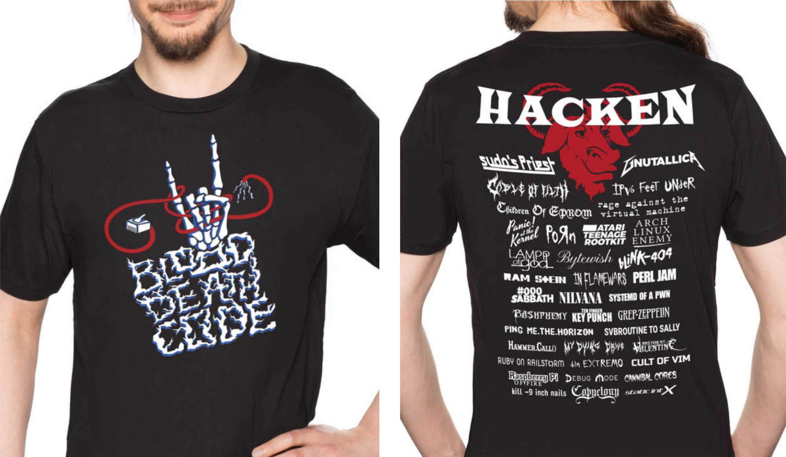
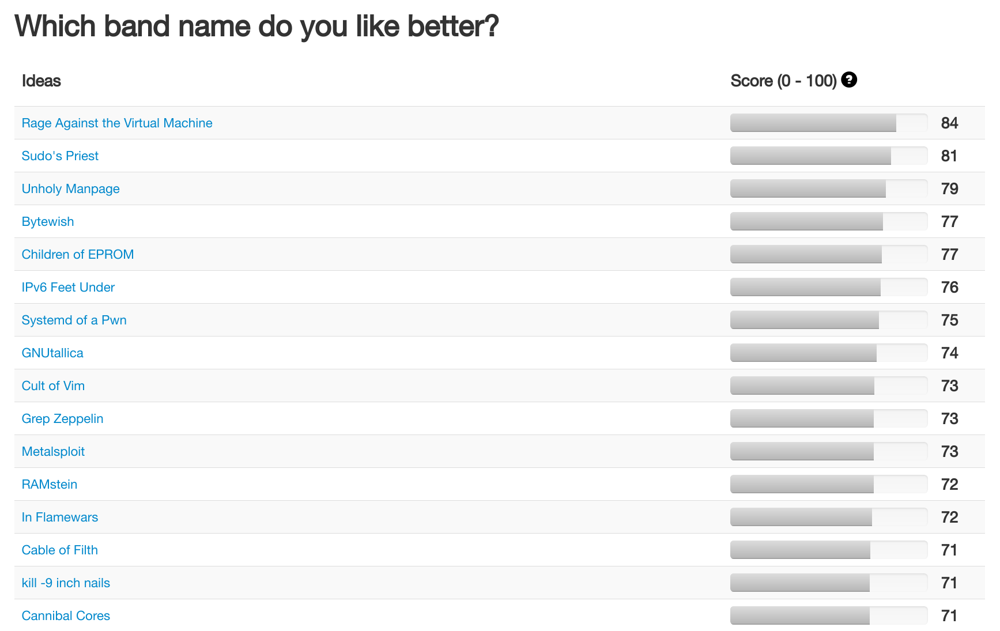

## Want one?

You can get this shirt at [GetDigital](https://www.getdigital.de/Hacken-Open-Air.html?her=BB). It's a collaboration with my good friend [Bleeptrack](https://www.bleeptrack.de/), who designed the front side!

You can also get it as a [hoodie](https://www.getdigital.de/Hacken-Open-Air-Hoodie.html?her=BB) and in a [cut which emphasizes the waist](https://www.getdigital.de/Hacken-Open-Air-Girlie-Shirt.html?her=BB).

## History

In September 2017, Bleeptrack and me had the idea for a festival shirt with nerdy band names on it. We brainstormed a bit, and asked around on Twitter for ideas:

<%= tweet("909410091266449410") %>

<%= tweet("910974109324111873") %>

When we got *a lot* of feedback, we wanted to set up a website where people could vote for their favorite band names, and could contribute new ones. We discovered the open source project *All Our Ideas*, which seemed perfect! We set up a poll, which received over 10000 votes and over 260 total ideas in a few days. Whew! [The results](http://allourideas.org/nerd-metal/results?all=true) were really helpful for us to select band names for the shirt, and to put them in a good order.

When designing the band logos, I made sure to only use fonts with free licenses. Bine drew a front side, and we iterated both sides a bit - thanks to our beta testers!

Initially, we wanted to set up our own on-demand printing shop at *Spreadshirt*, but we discovered that they would not allow parodies at all. So we contacted the nerdy online shop *GetDigital*, who were immediately enthusiastic about our idea. It took a while before the shirt actually went into print, though, because of internal personnel problems, Christmas time, and our complicated, big designs, which meant they had to look for a new contractor to do the actual printing.

But since June 2018, it is finally possible to [buy the shirt](https://www.getdigital.de/Hacken-Open-Air.html?her=BB)! We can't wait to make more like this. Actually, Bleeptrack has created a ton of other awesome shirt designs, [check them out!](https://www.bleeptrack.de/t-shirts/)
