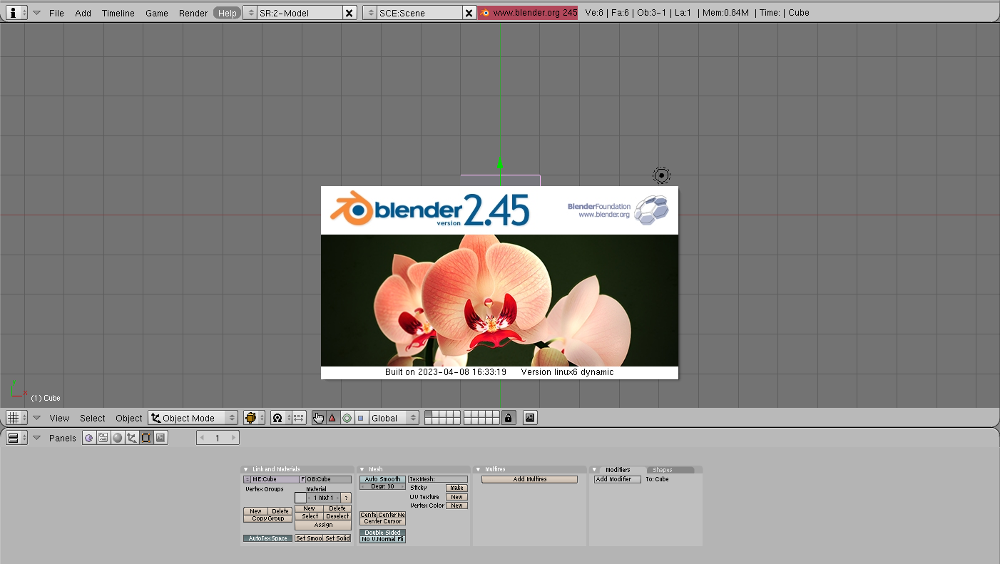
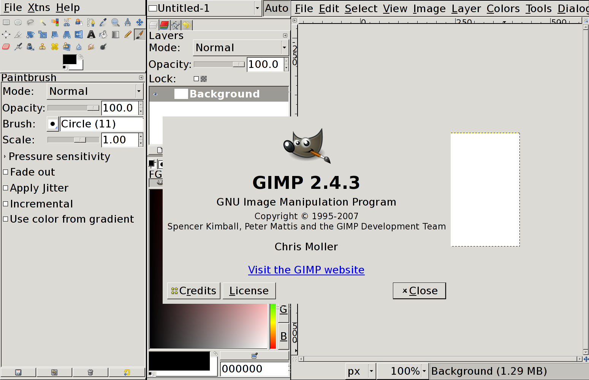

Several people around me have been talking about Nix lately, and say that it's cool. And because I trust those people, I decided to learn a bit about it!

What is Nix? Among other things, Nix is an ecosystem of tools that you can use to **build software in a reproducible way**: Usually, when I try to compile a program, I need to make sure that I have all libraries and other dependencies I need, in the correct versions. With Nix, you can describe exactly which other things a piece of software depends on, and also how to build those.

So I thought: Could we try to build some *really old* software? Like, for example, Firefox from 15 years ago? :D Let's try that, and let's also try to build the graphics programs Blender, Inkscape and GIMP.

## What you will get out of this post

This post is written for two audiences: If you're actually interested in building this old software yourself, and playing around with it, it will show you how to solve some of the problems you'll encounter.

But also, if you're just curious about solving computer problems in a more general sense, this post will show you some methods and tools you can use when attempting to fix bugs yourself!

If you **just want to try these old software versions yourself**, you can use my [modified nixpkgs repository](https://github.com/blinry/nixpkgs), which includes all the described changes I made.

## Blender 2.45 (from 2008)

First, I tried building an old version of the 3D graphics program Blender!

Where do we get software packaged with Nix? There's a giant collection of Nix software packages called *nixpkgs*, living in the Git repository [nixpkgs](https://github.com/NixOS/nixpkgs). As I write this, it has 470,000 commits. 😳 And, [according to Repology](https://repology.org/repository/nix_unstable), it bundles over 90,000 software packages!

I cloned the `nixpkgs` repo, and located the files describing Blender using `fd blender` (a `find`-like tool). They're in `pkgs/applications/misc/blender/`. Let's look at the history of that directory:

    $ git log .
    ...
    commit 5bca69ac34e4b9aaa233aef75396830f42b2d3d7
    Author: Yury G. Kudryashov <urkud.urkud@gmail.com>
    Date:   Wed Jan 30 17:20:48 2008 +0000

        Nix-expr style review

        Unneded args.something replaced with
        args: with args;
        line. After this line args is the only place where we can recieve variables from.

        Also removed several
        buildInputs = [];
        lines.

        svn path=/nixpkgs/trunk/; revision=10415

    commit 8779bd423223b47bf523b1feab0d9cfb3c664f9c
    Author: Yury G. Kudryashov <urkud.urkud@gmail.com>
    Date:   Mon Jan 28 19:39:27 2008 +0000

        Removed unneeded cmake dependency for blender

        svn path=/nixpkgs/trunk/; revision=10332

    commit 30669073d52466f34ac3aca52a1c26ed1a60c9fd
    Author: Marc Weber <marco-oweber@gmx.de>
    Date:   Sat Dec 1 18:05:26 2007 +0000

        blender default.nix

        svn path=/nixpkgs/trunk/; revision=9813

Whoa, the log goes back to 2007! Looks like this used to be an SVN repository, but they imported it into Git. Very cool. And the full repo goes back to 2003! Let's use the `5bca69ac` commit as our base, it's a slighly improved version of the very first Blender package in the nixpkgs. We can check out this commit, change into another directory and try a build.

The following command tells Nix to build the `blender` package, according to the Nix source code currently located in `path/to/nixpkgs`:

    $ nix-build path/to/nixpkgs -A blender

### Problem 1: Couldn't resolve host 'nix.cs.uu.nl'

    error: builder for '/nix/store/0ri9g54hbni4x7xrid45a2n195bb6p1i-glibc.tar.bz2.drv' failed with exit code 6;
           last 3 log lines:
           > downloading /nix/store/vkkr1r2gdldn0j9l8vm9csl01mip3ky6-glibc.tar.bz2 from http://nix.cs.uu.nl/dist/tarballs/stdenv-linux/x86_64/r6905/glibc.tar.bz2
           >
           > curl: (6) Couldn't resolve host 'nix.cs.uu.nl'

Nix tries to download some source code from a domain that doesn't exist anymore. It's the source code of an old version of glibc, the GNU Project's implementation of the C standard library. Nix needs to build it because Blender depends on Python, Python needs to be built using gcc, and gcc depends on glibc.

The domain *nix.cs.uu.nl* might've belonged to the computer science department of the University of Utrecht? Yeah, it's archived in [the Wayback Machine](https://web.archive.org/web/20071210212217/http://nix.cs.uu.nl/):

[This page in the NixOS wiki](https://nixos.wiki/wiki/Building_ancient_nixpkgs) suggests that to resolve the issue with the broken domain, you could replace the references to those URLs with the more modern mirror `tarballs.nixos.org`.

For this project, the only file where I needed to do this replacement was `pkgs/build-support/fetchurl/mirrors.nix`:

    hashedMirrors = [
      http://tarballs.nixos.org
    ];

## Problem 2: More missing source files

Here's what happens when we try to run the `nix-build` command again:

    downloading file curl-7.17.1.tar.bz2 with sha256 hash 0yz50r75jhfr2ya6wqi6n90bn4ij30299pjglmlckzq6jp28wrkz...

    trying http://curl.haxx.se/download/curl-7.17.1.tar.bz2
      % Total    % Received % Xferd  Average Speed   Time    Time     Time  Current
                                     Dload  Upload   Total   Spent    Left  Speed
    ^M  0     0    0     0    0     0      0      0 --:--:-- --:--:-- --:--:--     0^M  0     0    0     0    0   >
    curl: (1) libcurl was built with SSL disabled, https: not supported!
    error: cannot download curl-7.17.1.tar.bz2 from any mirror

Okay, even with the updated mirror, some other URLs where you could download the source code of programs also have stopped working. I learned that if you find other sources for the programs, you can add them to the Nix store using `nix store add-file <file>`, and Nix will happily take them, as long as the hash is the same.

Often, plugging broken links into the [Wayback Machine](https://archive.org/web/) worked well! I needed to download the following sources for missing files:

- [curl-7.17.1.tar.bz2](http://web.archive.org/web/20100825041424/http://curl.haxx.se/download/curl-7.17.1.tar.bz2)
- [Python-2.5.1.tar.bz2](http://web.archive.org/web/20191215101910/http://www.python.org/ftp/python/2.5.1/Python-2.5.1.tar.bz2)
- [blender-2.45.tar.gz](http://web.archive.org/web/20230312114801/https://download.blender.org/source/blender-2.45.tar.gz)
- [openal-soft-1.1.93.tar.bz2](http://web.archive.org/web/20171015183058/http://kcat.strangesoft.net/openal-releases/openal-soft-1.1.93.tar.bz2)
- [cmake-2.4.7.tar.gz](http://web.archive.org/web/20151020051501/http://www.cmake.org/files/v2.4/cmake-2.4.7.tar.gz)
- [fontconfig-2.4.2.tar.gz](http://web.archive.org/web/20220226170444/https://www.freedesktop.org/software/fontconfig/release/fontconfig-2.4.2.tar.gz)
- [libxml2-2.6.30.tar.gz](http://xmlsoft.org/sources/old/libxml2-2.6.30.tar.gz)

In [my modified nixpkgs repo](https://github.com/blinry/nixpkgs), I already replaced the specified URLs, so you won't have to download them manually.

## Problem 3: Impurity in Python package

Let's try to run the `nix-build` command again!

    error: builder for '/nix/store/zpnw9n45d92fj28bqprqdfws1fhxhfgq-python-2.4.4.drv' failed with exit code 1;
    python$EXE ../../Tools/scripts/h2py.py -i '(u_long)' /usr/include/netinet/in.h
    Traceback (most recent call last):
      File "../../Tools/scripts/h2py.py", line 175, in ?
        main()
      File "../../Tools/scripts/h2py.py", line 75, in main
        fp = open(filename, 'r')
    IOError: [Errno 2] No such file or directory: '/usr/include/netinet/in.h'
    make: *** [Lib/plat-linux6] Error 1

During the build process, Nix tries to access the path `/usr/include/netinet/in.h`, but it's not there! It can't find it because builds happen in isolated "sandboxes", which only have the things which the package explicitly specified. If builds try to access things from the outside, they would no longer be reproducible, because those outside things could be different on different computers.

I searched the nixpkgs commits for a reference to that file, and found this commit from 2013:

    commit 723d5a5581a1ec4dc32eec3b197abb49def666e2
    Author: Florian Friesdorf <flo@chaoflow.net>
    Date:   Wed Jan 9 08:26:15 2013 +0100

        fix python-2.6 build: purity for systems with stdenv.gcc.libc

        On other systems python26 will continue to look for
        /usr/include/netinet/in.h among others. I don't know whether/what to
        do about that.

That commit introduces a patch that substitutes a couple of references to `/usr/include` with `${stdenv.gcc.libc}/include/`, a path that's now dependent on the package's inputs. I added this to the `preConfigure` step of the `python/2.4.nix` file:

    for i in Lib/plat-*/regen; do
      substituteInPlace $i --replace /usr/include/ ${stdenv.gcc.libc}/include/
    done

I backported those lines into the python package from 2008, and it would now successfully build, yay!

When I continued the build, I discovered that, in addition to Python 2.4.4, Nix would also try to build Python 2.5.1. It's probably a dependency of another of Blender's dependencies? The same fix helped here, too. \o/

## Problem 4: OpenAL has no Makefile

I tried running the `nix-build` command again...

    error: builder for '/nix/store/60sysjw0cnm48q2a3vdwzaaczpmvnwpv-openal-soft-1.1.93.drv' failed with exit code 1;
           last 10 log lines:
           > openal-soft-1.1.93/OpenAL32/alThunk.c
           > openal-soft-1.1.93/OpenAL32/alBuffer.c
           > openal-soft-1.1.93/openalrc.sample
           > source root is openal-soft-1.1.93
           > configuring
           > no configure script, doing nothing
           > building
           > make flags:
           > make: *** No targets specified and no makefile found.  Stop.
           >

Nix complains that the source code of OpenAL (an audio library) has no makefile. (A makefile is something like a recipe for building software.) And indeed, when I looked at version 1.1.93, it only had a *CMakeLists.txt* file, which is related to the CMake buildsystem. I knew that running `cmake .` would generate a makefile. Nix has a "default builder", which knows how to build typical projects.

I would've expected that this default builder would know about CMake, but surprisingly, running `rg cmake` in the whole nixkpgs only yielded about 10 packages where it was mentioned. Maybe it was not a big thing back then?

So, how would I add a step that would run `cmake` before the rest of the building continues? After some googling, the answer was adding these lines to the OpenAL package:

    configurePhase = "cmake . -DCMAKE_INSTALL_PREFIX=$out";

### Problem 5: linux6-config.py doesn't exist

So, we run the `nix-build` command again! I got my favorite error in this series:

    error: builder for '/nix/store/69sa0wgax1ijd7pw7cdq6xi4dyzib2pq-blender-2.45.drv' failed with exit code 2;
           last 10 log lines:
           >   BF_OPENEXR_LIBPATH = /nix/store/4vdd02llb0gs4jk2pv5kfcrmp5z2hr87-openexr-1.4.0/lib
           > Command-line targets
           >       No targets given, using default
           > config/linux6-config.py doesn't exist
           > user-config.py not found, no user overrides
           >
           > scons: *** Error converting option: WITH_BF_OPENAL
           > Invalid value for boolean option:
           > File "SConstruct", line 171, in ?

This stumped me for a while, and I was looking at the wrong places. I tried setting the `WITH_BF_OPENAL` variable to different values, but eventually I realized that the error was trying to tell me something else: There was no `config/linux6-config.py` file. My guess was that this file would set a bunch of different things, depending on the operating system. I'm using Linux kernel version 6.2.9 currently. So, what other configuration files are there? I extracted the source code of Blender 2.45, and was amused to realize that the most "modern" configuration was in a file called `config/linux2-config.py`. I guess the the Blender developers back then didn't think Linux kernel versions would ever start with a 6? :D

The platform was being set in the *SConstruct* file, so the most direct thing I could think of was to force it to always be "linux2". I added this line to the beginning of the `buildPhase` string in the Blender package, which performs that substitution:

    sed -i -e \"s/^platform.*$/platform = 'linux2'/\" SConstruct

Now, when running `nix-build`, Blender actually compiled, and I ended up with a binary, wheeee! Or, as the included README puts it: "Welcome to the world of Blender!"

## Problem 6: X_GLXCreateContext fails

We have a binary, let's run it:

    $ ./result/bin/blender
    Checking for installed Python... got it!
    X Error of failed request:  BadValue (integer parameter out of range for operation)
      Major opcode of failed request:  152 (GLX)
      Minor opcode of failed request:  3 (X_GLXCreateContext)
      Value in failed request:  0x0
      Serial number of failed request:  29
      Current serial number in output stream:  30

Oh. When I saw this error, I immediately knew that this would be a hard one to solve, because I know so little about graphics drivers. GLX is the OpenGL extension of the X Window System, so it's used to display 3D things in graphical applications on Linux.

Usually, when I got these types of GLX errors, the solution was to update whatever I tried to run, or to reboot. But I had never really understood what was going on here, and I had no idea on how to debug it. I [asked for help on Mastodon](https://chaos.social/@blinry/110145358329944298), and jix had a couple of ideas.

- Compile the offending program and its dependencies with debug symbols. (Never figured out how to do that in a way that wouldn't take a lot of work.)
- Run it in gdb (the GNU debugger) and see where exactly it crashes.
- Enable the indirect rendering mode in Xorg (I tried this, but then Blender crashed Xorg.)

Other approaches I tried:

- Use [nixGL](https://github.com/guibou/nixGL) as a wrapper (it sets some environment variables in a wrapper script, which fixes modern OpenGL programs built with Nix in a way I don't understand).
- Boil down an OpenGL example program to only leave the lines that reproduce my crash.
- Use [xtruss](https://www.chiark.greenend.org.uk/~sgtatham/xtruss/) to trace calls into the X Server (didn't give me new information).

I talked to jix again a few days later, and they suspected that the easiest workaround would be to fall back to a way of rendering 3D graphics that wouldn't go through a graphics card, and instead, just be a software implementation of OpenGL. This would be slow, but it might avoid some incompabilities between my modern X Server/graphics driver, and old 3D software.

They came up with the fix to build the mesa library (an open source implementation of the OpenGL API, which talks to graphics cards) in a way where it would only use software rendering: Replacing the "linux-dri-x86-64" target in the mesa package with "linux-x86-64". This seems to remove the "Direct Rendering Interface" capabilities.

### Success!

After rebuilding using `nix-build`, we can now finally run Blender! <3

Sweet, sweet nostalgia! Of course, there already was default cube in the scene back then. And you had to right-click to select objects by default...

## Inkscape 0.45 (from 2008)

Another program I started using a lot 15 years ago is the vector graphics program Inkscape.

### Problem 1: Missing source files

When running `nix-build path/to/nixpkgs -A inkscape`, I encountered a similar error as before, where two source files were not present at their original locations anymore. I downloaded alternatives from these URLs:

- [inkscape-0.45.1.tar.gz]()
- [gc-7.0.tar.gz]()

### Problem 2: Segmentation fault

That gives us a binary. Let's try to run it:

    $ ./result/bin/inkscape

    Emergency save activated!
    Emergency save completed. Inkscape will close now.
    If you can reproduce this crash, please file a bug at www.inkscape.org
    with a detailed description of the steps leading to the crash, so we can fix it.
    fish: Job 1, './result/bin/inkscape' terminated by signal SIGSEGV (Address boundary error)

That doesn't sound very good. SIGSEGV is a signal related to a "segmentation violation", which happens when a program tries to write to memory outside of its allowed regions. I tried using various tools to inspect the coredump, but didn't get very far.

Maybe we can run a debugger and see more detail about what happened? Let's use the GNU debugger:

    $ gdb ./result/bin/inkscape
    Reading symbols from ./result/bin/inkscape...
    (No debugging symbols found in ./result/bin/inkscape)

No debugging symbols, okay... let's try it anyway:

    (gdb) run
    Starting program: /nix/store/vx7f9ihpd7ahvgp8x17c0plqddwz35hc-inkscape-0.45/bin/inkscape

    Program received signal SIGSEGV, Segmentation fault.
    0x00007ffff54e523a in translate_array () from /nix/store/4shfp39ixrjz7riga3n26v53arb0vwpc-freetype-2.3.1/lib/libfreetype.so.6

This is the same crash as before, but now we can try to print a backtrace:

    (gdb) bt
    #0  0x00007ffff54e523a in translate_array () from /nix/store/4shfp39ixrjz7riga3n26v53arb0vwpc-freetype-2.3.1/lib/libfreetype.so.6
    #1  0x00007ffff54e9134 in load_truetype_glyph () from /nix/store/4shfp39ixrjz7riga3n26v53arb0vwpc-freetype-2.3.1/lib/libfreetype.so.6
    #2  0x00007ffff54e99cf in Load_Glyph () from /nix/store/4shfp39ixrjz7riga3n26v53arb0vwpc-freetype-2.3.1/lib/libfreetype.so.6
    #3  0x00007ffff54dda41 in FT_Load_Glyph () from /nix/store/4shfp39ixrjz7riga3n26v53arb0vwpc-freetype-2.3.1/lib/libfreetype.so.6
    ...

I'm not sure how this works so well without debugging symbols, but yay!

Huh, so the crash happened somewhere in a "load glyph" function. One very neat tool to see more about what a program does is called `strace`, which prints all system calls the program does in the Linux kernel. You can see which files it accesses, for example. Let's try it:

    $ strace ./result/bin/inkscape
    ...
    stat("/usr/share/fonts/handjet/Handjet[EGRD,ESHP,wght].ttf", {st_mode=S_IFREG|0644, st_size=372832, ...}) = 0
    open("/usr/share/fonts/handjet/Handjet[EGRD,ESHP,wght].ttf", O_RDONLY) = 6
    fcntl(6, F_SETFD, FD_CLOEXEC)           = 0
    fstat(6, {st_mode=S_IFREG|0644, st_size=372832, ...}) = 0
    mmap(NULL, 372832, PROT_READ, MAP_PRIVATE, 6, 0) = 0x7f217ef13000
    close(6)                                = 0
    brk(0x2f50000)                          = 0x2f50000
    ...
    --- SIGSEGV {si_signo=SIGSEGV, si_code=SEGV_MAPERR, si_addr=0x7f217ec1b000} ---
    +++ killed by SIGSEGV (core dumped) +++
    fish: Job 1, 'strace ./result/bin/inkscape' terminated by signal SIGSEGV (Address boundary error)

Interesting, the font library that Inkscape uses tries to load various fonts installed on my system... and crashes after opening one called [Handjet](https://github.com/rosettatype/handjet), that seems to be a very fancy variable font with multiple parameters? Maybe the Fontconfig from 2008 isn't able to handle it?

Let's, um, "fix" this problem by moving the font somewhere else:

    $ sudo mv /usr/share/fonts/handjet/ /root

### Success!

## Firefox 2.0.0.11 (from 2008)

Another program I wanted to build is Firefox.

    $ nix-build path/to/nixpkgs -A firefox

### Problem 1: No rule to make target Linux6.2.mk

    error: builder for '/nix/store/dkdxljpvhdr2bn3i5cvpj5p9fy50hwpr-firefox-2.0.0.11.drv' failed with exit code 1;
           last 10 log lines:
           > building ../coreconf/Linux6.2.mk
           > /nix/store/36sp3r35nxhhj5m83bxsvf7xqgdrhz1l-gnumake-3.81/bin/make -j1: *** No rule to make target ../coreconf/Linux6.2.mk.  Stop.
           > make[3]: *** [../coreconf/Linux6.2.mk] Error 1
           > make[3]: Leaving directory `/build/mozilla/security/coreconf'
           > make[2]: *** [.nss.cleaned] Error 2
           > make[2]: Leaving directory `/build/mozilla/security/manager'
           > make[1]: *** [tier_50] Error 2
           > make[1]: Leaving directory `/build/mozilla'
           > make: *** [default] Error 2
           >

This is a similar problem like we've encountered before with Blender: The build process didn't expect there to be a Linux kernel version more modern than version 2.6. I solved this by applying [ckie's solution](https://github.com/ckiee/nixpkgs/commit/4fe9b9f046295a3a76315e2910ca03dfc3a0e466), which just copies over a config file for version 2.6. I added this to `firefox/builder.sh`:

    patchPhase() {
        if test -z "$patchPhase" -a -z "$patches"; then return; fi
        header "patching sources"
        startLog "patch"
        patchW
        stopLog
        stopNest
        cp security/coreconf/Linux2.6.mk security/coreconf/Linux6.2.mk
    }

### Success!

"Congrats! You're using the latest version of Firefox! An **even newer** Firefox is available." 😂

Firefox uses the codename "Bon Echo" here, I think Mozilla didn't allow binary distributions using the original Firefox branding back then...

For some reason, Firefox showed "Server not found" errors for all websites I tried to visit, until I configured a Proxy server (under Edit -> Preferences -> Advanced -> Network -> Connection -> Settings). I just installed and started `mitmproxy`, and used `127.0.0.1:8080` as the proxy.

I couldn't access blinry.org, I think the allowed SSL algorithms are too new for Firefox 2.0...

## GIMP 2.4.3 (from 2008)

After all fixes from before, this one "just worked":

    $ nix-build path/to/nixpkgs -A gimp

Today's GIMP still uses the same icon set!

## Closing remarks

This was fun! Trying to build old software allowed me to get some pretty deep insights into various parts of Nix. So many different errors...

One thing I still would like to try is building a full GNOME desktop (version 2.16). There is a `pkgs/desktops/gnome` directory, but the support seems very rudimentary, only packaging the window manager *metacity*, the *gnome-panel*, *gnome-terminal*, and a couple of helper libraries... other components, like a GNOME settings program, don't seem to be packaged, so I'm not sure how to get started. The "operating system" related things used to live in the [nixos](https://github.com/NixOS/nixos) repo back then, before it was merged into *nixpkgs*, so maybe there's something in there?

Other open questions:

- What would I need to do to have 3D-accelerated graphics in Blender?
- Why can't Firefox 2.0 resolve domain names?
- Why was I able to debug the Inkscape crash, even though it had no debugging symbols?
- Is it possible to "override" Nix derivations from 2008, to fix them in a more elegant way than to modify the *nixpkgs* repo?

## Wanna time travel to 2008 yourself?

Again, I published a [modified nixpkgs repository](https://github.com/blinry/nixpkgs), which **includes all required changes to build an run Firefox, GIMP, Inkscape and Blender from 2008** on my Arch Linux machine in 2023. Give it a try and let me know how it went for you!
