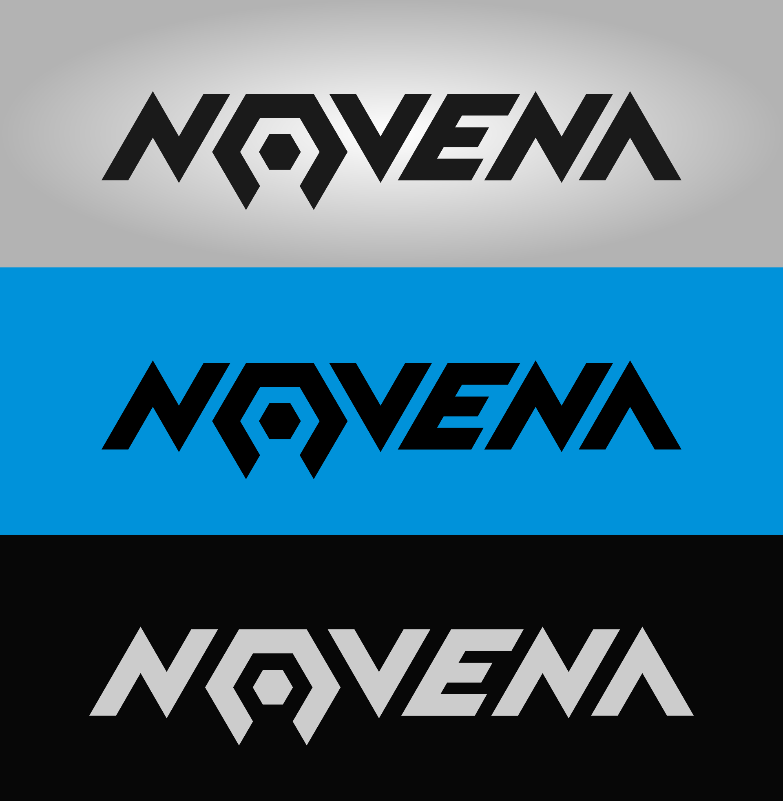

A logo design for the open-hardware computer *Novena*. It was one of [124 logo submissions](https://www.crowdsupply.com/sutajio-kosagi/novena/updates/1087). The "claw" is a reference to the [Open Source Hardware logo](http://www.oshwa.org/open-source-hardware-logo/).

Here are some older designs:

<%= tweet(459690652100341760) %>

<%= tweet(459833474241658880) %>

