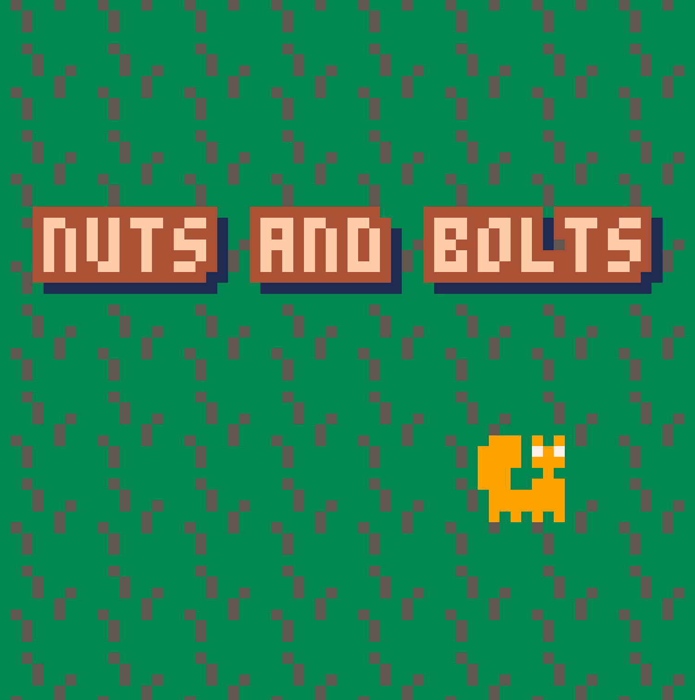

A game for One Hour Game Jam #197, with the theme "misleading title". Done while I was in Brussels for FOSDEM.

My first real game done on the "fantasy console" PICO-8. I was impressed by how quickly you can prototype on that platform! I'm especially proud how juicy this game is, including lots of particle effects and screen shake!

You can [play the game in your browser](play/)!

