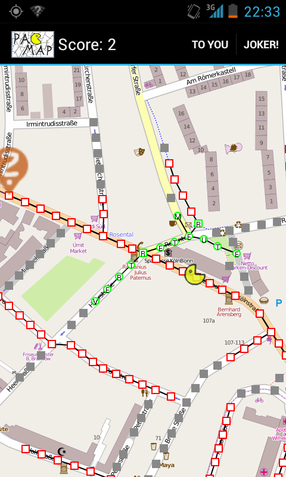

PacMap is a little Android game that combines elements of Geocaching with those of crossword puzzles.

It was written in the beginning of 2012 with Sandra Hesse and Felix Geilert. It’s our contribution to the [informatiCup 2012](http://www.gi.de/wir-ueber-uns/wettbewerbe/informaticup/informaticup-2012.html) competition, where we reached the fourth place.

You can read the (german) documentation and take a look at our talk here:

<%= titlepage("pacmap-ausarbeitung", "Documentation") %>
<%= titlepage("pacmap-vortrag", "Talk") %>

You can also [download and play the app](pacmap.apk), of course!

