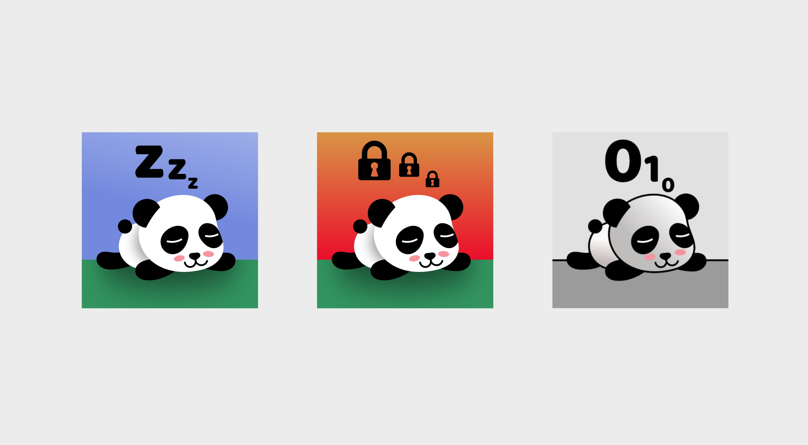
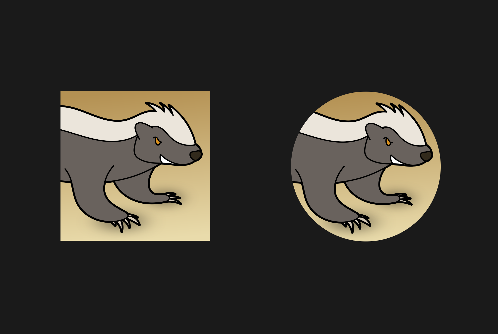

Sometimes, people have so much unconditional trust in me that they [throw money at me at a regular basis](https://www.patreon.com/blinry). That's *awesome*, and I'm always very humbled and thankful when that happens. I have this thing where, if you seriously want to give me $25 or more per month, I'll set up a Twitter bot that talks like you, and I'll draw you a custom profile image for your social media accounts. Here are the ones I've done so far:

## @zormit

Moritz' wish was an avatar in a hand-drawn cartoon style. I drew this one in Krita, from a photo reference:

## @marudor

Marudor asked for a panda in a vector graphics style. There are also two alternate versions: For his protected account, and for the bot, [@markovdor](https://twitter.com/markovdor).

## @jochris451

Christina liked my [pixel art poster of the CCH](/pixel-cch/), so I made her a simple pixel art avatar from a photo reference. Theres also a robotic version for [@botchris451](https://twitter.com/botchris451).

## @fucx@chaos.social

Thomas described the honey badger as his "spirit animal" – judging from a few popular YouTube videos, it seems to be super fearless! For this one, I aimed for a cartoon look. I always make sure that my avatars look good when they are placed inside circles, like Twitter does these days:

## You?

You can [bribe me!](https://www.patreon.com/blinry) :D
