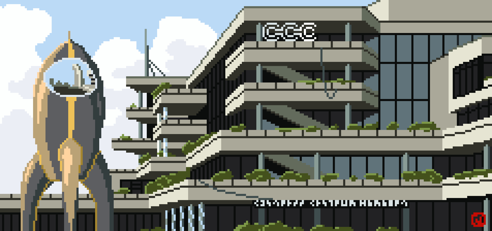

For five years, the Congress Centrum in Hamburg, Germany has been the venue for the annual Chaos Communication Congress, a four-day conference for hackers, artists, and open-minded folk. The building was opened in 1973, and while it is a little antiquated by now, its charm was loved by many. In 2017, the building will be closed for renovation for a few years, the older parts as well as the depicted front entrance will be removed. This image is dedicated to the old CCH, to say thanks for everything and goodbye!

To the left is one of the CCC's logos, the rocket *Fairy Dust*.

Like everything on this site, the image is released under a [Creative Commons license](/about/). Here's a ["high-res" version](cch-high-res.png) (23800x11200 pixels, 200 dpi at 3 meters width), in case you want to print a poster of it or something.
