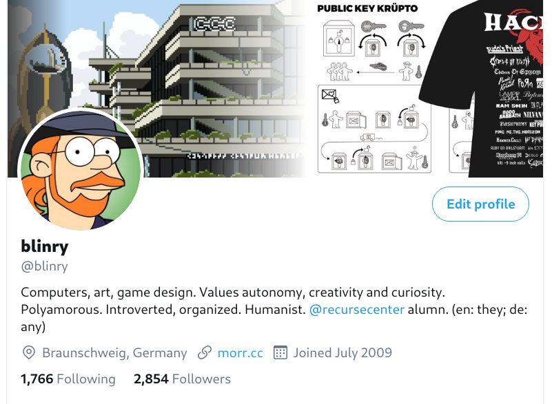

"blinry" is now printed in my official German ID documents! I want to tell you how I did it, and document this as well as I can, so that you can maybe do it, too!

Specifically, it's printed in the field "Ordens- or Künstlername/Religious name or pseudonym", which is present both on the *Personalausweis*, as well as the *Reisepass*!

## Why have it officially recognized as a pseudonym?

There's no clear single reason for me. I was curious how the process would work. It might make it easier to use it to sign contracts or to receive letters under this name.

Really, it's mostly about closing the gap between the name I identify with, and the name printed in official documents.

## Requirements

Who can have their pseudonym officially recognized in Germany? There don't seem to be precise requirements, unfortunately. The [Law on National ID Cards](https://www.gesetze-im-internet.de/pauswg/BJNR134610009.html) is very brief on this, and just mentions that there is a field for a pseudonym, and that applicants need to produce evidence if they want something printed in there.

But when trying to find out what the requirements might be, I found a few recurring themes:

- You've been using that pseudonym for a while.
- You're doing art or other forms of publication under this name.
- You're known under this name on a nationwide or international level.

That seemed like it all applied to me! So I started collecting evidence.

## My application

I put together a 10-page letter with lots of screenshots, here's what that looked like for me! (German original [here](kuenstlername.odt), feel free to base your application on it!)

> I hereby request that my pseudonym "blinry" be printed on my national ID card.
> 
> I am known by this name internationally since around 2017, and do publishing and art under this name. As an independent designer, artist, and speaker I am only using this name at this point, meaning that it displaced my birth name. I am introducing myself as "blinry", and most customers, colleagues, and friends only know me by this name. I would like to be able to use it when sending invoices or opening bank accounts.
> 
> I have attached eight pieces of evidence to demonstrate that I am internationally known by this name.
> 
> If you have questions, feel free to reach out at [email address].
> 
> ### Google search
> 
> A Google search for "blinry" (in an anonymous browser window, without being logged in, to make the results more neutral), results only in hits concerning my person, including my homepage and various social media accounts.
> 
> 
> 
> ### Twitter
> 
> I'm doing art and other publishing on the social networking service *Twitter*, and have over 2800 followers.
> 
> 
> 
> My tweets regularly get over 500,000 people per month.
> 
> 
> 
> ### Talks and publications
> 
> On my website morr.cc I'm linking to many of my public appearances. Some of the contexts are conferences like the *Chaos Communication Camp* north of Berlin or the yearly MRMCD in Darmstadt. In addition, I'm part of different groups who create small video games. Since 2017, I publish these only under the name "blinry".
> 
> 
> 
> My website has had over 400,000 impressions on Google in the past three months.
> 
> 
> 
> ### Opening of the 36th Chaos Communication Congress
> 
> A the end of 2019, together with a friend, I gave the opening speech of the 36th *Chaos Communication Congress*, one of the largest meetings of tech enthusiasts, artists, and hackers of the Chaos Computer Club, which is taking place each year in Congress Center Leipzig. Over 27,000 people watched the [recording](https://media.ccc.de/v/36c3-11223-opening_ceremony).
> 
> 
> 
> *Deutschlandfunk* and the *Dresdner Neuesten Nachrichten* reported on this opening:
> 
> 
> 
> 
> ### Report in the c't
> 
> After publishing a video game, the *c't*, a magazine for computer technology of the publisher *Heise*, reported on it in the 13th edition of the year 2017.
> 
> 
> 
> ### Pixel art poster
> 
> At the end of 2016, I designed a pixel art poster, which I offered on a pay-what-you-want basis. About 1500 posters were handed out. The poster is signed with "blinry".
> 
> 
> 
> ### Freelance design work
> 
> In my freelance design work, I also use the name more and more. Here's an example for how a customer announced one of my logo designs.
> 
> 
> 
> ### Commercial design work
> 
> Together with a friend, I designed a t-shirt for the online shop "getDigital". The product page has the following description:
> 
> 

I printed all of that out, put it in a thick envelope, and sent it to my city's municipal office ("Bürgeramt").

<%= tweet("1255213718075572225") %>

## The response

And then waited. 10 days after mailing this out, I got this email!

> After reviewing your documents, I don't see any reason why we can't put the pseudonym "blinry" on your national ID card. Please call me to schedule an appointment. [...]

I was excited, and really surprised how fast and unproblematic this went!

Visiting the office and doing the paperwork went almost exactly like doing any other extension of the ID card. The office worker told me that she had never entered a pseudonym before. She also told me that her colleague (who had sent me the email) "had done some additional research, and had attached some more screenshots to my letter", and that it all seemed to check out!

By the way, because all information in the German ID card is in ALL CAPS for some reason, I didn't have to explain why "blinry" should be written in lowercase...

After this appointment, the ID card was printed and mailed to the Bürgeramt, which took a few weeks. Because of the pandemic, and because the Bürgeramt is placed inconveniently far away from where I live, I only went to get it today!

Finally holding it in my hand feels super meaningful to me! :') It feels validating for what has become my core identity.

## The future

Next steps probably involve putting the name on my mailbox, so that I can receive letters with it! And possibly changing my main email address, oof.

I also anticipate that it will be challenging using the name in any official context. I guess I'm [mononymous](https://en.wikipedia.org/wiki/Mononymous_person) now, and forms asking for a "first name" and a "last name" don't really make sense.

But whenever I get strange looks, I now can pull out my ID card and show them that it's officially recognized! :)

## Resources

If wanna try this for yourself, and have questions, feel free to ping me! I don't have a good sense for how many pieces of evidence you might have to produce in order to apply successfully, or how they need to look like, overall, but if more of us do it, maybe we can find out!

There's one other person who I know of who documented how to apply for a pseudonym in Germany: [leitmedium](https://www.leitmedium.de/themen/kuenstlernamen/) -- it's also a super interesting read!
