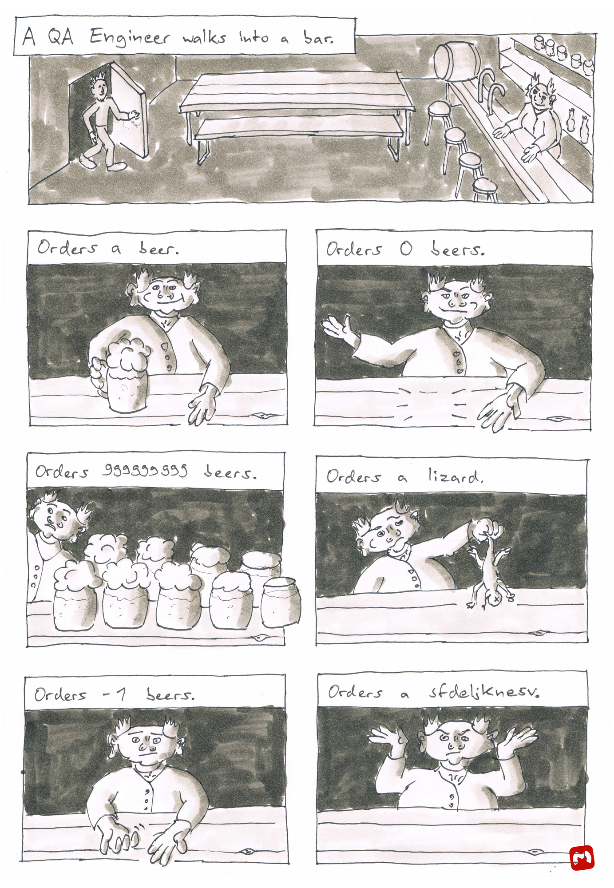

This is my first attempt to draw an analogue comic since a long time. The text is based on [a tweet](https://twitter.com/sempf/status/514473420277694465) by Bill Sempf, and published here with his permission. For non-software people: QA means *quality assurance*.

The tweet sparked many more ideas on what the engineer could order, you can find an overview [on Bill's homepage](https://www.sempf.net/post/On-Testing1.aspx).
