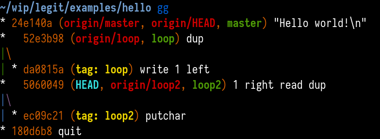
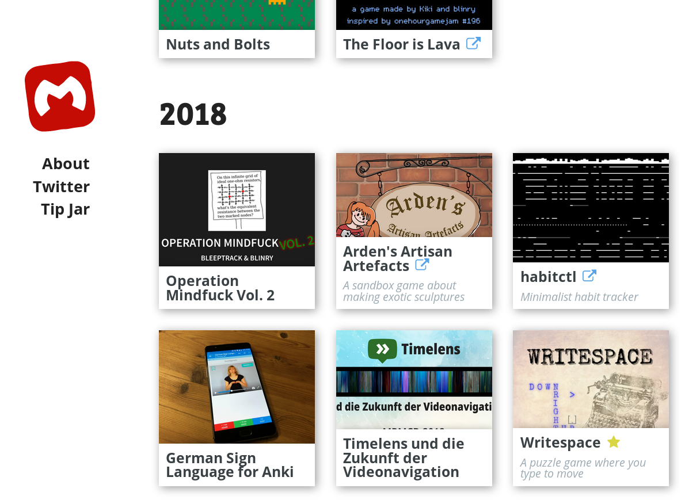

I'm currently in New York City for three months, to attend the [Recurse Center](https://www.recurse.com), a self-directed, community-driven educational retreat for programmers.

It's one of the best experiences of my life! <3 One of the many helpful traditions and techniques is to do *check-ins*, where you talk about what you did, and what you plan to do. I've found doing daily check-ins in RC's internal chat system immensely helpful.

So, to share a bit of what what I'm doing at RC, I thought I would just dump all of it here. It's kind of raw, I didn't replace the Slack-style emoji syntax with actual emoji, for example – partly because not all of them are offical emojis. :P Enjoy!

## 2019-04-02

Hey all! I thought I'd try doing these check-ins everyone is raving about!

Yesterday:

- First day at RC! The space seems amazing and full of possibilities! I enjoyed the meet-and-greet a lot, and would love to do that again sometime. Signed up for #**Coffee Chats** :)
- Was quite overwhelmed by everything going on. Need to remember to take it slowly, intense days like drain my internal batteries quickly. Still jet-lagged. :sleeping:
- I'd like to understand how programs compile down to bytes in an executable! To help with that, I built a tiny command line tool based on the `nasm` assembler, which interactively translates Intel-style assembly instructions to bytes:

- Skimmed [Intel's x86-64 manual](https://software.intel.com/en-us/articles/intel-sdm) to learn how that translation works. Volume 2, chapter 2 is a good starting point. Started writing a miniature assembler, [`minias`](https://github.com/blinry/minitools), which can compile a tiny subset of x86 operations to bytes – for now, *syscall* and some very specific immediate-value *mov* instructions:

Today:

- Looking forward to the pair programming workshop!
- Wrap the generated byte instructions in an ELF file, to be able to actually execute them. :sparkles:
- Add more operations to `minias`, maybe *cmp* and jumps?

## 2019-04-03

Moin! (In northern Germany, people use that as a casual greeting. A fitting reply would be: "Moin." :D)

Yesterday:

- Paired with @**Stephen Kell (m3'19)** on a Game of Life implementation in Ruby, which I enjoyed a lot! I have a tiny amount of pair programming experience from when I participated in game jams, and I'd love to do that more here! Seems to take a bit of courage to initiate pairing, though. :O
- Put together a 64-bit ELF binary header, and add a segment table entry which just loads the complete file into memory, and start execution at the beginning of the instructions. After a bit of fiddling, `minias` can now create little programs which… quit and return an exit code! :octopus:

- Added more instructions to `minias`: *cmp* and *ret* were straightforward, but adding labels and jump instructions required me to extend the stucture of the code quite a bit. After that, I basically got *call* for free!

Today:

- I have basic control flow, so the next thing I need is a way to work with data. ELF files have .data and .bbs sections to allocate space for static and dynamic data, I think. I'd like to find out how they work and extend `minias` to put them in the ELF binary. At that point, I should be able to compile a simple "hello world" program.
- Learn about opsec with @**Michael Zaneri (SP1'19)**!

## 2019-04-04

Good morning! How are y'all feeling today?

Yesterday:

- Implemented a simple *db* instruction, which you can use to put raw bytes into the binary.
- Learned how the section header table is structured, and taught `minias` to understand *section* properly, so I can now split my programs into sections like ".text" (for code) and ".rodata" (for read-only data).
- An ELF file also needs a ".shrtrtab" section which contains the *names* of all the sections. Implemented that. And for some reason, the first entry of the section table needs to be a NULL entry. I still have no idea why.
- I can assemble a simple "hello world" now! \o/ Even though I'm still cheating a bit, and put the address of the text data directly into the instruction:

Today:

- Fix a mistake in the Wikipedia article about the ELF format I stumbled over while implementing sections yesterday! :book:
- To avoid the above "cheat", the next step is to understand symbol relocation: The position of the "hello world" string in the binary is not known when assembling, that's the job of the linker. So I'd like to learn how that works today.

## 2019-04-05

Have a wonderful Friday, y'all!

Yesterday:

- Fixed the Wikipedia article, see above.
- Debugging session on @**Stephen Kell (m3'19)**'s C++ code instrumentation tool `cccppp`.
- Feelings check-in, presentations and game night. Had some wonderful conversations with people and maybe fell in love a little bit with this community. :green_heart:

Today:

- I'll take today off from working on `minias`. Going to explore the space a bit, see what other people are doing, maybe make some contributions to community tools like @**Jason Owen (SP2'19)**'s <https://faces.recurse.com>
- Pair with @**Nick Aversano (SP2'19)** on his WebGL game engine.
- Give a presentation on hand-writing an ELF binary. :writing: 
- Looking forward to the mob programming session tonight!

## 2019-04-08

Hey :) Hope you had a relaxing weekend, and could recover from last week somewhat. I certainly did, took a long walk over Brooklyn Bridge and through the Financial District, and whew, this city sure is pretty!

Friday:

- Paired with @**Nick Aversano (SP2'19)** to implement sprite rotation in his game engine using the WebGL helper library *TWGL* (rhymes with "wiggle" :laughing:). Learned the JavaScript syntax for object destructuring and spread properties!
- Prepared and gave a 5-minute presentation on how a very minimalist ELF "hello world" executable is structured. Got some positive feedback after that, which is super encouraging! :green_heart: Thinking of doing a longer session, where I can explain every single of the 167 bytes that make up the resulting binary.

Today:

- I think I have a sliiight grasp by now of how symbol relocation is supposed to work. I'll try to implement it for some really simple cases today. I've got a string table and a symbol table, and I still need a relocation table. The result will be one of those mysterious "relocatable object files" (.o) I've seen before, but never was quite sure what they were. I should then be able to use the standard GNU linker `ld` to do the actual relocation and generate a binary!

## 2019-04-09

Hey all!

Yesterday:

- Implemented simple symbol relocation in `minias`! It only knows how to do a very specific relocation (when using *mov* with a label), but I can now assemble a "Hello world" without using cheats, which will create an object file which I then can link using GNU's `ld`! This feels like a huge #**victory**! :fireworks:
    
- Helped a charming group of people levelling up their Git skills! For practising GitHub's pull request workflow, we started a simple recipe collection :P
- Was convinced by @**Tenor Tenor (m3'19)** to use Vim's buffers directly instead of tabs, like I've done for the last 14 years :P Installed the "vim-buftabline" plugin to make the transition less painful.
- Paired with @**Tim Vieregge (SP2'19)** on writing a boot sector in assembly!!! Turns out if the first 512 bytes on a disk end with 0x55aa, the BIOS will just load them into memory and start executing the instructions?! This is so interesting! Here's us booting into a "Hello world"  from @**Patrick McCarver (SP1'19)**'s USB stick! (It was *supposed* to say "Hello RC" :P)
    
    We also wrote a bootsector which dumps its own contents to the screen!
    

Today:

- Pair with @**Colin Rothfels (SP1'19)** on `minias` improvements in Rust!
- Continue working through the OS implementation series (I'm using this one: <https://github.com/cfenollosa/os-tutorial>)
- Maybe prepare a non-technical talk for tonight?

## 2019-04-10

Hey, how's your day going? :bunny:

Yesterday:

- Implemented proper bytestring handling in `minias` with  @**Colin Rothfels (SP1'19)**, so it can now output Unicode characters and emoji! :D
- Started implementing a "_start" symbol, for the linker to know where the entry point should be. Encountered a weird bug where `ld` would not be able to see this symbol. Did a debugging session on this with @**Jeanine Peters (SP2'19)**, and it turned out that the reason was the one place in my code that had a "FIXME" comment… ELF sections have this "info" field, which does different things for different section types, but for symbol tables, it is supposed to be "the index of the last local symbol, plus one". I didn't set this properly, and as "_start" has to be global, `ld` probably didn't look at it at the correct position.
- Read through the nasm documentation and through the x86 Wikibook, to get a feeling of what instructions I haven't seen so far. I think most of them are very obscure and I will never need them. :D
- [Fixed a typo in Zulip](https://github.com/zulip/zulip/pull/12087)!

Today:

- At this point, I feel like I'll get diminished returns from continuing implementing an assembler by from scratch. Before coming to RC, I thought it might be fun to also implement my own linker at this point, but I feel like I probably have a vague feeling of what it would do. Might be more fruitful to use existing tools to learn how dynamic linking works! When working with C, this has been the greatest mystery of all for me. :wizard_hat:
- Find out how UEFI systems deal with boot sectors. @**Tim Vieregge (SP2'19)**'s notebook had a dedicated "legacy mode" for booting from those, but my T460s didn't seem to have that.

## 2019-04-11

Greetings!

Yesterday:

- Learned about the *System V AMD64 ABI*, a convention of how functions work on a low level – it defines how to pass arguments to functions via registers and the stack, for example. Used that knowledge to call a C function from assembly, and to call an assembly fom C, and link those pieces together. 
- Static linking seems straightforward, dynamic linking on the other hand seems like a huge jump in complexity. I looked at how to call a function from assembly and dynamically linking that (the magic line was `ld printf.o -o printf -lc --dynamic-linker /usr/lib/ld-linux-x86-64.so.2`), but it still feels very mysterious and I don't know how it's implemented. 
- Regarding boot procedure on UEFI systems, that seems to be reallllly complicated and I realllllly don't want to try to do that by hand. :shock: On the upside, I found out that my notebook has a "legacy boot mode", too! :D
- Had an extended coffee chat with @**Joe Mou (SP1'19)** about organizing notes. I'm using a very simple Vim plugin called [vimboy](https://github.com/blinry/vimboy), which I built about 8 years ago, and which allows you to keep a personal wiki in plaintext. It's one of those tools I use daily and couldn't do without.

Today:

- Salad! Coffee chat! Feelings! Talks! No fixed plans besides that for today, let's see what comes up!
- I don't have a good idea yet of how I could understand dynamic linking better. Implementing tools has been helpful for understanding ELF files, maybe I should continue that, after all, and generate a simple dynamically linked binary from scratch.

## 2019-04-12

Hey everyone, I hope your Friday will be really neat!

Yesterday:

- We used the Abstract Salad Factory pattern to successfully implement some delicious concrete salads! Let's do this again!
- Learned how to use `gdb`! I have to admit that I solely relied on print-debugging before, beause when I encountered bugs, it always seemed easier to just do that, instead of learning how to use a proper debugger. So it seems like a valuable time investment to learn that before you need it. And it's pretty neat! Some things I learned:
  - Press Ctrl-X Ctrl-A (or use the `-tui` command line flag) to switch to a neat graphical mode where you can always see the source code, and have markers for the current line and for your breakpoints! If you remember one thing, make it this one.
  - Additionally, Ctrl-X 2 will show the disassembly of the current program, and pressing that again will show the CPU's registers!!
  - `condition 3 i == 10` will add a condition to breakpoint #3, and only halt execution when the condition is true.
  - You can use `print` for assigning to variables while the program is running! Example: `print i = 10`
  - `gdb` can also debug Rust programs! :sparkles: Use the wrapper `rust-gdb` (which comes with Rust) to have proper object printing. Use `break rust_panic` to halt execution when you run into a panic, to be able to backtrace.
  - **(YouTuber voice)** What are your favorite `gdb` tricks? Let me know in the comments below!
- Gave a presentation about a project really close to my heart: [Timelens](https://timelens.io)!
- Built a little React app with @**Isaac Pearl (SP1'19)** , which uses the Web Audio API to play back audio files you drag & drop on it – but *backwards*! Seemed to us like you could give wicked music performances with that tool!

Today:

- On Fridays, I try not to have appointments, obligations, or any fixed plans, really. Let's experiment!
- I started thinking about what a really good interactive environment for learning and teaching x86 assembly might look like. Might think about that some more.

## 2019-04-15

Hey everyone, hope you had a relaxing weekend. I did a lot of touristy things in Manhattan, like walking along the High Line, visiting Times Square and the New York Public Library's Schwarzman building. I also wrote a [short, interactive horror story](https://morr.cc/running-out-of-space/)! :D

Friday:

- @**Tim Vieregge (SP2'19)** and I looked at each other's `.vimrc`! *blush* Some takeaways:
  - The vim-surround plugin is super useful for dealing with pairs of parens, brackets, and so on.
  - Also, why have I never used vim-commentary? It's great!
  - Mapping `;` to fzf's `:Buffers` seems like a neat idea.
- Tried these plugins and tidied up my Vim config files a bit.
- Polished the Timelens userscript for YouTube. It visualizes a video's color deveopment, making navigation more efficient, precise, and active. I'd love some feedback on this! <https://timelens.io/youtube/>

Today:

- Now that I know my way around assembly language a bit, it might be fun to look at LLVM, and how it abstracts away from that. Maybe write some programs in LLVM's *intermediate representation*?
- Debugging, continued: look at how to debug JavaScript in the browser! That also seems like a super useful skill.

## 2019-04-16

Hej! :)

Yesterday:

- Worked with @**Zoe Larissa Statman-Weil (SP1'19)** on refactoring and fixing bugs in her Mapbox-powered JavaScript application.
- @**Jeanine Peters (SP2'19)** and I finished the leetcode problem on Sudoku puzzles we had been working on!
- Skimmed the complete [documentation on the LLVM IR](https://llvm.org/docs/LangRef.html), which is actually not that long! I feel like the parts which you actually need for building a frontend for simple languages could fit on a few pages.
- Wrote a hello world and a ROT13 implementation in LLVM IR! [This is how that looks like.](https://github.com/blinry/llvm-ir-tests/blob/master/rot13.ll) The language is strongly typed, and definitely not meant to be written by humans! :D You have to include references to your types *everywhere*! Even though, it feels a bit more convenient than raw x86-64 assembly language, because you can actually type out your functions, and properly call them.
- And then I thought, huh, let's do a benchmark of the ROT13 binary which is created when you put this IR through all the built-in optimization passes on the one hand, and my [raw implementation in x86-64](https://github.com/blinry/x86-tests/blob/master/rot13.asm) on the other. Well, **turns out that the LLVM version is 60 times faster?!?** When looking at what the binaries are doing with `strace`I found out that apparently, LLVM knows how to bundle my `getchar` and `putchar` calls together to blocksizes of 4096 bytes each, and operates on that! Mind blown, I didn't expect that level of optimization!

Today:

- As LLVM IR is not meant to be written by humans, what would be good ways to generate it? I think it comes with a code generation library in C++, but I'd rather use another language, to be honest! ^_^
- Attend the event planning open meeting and the Localhost talks!

## 2019-04-17

Good morning RC!

Yesterday:

- Looked at code generation bindings for LLVM. Rust has a crate which gives direct, unsafe access to LLVM's official C API, and several unmaintained ones, which provide more idiomatic bindings. Both options do not really spark joy. There seem to be okayish bindings for Python and Haskell, even though I think they use older LLVM versions.
- It would be nice to have a very tiny language to implement a compiler for. So why not make my own? I love esoteric programming languages anyway, and I always wanted to make one. The [Esolang Wiki](https://esolangs.org) is a brilliant source of information around that topic, and there is a nice zine in RC's library called "New Languages", which I absolutely recommend to read!
- Brainstormed some ideas for esoteric languages. It turned out that some of these already have been realized:
  - A language consisting entirely of emoji.
  - Write short English snippets describing what you want to do, the compiler will post the description on StackOverflow, and then insert the answer receiving the most upvotes.
  - A language based on knot theory, which can be realized on a piece of yarn.
  - In Russia, "Hello world" prints YOU!
  - A language which only uses expressions from Daft Punk's song "Technologic".
  - A language where programs are represented by positions on a Go board.
  - Horror Vacui as a programming language: The number of seconds which pass before you type the first character determines what the program does.
- And then an RC-external friend hat a brilliant idea: A language where the program is described by the graph formed by commits in a Git repository. Have been thinking about that ever since. Writing programs in that language could be a good exercise in using history-rewriting Git commands. The graph could describe the control flow? Branching points are if/else or switch statements? Tags could serve as jump labels? But how to do jumps? And do merge commits have a special meaning? Still have to think about how to do computation. If you wanna talk about this, hit me up! :)

Today:

- Try to write example programs in GitLang (working title), see how that feels like.
- Lots of events going on today: a talk about RSA, a discussion on learning structures, a math workshop about Project Euler, a hackathon planning meeting!
- Go home early! :wink:

## 2019-04-18

Hey everyone! :cherry_blossom:

Yesterday:

- Lots of events! @**Anna Walsh (SP1'19)** and @**Nicole Baram (SP2'19)**'s refresher about RSA felt really helpful, and @**Yoni Elhanani (SP2'19)** kind of makes me want to do Project Euler problems! :)
- Brainstormed a bit on the Git language. @**Jeanine Peters (SP2'19)** suggested to call it *legit*, and I really like that! I think the language could be stack based, like [Befunge](https://esolangs.org/wiki/Befunge) or FORTH, and have operations like "get" and "put", "add" and "sub", "swap" and "dup", "quit" and "jump". Need to be careful to make it Turing-complete, however – I might need two stacks, or a way to provide random access to the single stack.
- Started writing a *legit* ROT13 implementation (on paper). Feels like a language which is easy to learn, but hard to master.
- Went home early! :grinning_face_with_smiling_eyes:

Today:

- Realize the ROT13 implementation in an actual Git repo.
- Think about the minimal feature set to make it Turing complete.
- Maybe start writing a quick-and-dirty interpreter for that language, to find problems in the design?
- Give a demo about the Wikidata Card Game Generator!

## 2019-04-19

Hey, what's up? :)

Yesterday:

- Wrote a quick [first draft of a language specification for legit](https://files.morr.cc/legit-spec-v1).
- Started writing a ROT13 implementation. This is how it looks like:
  
- Note that the program has a typo: "Z" instead of "z" in 6deaa0c. I have no idea of how to reword that without creating all merge commits which come after that manually again. Creating a program in *legit* is… um, a challenge? Let's just say, TIL about `git commit --allow-emtpy`, `git write-tree` and `git commit-tree`.
- Debugged some cronjobs with @**Alan Chu (SP2'19)**, and learned about TypeScript and the inner workings of @**chat-bot**!
- Feelings check-in made me cry a bit. Thanks for your vulnerability! :cry:
- Demoed the [Wikidata Card Game Generator](https://cardgame.morr.cc) I made with my friend [Bine](https://www.bleeptrack.de) a few months ago.

Today:

- No plans, as usual on Fridays! :) Might be fun to look at how to use [c3nav](https://github.com/c3nav/c3nav) for indoor mapping.

## 2019-04-22

Hey, y'all! Hope you'll have a great week! I went to the Brooklyn Botanical Garden yesterday – highly recommended, the cherry blossom is at its peak currently, and the conservatory showcases many bonsai trees, some of which are over 500 years old! :O

Friday:

- Looked at [c3nav](https://35c3.c3nav.de), the software used for mapping large CCC events like the Chaos Communication Congress. I thought it might be fun to have an electronic map of RC! But. There's no documentation at all on how to set it up or how to use it, and the maintainer seems unwilling to provide documentation or help. I contacted her, and it seems she doesn't want to allocate time to that. Maybe drawing a static map would be an alternative.
- Implemented an interpreter for *legit* in Ruby! That's a language I'm deeply in love with since many years, and it's my go-to language if I quickly need to type out something. It was an amazing feeling when my example ROT13 program successfully ran for the first time! Exept for some DSLs, *legit* is the first language I ever created! :fireworks:
- Started working on a compiler, which will translate *legit* programs to LLVM IR.
- Wrote a "hello world" program, and introduced a new type of instruction: a string literal will push all contained characters on the stack. As the characters are pushed on the stack in reversed order, the program will first write them all on the tape, then print them in the correct order:

Today:

- Discuss the design of the language with a few people. Check whether anything is very counter-intuitive.
- Add the remaining missing *legit* instructions to the compiler. Refactor the code a bit.
- Design a logo for *legit*, improve documentation, prepare public release.
- The "holy grail" would of course be a brainfuck interpreter! :D (Which would also proof that *legit* is Turing complete.) Maybe write out how that might work on paper.

## 2019-04-23

Hi everyone! :sunny:

Yesterday:

- Had a *legit* discussion with @**Joe Mou (SP1'19)** and @**Nick Aversano (SP2'19)**. We discussed different approaches to do jumps and calls, and I think it helped the language design a lot!
- Worked on the proposal for a GLASS OF WATER emoji, soon to be submitted to the Unicode Consortium, with @**Kate-Laurel Agnew (SP2'19)**, @**Ratan (Rai) Sur (SP1'19)** and @**Tim Vieregge (SP2'19)**. The process is much easier than I imagined! [Emojination](http://www.emojination.org/) has all the links and resources on how to do that yourself!
- Got fed up creating *legit* programs manually, so I wrote some bash scripts which do it for me.
- Implemented the tape mechanics for the *legit* compiler, as well as new jump instructions, and adapted the examples.
- Made some quick logo designs for legit. Which one do you prefer? The second already feels very obscure, but maybe that's appropriate.

Today:

- Continue to think about how to implement a *legit* Brainfuck interpreter! This is not gonna be trivial. :grinning:
- Give a presentation about Ludum Dare this evening!

## 2019-04-24

こんにちは、みんなさん！

Yesterday:

- Wrote some Git tools from scratch in @**Joe Mou (SP1'19)**'s workshop! Super interesting and demystifying! I'm looking forward to continue with that!
- Started writing the *legit* Brainfuck interpreter. Doing the loop instructions is tricky, the six other ones work by now! Thanks for helping me debug, @**Nick Aversano (SP2'19)**! Nick pointed out that I'm using a **bash** script to generate a **legit** program, which is then compiled by a **Ruby** script to **LLVM IR**, to be converted into a binary, which can then interpret **Brainfuck**, and that's more layers than I expected. :sweat_smile:
- Gave a talk about how the game jam Ludum Dare works! :joystick: Slides and links here: <https://morr.cc/dare-to-ludum-dare/>
- @**Jason Owen (SP2'19)** showed me the current status of his RC project directory. I have a number of features in mind which I think would be great, and we filled the issue tracker with those! :D

Today:

- Try to finish the Brainfuck interpreter!
- Lots of interesting events: a Git mob learning session, the personal website jam, an improv session, and Latin puzzles! :blush:

## 2019-04-25

Good… morning! :D

Yesterday:

- Fixed all the bugs in my Brainfuck interpreter  written in *legit* – especially the loop instructions took a lot of debugging.
- Fixed one or two bugs in the *legit* compiler. It can run the same programs as the *legit* interpreter (both written in Ruby) now, but harnessing the LLVM toolchain makes it faster by at least two magnitudes (2 seconds vs "0 seconds"):

- Went to the personal website jam for the first time, and implemented little icons for external links and my favorite projects on [my homepage](https://morr.cc):

- @**Agustin Ramos Anzorena (SP1'19)** and @**Travis Horton (SP1'19)** hosted some improv games, which was something I always wanted to try. Warmup was super fun, but I think I need more practice to feel comfortable participating in scenes. Would love to try that again!

Today:

- I've been thinking about how to share what I'm doing at RC publicly. I'm considering creating a blog post for each week, which consists basically of these check-ins?
- Pair with @**Jaryn Colbert (SP1'19)** to make improvements to <https://faces.recurse.com>! :camera:
- Give a talk about [legit](https://github.com/blinry/legit)! Polish the README, prepare a public release. Maybe create a page on the Esolangs wiki?

## 2019-04-26

Hey everyone!

Yesterday:

- @**Jaryn Colbert (SP1'19)** onboarded me to faces.recurse.com, and we implemented a new feature: [Only show people who have photos](https://github.com/jasonaowen/recurse-faces/pull/50)!
- Gave a talk about *legit*, forgot to mention the name. :shruggies: @**Kate-Laurel Agnew (SP2'19)** brought up the challenge to write a quine! :scared:
- Enjoyed the Company Meet & Greet! It was super informal, and many of the people were Recursers themselves. Interesting to see the variety of companies RC works with.

Today:

- RC Hackathon! :sparkles:

## 2019-04-30

Hi :3

Friday:

- For the *Stupid and Useful Things Hackathon*, @**Jared Pereira (SP2'19)** and me made a map of the floors and rooms of RC. It's meant to be printed and laminated, so that people can add details. Here's a quick-and-dirty zoomable version using Leaflet: <https://blinry.github.io/map-of-rc/> (Soon to be at <https://map.recurse.com>, if the stars align right? **EDIT: The stars aligned!**)

Weekend and Monday:

- Participated in the 44th iteration of the game jam *Ludum Dare*, where you make a game around a given theme in three days! The theme was "Your life is currency", and @**Tim Vieregge (SP2'19)**, @**Byung Joo Shin (W2'19)**, @**Alan Chu (SP2'19)** and me made [Capitalist Piggies](https://ldjam.com/events/ludum-dare/44/capitalist-piggies), where you play as a piggybank that wants to escape from evil banker piggies! @**Agustin Ramos Anzorena (SP1'19)** joined us on Monday to create some pretty visual assets! We used the [LÖVE](https://love2d.org/) game engine, and it was super fun, and super exhausting! :D

Today:

- I'm gonna take at least a day off. :sunny: Four days of focused hacking are a lot for me, and I need to recharge my internal batteries a bit. See y'all soon!
