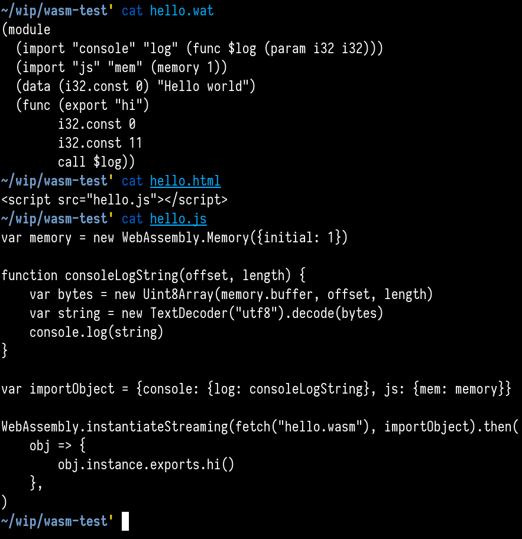
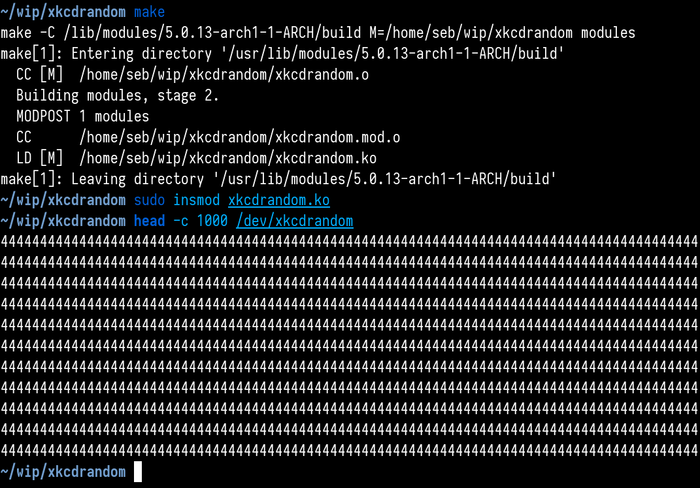
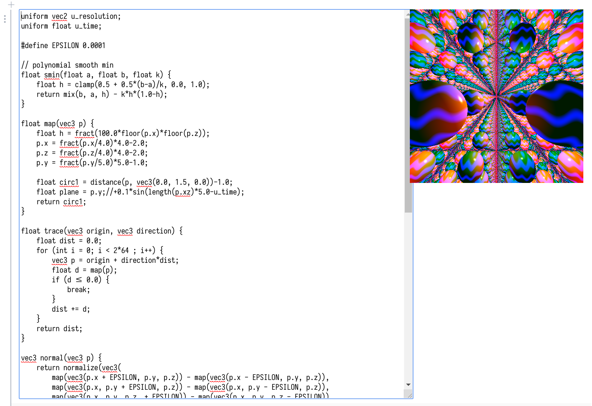
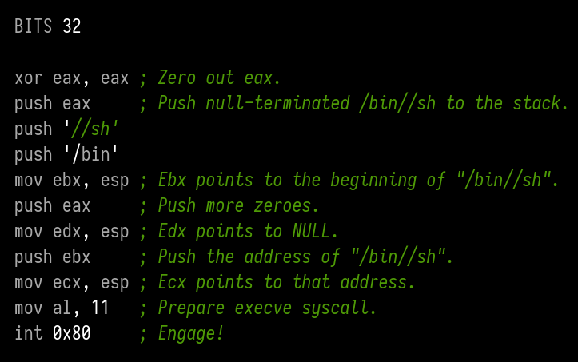
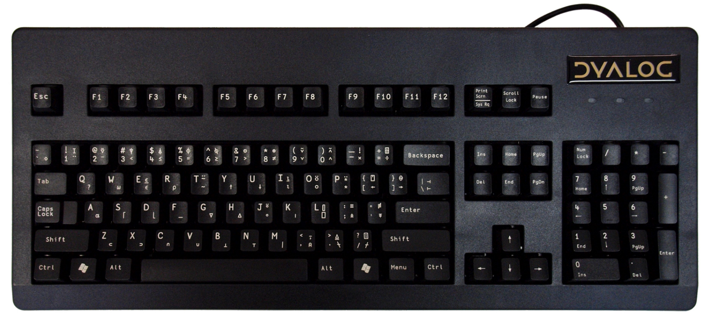
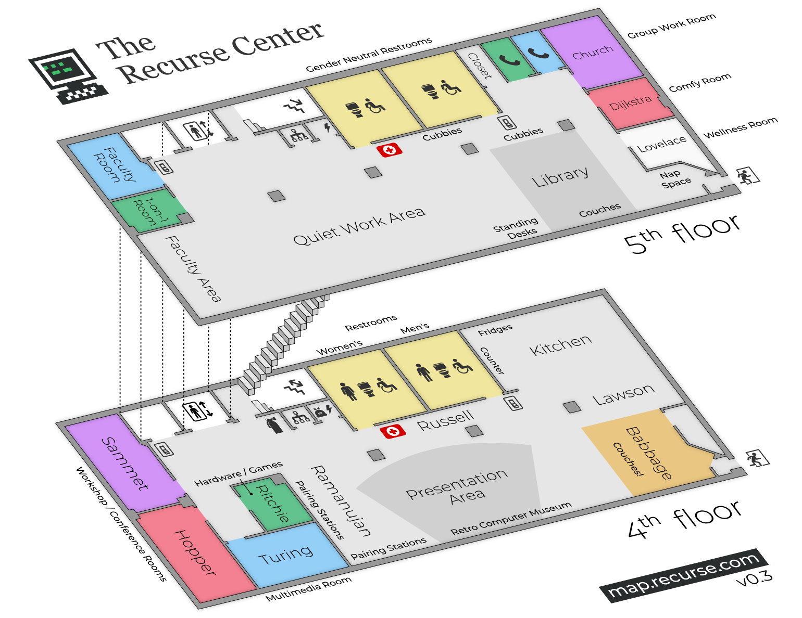
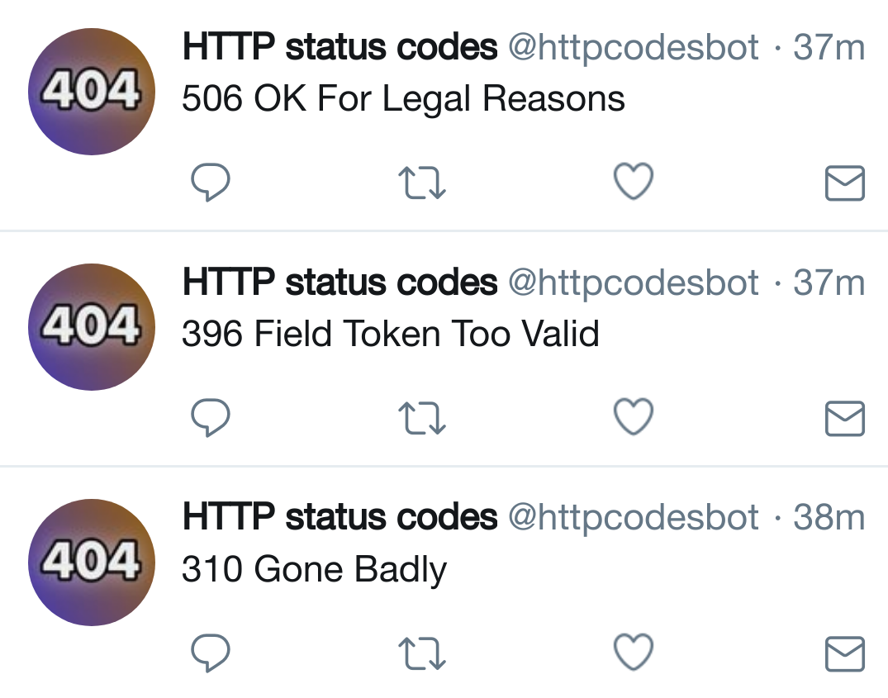

Continuing my check-ins from the [first month](/rc-month-1/)! Putting all of these together, I'm astonished on the variety of stuff I worked on. (Also, the Recurse Center is very neat, and you should all go!)

## 2019-05-03

Hey everyone! I really needed some time off :exhausted:, but I'm back, and I feel kind of re-energized at this point. Oof.

Tuesday:

- Went to the event planning meeting and co-volunteered to organize the non-technical talks during the second half of my batch, together with @**Jaryn Colbert (SP1'19)**!

Wednesday:

- Published a [blog post about my first month at RC](https://morr.cc/rc-month-1/), which is basically just a collection of these check-in. Wrote some helper scripts to help me with tasks like collecting all images included in these posts.
- Polished up the docs for *legit*, and made the final logo, preparing a public release.

Yesterday:

- Published a [blog post about legit](https://morr.cc/legit/), which includes the specification, and some examples. Happy to see it was [well-received](https://twitter.com/blinry/status/1123941890469040133)! One question that came up a lot is how to pronounce the name – and people agreed that it's probably pronounced like "GIF" :P Also, I learned that you can actually do this to meta-track the changes in a Git repo:

        cd .git
        git init
        git add .
        git commit

- Talked with @**Jaryn Colbert (SP1'19)**, @**Kiwako Sakamoto (SP1'19)**, and @**Corin Faife (SP1'19)** about organizing the non-technical talks. @**Kiwako Sakamoto (SP1'19)** made some [very helpfull additions to the wiki page](https://github.com/recursecenter/wiki/wiki/Non-technical-talks) on how the event works! Sent my first message tagging `Everyone at RC` :bell:
- Started working with @**Jaryn Colbert (SP1'19)** on making faces.recurse.com more forgiving: if a person has multiple first names, it should be sufficient to guess one of them. If a person has an alias (like me ^_^), it should be sufficient to guess that. Adding last names should be allowed.
- Feelings check-in was really important and relieving for me. Thanks, y'all! :green_heart:
- Gave a talk about [writing generative grammars with Tracery](https://morr.cc/twitter-bot-workshop/). I should really make the HTTP status generator into a Twitter bot sometime. "311 No Choice" :P
- Another round of Company Meet & Greets! I enjoy the format a lot.

Today:

- Pair on game engines, Twitter bots, or map.recurse.com!
- Teach juggling?
- Also, visit MoMA later today (it's free on Fridays!)

## 2019-05-06

Hello, lovely people! I spent this weekend reviewing talks for [Enthusiasticon](https://www.enthusiasticon.de), walking through East Village, digital painting (I really want to do this more!), and making [Biangbiang Noodles](https://www.chinasichuanfood.com/biang-biang-mian-biang-biang-noodles/) (fun fact: The Chinese character for that dish has 58 strokes!)

Friday:

- Continued implementing more forgiving name guessing for faces.recurse.com with @**Jaryn Colbert (SP1'19)**. We think we're almost there!
- Added a "drop a marker and share the link" feature for map.recurse.com with @**Vidhi S Shah (SP1'19)**.
- The "New Order" exhibition at MoMA was pretty neat, and not as full as I had expected. Also, I found this treasure on the top floor: 

Today:

- Even though it itches me to transition to new topics (Machine learning! Functional programming! Generative Art! ALL the frameworks!), I think I'll keep looking at low-level stuff for a while: I'd like to learn how WebAssembly works (or what that even is), and write a tiny silly module for the Linux kernel! So maybe I'll start with one of those topics today.

## 2019-05-07

Hey all, how are you today? :sunflower:

Yesterday:

- Looked at what WebAssembly is and how it works. Especially [Mozilla's tutorial series](https://developer.mozilla.org/en-US/docs/WebAssembly) seemed helpful. I think it's hilarious that the tool converting the text-based representation to the byte format is called `wat2wasm` :D *Wat!* The language itself is interesting: Only four types (i32, i64, f32, f64), a very strict interface on how to use wasm code from JavaScript, a Lisp-like syntax based on s-expressions, and a stack-based computational model.
- Wrote a "hello world" wasm module, here's how it comes together with HTML and JS:

- Looked at how to compile Rust code to WebAssembly, but that process seems so multi-layered and convoluted to me that it's losing all elegance and the result is not very aesthetic to me. :/
- Set up auto-formatting in Vim using *Prettier* (thanks for the recommendation, @**Nick Aversano (SP2'19)**!) and *ALE*. It's so satisfying not having to do code formatting yourself! <3
- Realized that WebAssembly is not interesting to me right now. :grinning_face_with_smiling_eyes: When exploring other technologies, like x86 assembly or the ELF format, I feel like I get new insight of stuff I already know works. WebAssembly adds another layer, and seems targeted at people who want to build high-performance applications (like game engines) for the browser. It does not add new functionality, it adds efficiency to critical pieces of your software. It's good to know more about it, but I'm not going to explore that more, I think.
- Instead, I wanted to look a bit at the Linux kernel! I wrote my first simple kernel module, [xkcdrandom](https://github.com/blinry/xkcdrandom), that creates a device called `/dev/xkcdrandom` – when you read from it, you always get the number 4 ("chosen by fair dice roll, guaranteed to be random"). Writing kernel modules is a surprisingly pleasant experience!

Today:

- Explorables/Observables workshop with @**Toph Tucker (SP2'19)**! :eye:
- Finishing that Faces feature with @**Jaryn Colbert (SP1'19)**! :camera:
- Learning how to play Dwarf Fortress with @**Kate-Laurel Agnew (SP2'19)**! :pick:
- Looking for more ideas for fun kernel modules! I drew much inspiration from @**Kamal Marhubi (m2'18)**'s ["rickroll" module](https://github.com/jvns/kernel-module-fun/blob/master/rickroll.c), which hijacks the *open* syscall and always opens a "Never Gonna Give You Up" whenever userspace tries to open an MP3!

## 2019-05-09

Tuesday:

- Made an account on [Observable](https://observablehq.com/) and learned a bit about how to make notebooks there. I think it's a brilliant tool for making interactive explanations! Thanks to @**Toph Tucker (SP2'19)** for hosting the workshop! :green_heart:
- @**Jaryn Colbert (SP1'19)** and me [wrapped up our feature](https://github.com/jasonaowen/recurse-faces/pull/57) for more forgiving name guessing in faces.recurse.com!
- Non-technical talks were so good! Check out @**Max Chiswick (SP2'19)**'s photos of his [12000 km bicycle tour through Africa](https://docs.google.com/presentation/d/1VpGoBn3EkVkJBfJlSju3N7m1EquWHXiixydiNwzDJMM/edit), for example! :O
- Built a neat little dwarven fortress with a very patient @**Kate-Laurel Agnew (SP2'19)**. Then, we saved the game, and tried to have some *fun* by attacking a giant moose (apparently, a dangerous enemy when you don't have any armor or weapons? In the end, nobody died, but I think the dwarves puked a lot out of fear?) and digging a tunnel to a nearby river to flood the common rooms (surprisingly, the dwarves didn't care and kept socializing. Pool party? In the end, we built some escape stairs on which they – reluctantly – climbed to the outside).

Yesterday:

- Pairing with pears was great, thanks to @**Maren Beam (SP2'19)** and @**Nick Aversano (SP2'19)** for hosting that! Let's do this again! I started building an Observable noteook about teaching OpenGL fragment shaders and ray marching with @**Toph Tucker (SP2'19)**, and we got on all kinds of tangents :D We ended up with this *magnificent* shader:

- Photography meetup! I learned about [darktable](https://www.darktable.org), an open-source photo postprocessing software
- *Overcooked* is a very neat game!

Today:

- Think about how to make the [Map of RC](https://map.recurse.com) as useful as possible for NGW. Does anyone want to meet up with @**Alicia Thilani Singham Goodwin (F1'17)** and me to think about that?
- Today the SP1 batch is never-graduating! :cry: The six weeks went by so quickly! :O

## 2019-05-13

Hello~ everyone! :octopus: 

Thursday:

- Discussed some design questions regarding the Map of RC with @**Alicia Thilani Singham Goodwin (F1'17)**.
- Brainstormed ideas for silly Linux kernel modules with @**Jeanine Peters (SP2'19)**! Shrinking your video output by one pixel every minute? Making your mouse pointer move in reverse? Swapping two random keys on your keyboard? We tried actually implementing the last idea – diving into Linux' code base was surprisingly fun! We learned how to enumerate input devices, and how to find out which drivers are attached to them – so that's how we found `drivers/input/keyboard/atkbd.c`, which defines the driver for my Thinkpad's internal keyboard. We still don't reallly understand how scancodes relate to keycodes, but we managed to swap the x and z keys! We just copied the driver, made modifications to the scancode table, recompiled, unloaded the original driver, and loaded ours. What could possibly go wrong. I'd love to do more of this! :D

Friday:

- Worked a lot on the [Map of RC](https://github.com/blinry/map-of-rc), and released v0.2, featuring the positions of the first aid kits, and the fire extinguisher. Also, we'd previously left out the electrical closets, because they were not in the architects' floor plan. Oops!
- Split out the project into three repositories: [map-of-rc](https://github.com/blinry/map-of-rc) contains the base SVG, [map.recurse.com](https://github.com/blinry/map.recurse.com) contains the framework for the online version, and [map-of-rc-tiles](https://github.com/blinry/map-of-rc-tiles) has the map tiles in different resolutions, which are used by the online version, and can be regenerated at will.
- Paired with @**Tim Vieregge (SP2'19)** on making a "self-guided tour" flyer, which we hoped would be useful for the people exploring the new space for the first time during Never Graduate Week!

Weekend:

- Visited the *School for Poetic Computation* for their student showcase. One of my favorite installations: <https://twitter.com/blinry/status/1127356795457085442>
- Attended *!!Con*. Oh wow. I'm so glad the talks were recorded, so I can share some of them with y'all! Will try to take some time this week to do a little write-up.

Today:

- Try not to be overwhelmed by all the amazing stuff going on at RC during NGW! :grinning: I'd like to take a loot at the CTF, and @**David E Lu (W1'16)**'s AV systems talk sounds amazing!

## 2019-05-15

Hey there, lovely people! I'm getting more input than I can process currently, which is an interesting feeling, and I think I'm fine with that! :grinning_face_with_smiling_eyes: 

Monday:

- Talked about game dev and obscure digital art forms at the artist meetup organized by @**Andrew Yoon (F2'16)**!
- Went to the CTF intro, and formed a group called *Octopus on Toast* (because we found an artificial slice of toast and a plush octopus in Sammet when we first met there)!
- @**Jacob Kozak (W1'17)** gave us a whirlwind intro on the disassembly/debugging suite *radare2*. Super amazing to see what you can do with it! I had looked at the GUI a few times before, but the terminal version (which includes a visual mode) is so much better! We got really close to solving the *IoT pet feeder* challenge on Monday!

Tuesday:

- Fixed the remaining off-by-one errors for the *IoT pet feeder* challenge! I think it's easy to get addicted to the rush of adrenaline you experience when you've solved a problem like this!
- Attended the APL workshop by @**phoebe beatrice jenkins (m4'18)**. We started with basic features, and ended up with a Game of Life implementation (consisting of a single line of scary-looking symbols)! Hilarious!
- Had a lonnng walk over Brooklyn Bridge with @**Adelle Housker (W2'19)**, talking about family, life after RC, and coding bootcamps.
- We solved all challenges except for *cakebox*! :tada: This is so fun. I'd love to do more CTFs in the second half of my batch! People have told me good things about [picoCTF](https://picoctf.com)?
- Localhost talks were amazing! :green_heart: Felt a bit like a continuation of !!Con. Good job everyone!

## 2019-05-20

Hey everyone! :wave:

Very exciting to see so many new friendly faces in the space! Looking forward to get to know you in the next week(s)! I have some catching up to do! Last week was "Never Graduate Week", and participated in my second "Capture The Flag" event, so a lot of this check-in is about that:

Wednesday:

- Joined @**Alicia Thilani Singham Goodwin (F1'17)**'s outreach drive and messaged three wonderful people I think would be a perfect fit for the RC community! Also, put recommendations for them in RCs internal application system.
- Pondered some more about the *cakebox* challenge with @**Yoni Elhanani (SP2'19)** and @**Alex Segura (SP1'19)** and @**Shanti Chellaram (SP2'19)**  (the goal was to build a ZIP file containing a single file with the same MD5 hash as itself)… but to me, it felt like we would need to spend many more hours to get it done, so I gave up at this point.
- Went to the place that must not be named, before I knew it was off limits. :surprise:
- Had lovely conversations with @**Gabrielle Singh Cadieux (F2'17)** and @**Adrien Lamarque (S1'16)**!

Thursday:

- Joined a discussion on community software and how to maintain it, organized by @**Jason Owen (SP2'19)** and facilitated by @**John Hergenroeder (SP2'15)**. :green_heart: We identified the problem that an overview of community-built projects are really hard to find (there's a list [in the wiki](https://github.com/recursecenter/wiki/wiki/Recurse-Center-Software)). We'll also do some knowledge transfer this or next week for the S1 batch.
- By Thursday, my social batteries were pretty drained, so I spent the rest of the day listening to talks. For example, @**Andrew Yoon (F2'16)** showed off [spectrophone](https://gitlab.com/ajyoon/spectrophone), and @**Rachel Hwang (m7'18)** and @**Adrien Lamarque (S1'16)** demonstrated their reaction-diffusion system implemented in GLSL!

Friday:

- CTF wrapup! I was curious to learn how @**Cameron Finucane (SP1'18)** had set up the *Observation is… key!* challenge. This is what he answered: "I read the manual" :no_mouth:
- Started doing challenges on [picoCTF 2018](https://2018game.picoctf.com), a beginner-level CTF that is open the whole year. Exactly what I need right now! If you're interested in security stuff, definitely hit me up, I'd love to pair on solving some of these challenges!
- Learned what a shellcode is! It's basically a series of bytes that encode position-independent machine instructions, which, when executed, do something interesting! If you can somehow take control of the instruction pointer, you can jump there! For example, here's some instructions spawning a shell. The spare slash gets added to make the length of the string divisible by 4:

- When putting together shellcodes, it's important to avoid zero bytes (because many functions expect zero-terminated strings, and will ignore everything you put after that). Sometimes, you need to use tricks to avoid zero bytes, like only writing to al (the lowest byte of the eax register), which shortens the operand in the machine instruction. Or, if you want to include a *call* instruction, to avoid zero bytes in the relative offset that goes after the opcode, a trick is to do a near-jump to a position in the end of your shellcode, and then do the call with a negative operand (which will be filled with 0xff bytes). This stuff is so fascinating! :grinning_face_with_smiling_eyes:
- Learned about [format string exploits](https://en.wikipedia.org/wiki/Uncontrolled_format_string), and how a thoughtless `printf(string_from_user)` can be abused! I might give a presentation about that this week.

## 2019-05-21

Good morning! :sunny:

Yesterday:

- Gave guided tours through the physical RC space in the morning.
- Meeting new folks from the S1 batch was exciting! I love what y'all are interested in, the new energy you bring to the space, and I see lots of potential for collaboration!
- @**Tim Vieregge (SP2'19)** and I wanted to put together some fun Linux kernel modules! Inspired by a conversation with @**Jeanine Peters (SP2'19)**, we had ideas like "move the mouse cursor in unexpected ways", "shrink the screen by one pixel each minute", or "filter all network traffic and make images appear upside down". After some poking around in the source tree, we found that the kernel didn't feel like the correct place for those tasks, and decided to focus on a higher layer in user space. We discovered that modern X.org versions actually support multiple simultaneous mouse cursors, which is absolutely hilarious on its own! We wrote a program using Xlib and Xinput2 that makes two mouse cursors attract/orbit around each other. :stuck_out_tongue_wink:

Today:

- Continue working through [picoCTF](https://2018game.picoctf.com).
- Put together simple examples of basic binary exploits.
- More *Fun with Mouse Cursors*?

## 2019-05-22

Hey, y'all! Not feeling great today. I'm having a bad headache since Tuesday morning, that makes it hard to focus. That sucks, but I expect it to go away in a day or so.

Yesterday:

- Put together two simple examples of a buffer overflow exploit and a uncontrolled format string exploit. Turns out that's surprisingly hard to do, because modern compilers have all kinds of security mechanisms built in, like [stack canaries](https://en.wikipedia.org/wiki/Stack_buffer_overflow#Stack_canaries), that abort execution of a program if someone tries to overwrite the return address of a function. You need to turn that off explicitly. Also, there's a kernel feature called [ASLR](https://en.wikipedia.org/wiki/Address_space_layout_randomization), which randomizes the position of the different parts of a program in virtual memory when it's loaded and executed, so that functions are not at fixed addresses, for example. You can also turn that off. Third, modern C standard libraries don't have the `gets()` function anymore, you need to switch to an older standard to use it. And fourth, modern compilers will scream at you angrily that you *really* should not use `gets()`! :grinning:
- @**Evy Kassirer (m4'19)** and I tried to connect her macbook to the pen plotter. We didn't succeed, **but** we discovered that you can write stuff to other terminals if you find out which device in `/dev` they are connected to!
- Plotter meetup! I like to think about how to use devices in unintended ways, so I suggested controlling the pen in real time, using a mouse! I'm super glad that @**Wesley Aptekar-Cassels (m4'19)** actually made that happen! The result feels a bit like an etch-a-sketch.
- Continued working on the multiplayer mouse cursor thing with @**Tim Vieregge (SP2'19)**. What we currently have is rather hacky, but fun! We're planning to give a presentation on it at the end of this week.
- Talked to @**Christopher Ray Ertel (S1'19)** and @**Shae Matijs Erisson (S1'19)**, who might be interested in forming a team for a CTF in the next weeks!? :tada:

Today:

I'm going to take it easy today. Ideas include:

- Learn more about APL, after being introduced to it by @**phoebe beatrice jenkins (m4'18)**'s during NGW! It's a fascinating, concise language with many weird symbols, like the *worried face operator*: ⍨
- Document how map.recurse.com works, and how future batches can make changes to it!

## 2019-05-23

I'm better today, my headache is almost gone! :fireworks: 

Yesterday:

- Talked with @**Glen Chiacchieri (m4'19)** for almost two hours. We touched on a lot of topics, and I had some of my assumptions challenged (about psychoactive substances, about the goal of meditation, about the role I could play in other people's lifes). I took away a lot from that conversation. Thanks, Glen!
- Worked through the APL tutorials on tryapl.org – I still think the language is hilarious! Some of my favorite operators are the *domino* ⌹ (which inverts a matrix), the *fire hydrant* ⍎ (which executes a string as APL commands), and the worried face operator ⍨ is actually called *commute* and modifies the function before it to swap its operands. "But blinry", I hear you ask, "how do you type all these weird symbols?" Well, some people use APL keyboards (Dyalog is selling [a modern one](https://www.dyalog.com/apl-font-keyboard.htm), but on tryapl.org and similar environments you can also prefix ASCII characters with a backtick to generate APL symbols  – the domino is ``+`, for example.

- Here's my first attempt on a FizzBuzz implementation in APL. It generates the numbers from 1 to 100, maps them to pairs of the number and the replacement string, and displays either that one, or the number, if the string is empty:

        {(0=⍴⊃⍵[2]):⍵[1]⋄⊃⍵[2]}¨{⍵,,/(0=3 5|⍵)/'Fizz' 'Buzz'}¨⍳100

- Dealing with pairs like that felt really clumsy. Here's my second attempt – for each number, it creates an index into an array consisting of the replacement strings and the number itself, and select the correct one:

        {'FizzBuzz' 'Buzz' 'Fizz' ⍵[(0=15 5 3|⍵)⍳1]}¨⍳100

Today:

- Create some minimal documentation for the Map of RC.
- Community software intro & feelings check-in!
- Give a talk about nonverbal algorithm assembly instructions.
- Visit the student showcase at NYU's Game Center in the evening.
- I've brought Icehouse Pyramids for game night, anyone up for some [Zendo](http://www.koryheath.com/zendo/)? @**Yoni Elhanani (SP2'19)**

## 2019-05-28

Hey folks! :rainy: :rainbow:

Thursday:

- Gave a talk about [IDEA](https://idea-instructions.com), and had @**Ian Ross (SP2'19)** and @**Christopher Ray Ertel (S1'19)** betatest the BLÖCKCHÄIN one. In particular, we don't have a good analogy of hashing yet – currently, it's something like a meat grinder producing Rubik's cubes! :laughing: Better ideas would be super welcome (please don't share publicly yet):

    (Censored)

- The showcase at the NYU Game Center was *fantastic*, see [this topic](https://recurse.zulipchat.com/#narrow/stream/18927-social-(new.20york)/topic/5.2F23.20NYU.20Game.20Center)! I want to go to one of their usual Thursday events soon!

Friday:

- Implemented automatic pointer detection and better orbital mechanics for *MouseToy*. One of the important thing remaining is automatic restructuring of the device tree when you have, for example, three external mice attached. Currently, you need to configure them yourself to be independend from each other.
- Met @**Alicia Thilani Singham Goodwin (F1'17)** in her office hours. I wasn't sure what to work on next, and felt a bit lost. There are so many interesting things to learn, and I found it hard to prioritize. Preparing for this meeting already helped a lot – I made a list of things I want to do, and divided them into several categories:
  - Things that seem mysterious/scary, but maybe not fun:
    - Low level stuff:
      - How does Linux start up? What's an init ramdisk?
      - How is the Linux kernel structured? What exactly does it do?
      - Still a bit more about dynamic linking and the tools around that.
    - Machine learning! Tensorflow! GANs, transformers, style transfer networks?! GPT-2! BERT?!
    - Network stuff: How to configure interfaces? How does IPv6 work? How to properly use Wireshark?
  - Things that seem interesting to me right now:
    - RISC assembly
    - More security stuff/CTFs
    - Haskell/LISP
    - other languages, like Elm, Typescript
  - Things I could benefit from in the future:
    - Devops: How to deploy an application? How to back up its database?
    - Learning frameworks! Flask, React, Vue, ...
    - Building pretty web interfaces
    - WebRTC
  - Things I would enjoy, but already feel kind of comfortable with:
    - Making generative art, learn more about algorithms involved and frameworks like Processing
    - Making games, learning Unity/Godot?
    - Learning live coding environments
  - Things others would benefit from:
    - Make interactive articles about stuff I know well
    - Improve the map
    - Make a hub of community projects
    - Make the wiki more accessible/clean it up
 
  Alicia encouraged me to go for the scary/mysterious things, which is also the rule of thumb I had in mind. So I think I'll spend the next week or two getting my hands dirty with deep learning. Another tip she had was to use the resources of RC while I'm here – be it the wonderful people with their diverse interests, or the HEAP cluster. I'd love to keep doing visual and interactive stuff after RC, and I'd love to find more people to collaborate with on those, so maybe I'll also incorporate a bit of that into the second half of my batch.

- Brainstormed about a Toki Pona text adventure with @**Brandon Hopkins (SP2'19)** and @**Nick Aversano (SP2'19)**... not sure how to approach it best. Visuals would be super helpful, but a lot of work. We could try to translate an existing point & click adventure? Are there games like this under free licenses? Toki Pona is a constructed language with a very minimalist grammar and about 130 words. Maybe I'll bring it to the next language exchange. :smiley:

Today:

- I'd like to play with GPT-2! Exciting to see that the medium-sized model has been released by now! I think there are methods for fine-tuning the model with additional training data. While walking to RC this morning, I thought about which kind of text to throw at it – maybe RC directory profiles? *"This Recurser does not exist"*? :wink: Or my own tweets? I already have a personal Twitter bot that imitates me, [@yrnilb](https://twitter.com/yrnilb), which produces surprisingly interesting results, given that it only uses Markov chains!
- Give a talk about my stem cell donation.

## 2019-05-30

Moin! (That's a generic, casual greeting in northern Germany. An appropriate response would be: Moin!)

Tuesday:

- Tried and failed setting up Tensorflow on the HEAP cluster. Seemed to have some incompabilities between the local CUDA version and the Tensorflow version. Consulted with @**Vidhi S Shah (SP1'19)**, thanks!
- Did the first round of non-technical talks with @**Jaryn Colbert (S1'19)** (and without @**Kiwako Sakamoto (SP1'19)** and @**Corin Faife (SP1'19)** :sob:)!
- Gave a talk about the time I donated stem cells four years ago. If you can, please order your own registration kit [here](https://www.dkms.org/en)! You might be able to save someone's life!

Wednesday:

- Worked on adding more details to the Map of RC with @**Winston Smith (S1'19)**! The subdomain currently doesn't seem to work (investigating!), but here's how it currently looks like:

- Collaborative Indie Game night was fun, we played an obscure... experience? ... called *KIDS*, *Lovers in a Dangerous Spacetime*, and *The Messenger* (the soundtrack is [so good](https://www.youtube.com/watch?v=YFOa9SErWzY))!
- Finished setting up Tensorflow on the HEAP machine *mercer*. Took me about five attempts to get it right, but what worked for me was installing [Conda](https://conda.io) locally, and then running these commands (which also sets up `gpt-2-simple`):

        conda create -n tf tensorflow-gpu cudatoolkit=9.0
        conda activate tf
        ~/anaconda3/envs/tf/bin/pip install gpt-2-simple

- As a quick test of the finetuning step, I fed the complete text of *The Name of the Wind* to OpenAI's pretrained 345M model. I was *absolutely surprised* by how fast that produced good results! During training, a sample is printed each 100 steps, so I could watch as model learned. After the first 100 steps, it wrote a dark story about death and dying:

 > My father was not dead. He had stopped breathing. There was a look of pain on his face, but he did not know what was wrong.
> 
> I took the dagger and set it against his chest. He lay there, and I let him die. I took the dagger and put it in the water.
> 
> Two men came at my father. I went to them and they came to me. I had them all tied to the tree. I had them all tied up. I had them all killed.

After 200 steps, it had already learned about the names of characters and places in the book. After 1000 steps, I didn't really see improvement anymore. Generated text range from realistic conversations, to mythical background stories, to action-laden fights.

Here's two characters from the book discussing the composition of a song about in-world places and objects, smoothly transitioning between dialog and poetry. This blew my mind:

> “Nahlrout,” I mused. “How is it similar to that?”
> 
> She looked at me. “How really? Surprised the hell out of me.” She laughed. “How do you propose we compose the chorus?”
> 
> “I could compile a crescendo,” I snapped. “I know an excellent rhyme or meter that would make the most sense.”
> 
> She rolled her eyes. “I could, perhaps.”
> 
> “In any case, it will serve you right. The second movement of the chorus is:
> 
> “On the road to Tinuë
> 
> Through Tinuë
> 
> I stopped at an inn to get refreshment
> 
> And decided to walk to the Eolian
> 
> To see if my nahlrout had worn off.”

Today:

- Polish *MouseToy* with @**Tim Vieregge (SP2'19)** and give a presentation about it tonight!
- Visit NYC Resistor in the evening!

## 2019-05-31

Hey lovely people! :green_heart:

Yesterday:

- Converted my fake HTTP status code generator into a Twitter bot: [@httpcodesbot](https://twitter.com/httpcodesbot)

- Also, @**Nathan Jonathan Goldbaum (S1'19)** introduced me to [httpstatusdogs.com](https://httpstatusdogs.com) and [http.cat](https://http.cat) and [httpstatusgoats.net](https://httpstatusgoats.net), which are all super cute. :dog: :cat: :goat:
- Polished *MouseToy* some more with @**Tim Vieregge (SP2'19)**. Tim found out how to change the appearance of cursors, so we could implement a game of tag! Was super fun giving a presentation/demo about it in the evening! If you're interested in trying it yourself, the source code is here: <https://github.com/blinry/mousetoy>

Today:

- Check whether the Recursor API gives you access to people's profile descriptions. Finetune a GPT-2 model to them and see what happens!
- Make some animations in p5 with @**Winston Smith (S1'19)**!
