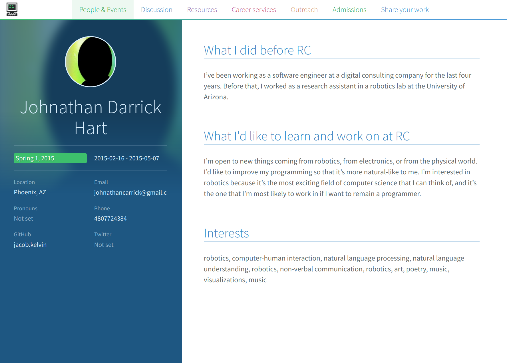
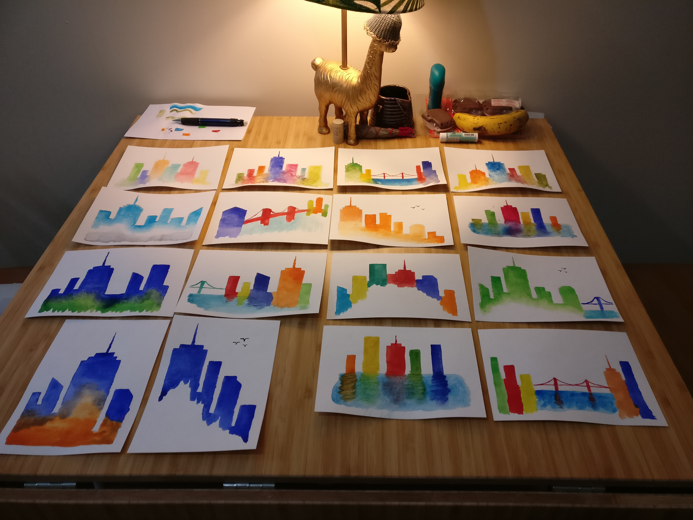
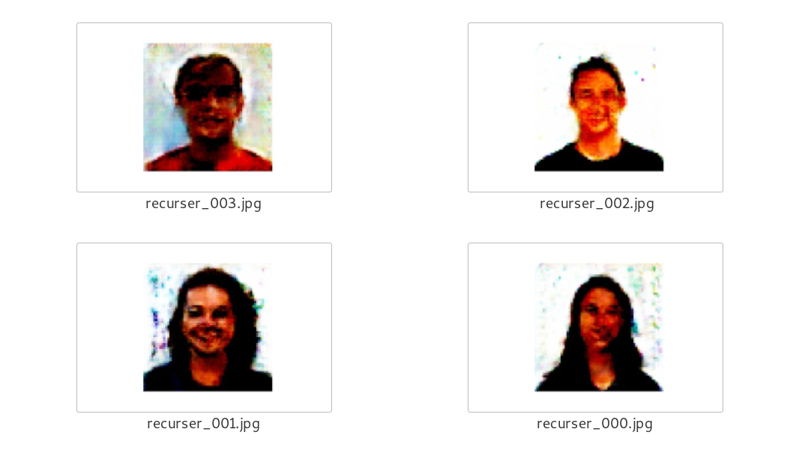
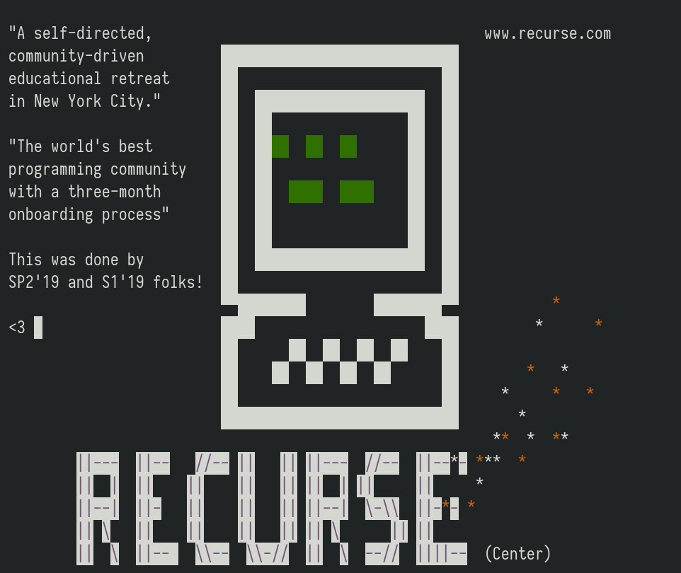
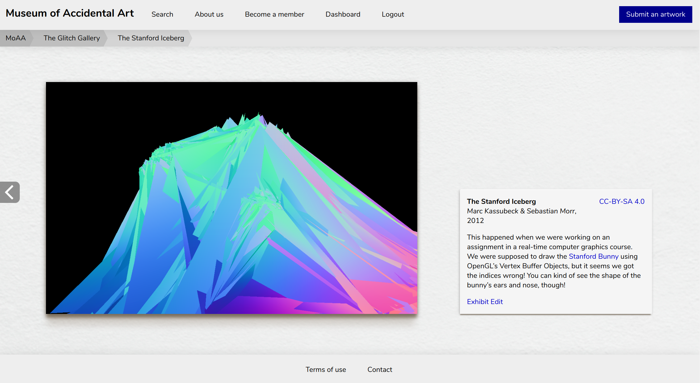
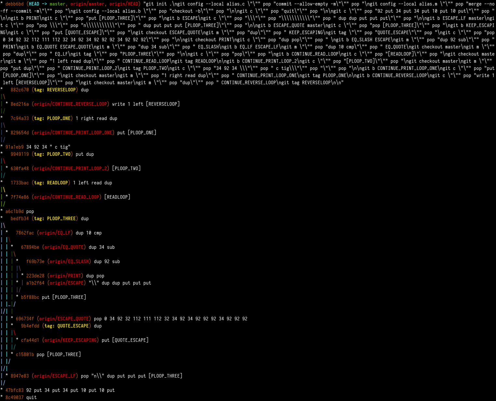
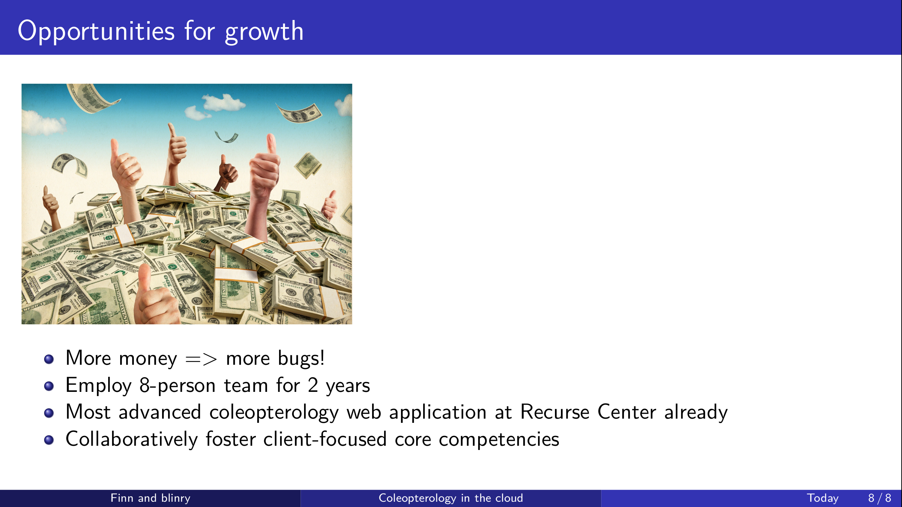
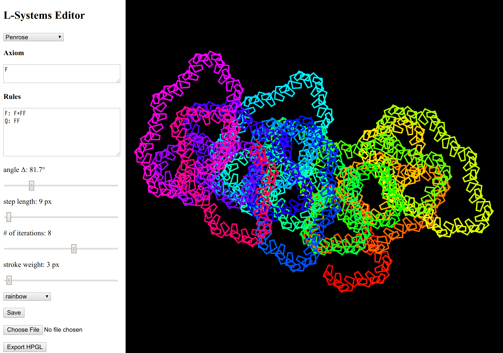

The last part of my daily checkins at the Recurse Center, after months [1](/rc-month-1/) and [2](/rc-month-2/)! In this month, I transitioned to doing much more graphical/interacive stuff.

## 2019-06-03

Hey everyone! :green_heart:

Friday:

- Created an animation with @**Winston Smith (S1'19)**! We used p5, and learned things about easing functions, and about how to plan and structure this kind of multi-step animation! Also, publishing this as a GIF on Twitter was a pain in the ass, we got the best result when exporting all frames individually, opening them as layers in GIMP, and then exporting them as a GIF. :confused: Even though, in the [resulting tweet](https://twitter.com/SequentialChaos/status/1134603237074624512), everything still looks a bit blurry. As for actually making the animation happen: we don’t store any state, but have formulas in place that give us the transformations we want. You can peek at the p5.js source code [here](https://sequential.me/sketches/wasps-and-nades/arrows/1/rainbow/sketch.js), if you want. Fun fact: we actually had another movement pattern in mind, but a bug produced this, so we decided to keep it! Out of appreciation of the fabulous [@beesandbombs](https://twitter.com/beesandbombs), we internally called this project *wasps and (gre)nades*. :P

- Crawled the [RC API](https://github.com/recursecenter/wiki/wiki/Recurse-Center-API) to get people's metadata and profile descriptions, then finetuned a GPT-2 model on that. Again, I'm amazed by how fast I got good results. Funny highlights:

---

> Bio
> 
> My name is Dasabuki Shinoda. I was born in Kyoto, Japan but spent most of my life in Tokyo. I was a professional model in two stylists' and an assistant manager's jobs. I then started working as a model in a fashion photography studio, and found that modeling, photography, and editing were not the most exciting and fulfilling of my interests.
> 
> I've since discovered the power and joy of design and programming, and have been working for a well-appointed desk ever since. 
> 
> I'm now trying to figure out what the heck I really am.

---

> I've been programming for a while, and recently fell in love with the idea of living in the past, and using computers as a tool for self preservation.

--- 

> What I'd like to learn and work on at RC
> 
> Go, go, go

---

> In programming I've primarily used Python, which is my natural language and the most natural language for programming I have.
> 
> Other than programming I love to listen to and study to the same.
> 
> Most of all, I want to get better and master my passions (music and food).

---

> Installing ImageMagick 3.0 and getting some testing/predicting working.
> 
> Installing and setting up a "no-fuss" automated testing environment for my codebase.
> 
> Getting some "yes" questions from the community about my codebase and project in general.

Today:

- Give a juggling workshop!
- More GPT-2 finetuning. Maybe create a tiny web interface to display the results?

## 2019-06-04

Hello, friends! :recursecenter:

Yesterday:

- @**Tim Vieregge (SP2'19)** and I wanted to get back into the habit of meditating regularly, so we made an accountability/support group in the #**meditation** stream, and are doing micro check-ins there since Monday. Join us! :slight_smile:
- The juggling workshop was so fun, thanks everyone for joining! Let's do another iteration of the *Recurse Circus* next Monday!
- Paired with @**Alan Chu (SP2'19)** on the command line tool that helps you insert *Co-authored-by* tags into commit messages. All Git repositories have the convenient `.git/hooks/prepare-commit-msg` hook that allows you to modify the commit message before it is opened in your editor! We first wrote a shell script to insert co-author tags, and then rewrote the thing in Go, which took 10 times as many lines, but is also (at least) 10 times prettier! And it's unit tested!
- Was surprised to see that my brain still can spit out some Blender shortcuts after almost a year of not really using it. (@**Nick Aversano (SP2'19)** tried to extrude 2D vector graphics of bugs into 3D, and had some… bugs in his workflow :P)

Today:

- I didn't get to the *thisrecurserdoesnotexist* web frontend yesterday, so I might do a bit of that today! よし！！

## 2019-06-05

Hey :}

Yesterday:

- Started making an ambient generative art thing with @**Kate-Laurel Agnew (SP2'19)**! The vision is a Zelda-style pixelart garden landscape. We started out with a prototype in Nicky Case's [Emoji Playground](http://ncase.me/emoji-prototype/), where we defined rules for a complex cellular automaton: empty spaces sometimes spawn a seedling, which can grow into a tree, which occasionally drop nuts. Then we had squirrels moving around, which multiply when there are many nuts, but die from overpopulation. And so on.

- After that, as a first step for implementing something similar ourselves, we wrote some Javascript that fills a canvas with randomly colored squares! :palette: Also, [keycodes.info](https://keycode.info/) seems helpful for figuring out the keycodes of Javascript input events!
- Made a web interface for *This Recurser Does Not Exist*! You can check it out here: *REDACTED*! Because the model could hypothetically leak real personal information, it's password protected: Username "*REDACTED*", password "*REDACTED*". This version contains about 500 pre-generated profiles. Please send me a screenshot if you find something funny! :)


Today:

- Would be a fun exercise to also generate photos for *This Recurser Does Not Exist*! The model would probably take the full name of a person as an input? I might do some research on how to do that today.
- I brought my roommate's watercolor supplies for crafternoon! Never tried that before!

## 2019-06-10

Long time no see, #**checkins** stream! :O I had a lovely, quiet weekend. Got some organizational stuff done, got eaten by mosquitoes, and tried using watercolors for the first time! Wrote 25 postcards in total, that I'll send off to 5 countries today! \o/ #**victory**


Wednesday

- Attended the fast.ai study group, and learned about embeddings and convolutional neural networks!
- Read the GPT-2 paper, and skimmed the two papers it's based on. Biggest takeaway: the researchers probably also don't *really* understand why and how the resulting models work. You just wire together a network in a way that makes sense to you, train it, and hope for the best! :D
- Spontaneously paired with @**Winston Smith (S1'19)** over dinner on drawing plane-filling fish and a tool to do so, and on snakes^Wcaterpillars moved by Perlin noise.
- Chilled with @**Maren Beam (SP2'19)** to some sick techno/house beats in Church. We gotta do that again! :green_heart:

Thursday

- Paired with @**Vidhi S Shah (SP1'19)** on training a GAN on the photos in the RC directory. Interesting to see how such a setup can be coded from scratch – we mostly sticked to [this PyTorch tutorial](https://pytorch.org/tutorials/beginner/dcgan_faces_tutorial.html). While the results are not realistic per se, I'm (again) super amazed by that training a this from scratch for a few hours gives so good results!

- Gave a demo on *This Recurser does not exist*, which was super fun!

Friday

- Made another animation with @**Winston Smith (S1'19)**! This one is based on an optical illusion called "contrast asynchrony". Brains are weird!


Today

- Another juggling meetup aka *Recurse Circus* :P
- Put together tomorrow's talk about tools for self-organization. Fun fact: I wanted to give a similar talk at another event last year, but… didn't find the time to prepare it. Oh, the irony!
- Faculty invited me to give a talk at this month's Localhost! :open_mouth: Gonna think about a good topic today. Which technical talk I gave at RC did y'all enjoy the most?

## 2019-06-13

Hey all! :sunflower:

Monday

- Recurse Circus! Thanks for joining, everyone! Good to see so many of you being happy with their progress! We ran out of juggling material on Monday, and had to improvise with paper cups and these little rubber animals for making tea! :D
- Spicy thai food at *Ugly Baby*! :chili_pepper: Sweet/salty food at *Milk Bar*!
- Submitted a talk proposal to the Chaos Communication Camp in August (about the why and how of game jams!)

Tuesday

- Continued working with @**Kate-Laurel Agnew (SP2'19)** on the *Infinite Garden* ambient art project – we got some CC-licensed pixel art plants, and and planted them randomly in a grid! :seedling:
- Great evening of non-technical talks about marathon running, technical diving, and lucid dreaming! Followed by an exursion to `ssh torus@ascii.town`! We collaborated on making a screen dedicated to RC (southeast of the *Red Outpost*, if you wanna visit)!


Wednesday

- Paired with @**Valerie Woolard (S1'19)** on some NLP fun in Python: The *Antonymizer* replaces words in a text with their antonym, the *Glossifier* replaces words with a longer definition, and the *Emojifier* replaces words with their emoji equivalents. Running the first paragraphs of *Alice in Wonderland* through those filters was fun! :P
- Paired with @**Winston Smith (S1'19)** on an interactive animation using [nannou](https://nannou.cc), a multimedia framework written in native Rust (thanks for mentioning this, @**Zach Krall (S1'19)**)! The animation is based on the *perpetual diamond illusion*, which is pretty mindblowing! We might share a more finished thing later.

## 2019-06-18

Yo, what's up? :cat:

Thursday

- Most people I've ever seen in an in-batch feelings check-in! :O Thanks for your vulnerability, everyone, it means a lot to me! I shared the realization that I really like it if people use a **neutral pronoun like they/them** for me, so feel free to try that sometime, if you want! :blush: (But other pronouns are okay, as well!)
- Gave a presentation about the *Museum of Accidental Art* (please don't share the link publicly yet). I probably want to change the name, not to clash with the [@accidental__aRt](https://twitter.com/accidental__art) project – I'm attaching a poll, if you want to help me find a good one! Please submit your pretty bugs!

- Really enjoyed exploring group theory using @**Alex Berke (SP1'17)**'s [coloring book](https://www.coloring-book.co), thanks for making that event happen, Alex! I wish my algebra professor had framed cyclic groups that way! :D

Friday

- Did a weekend trip to Washington, DC! (Uh, I always thought that was short for "District of California", even though I found that strange... also, I always wondered which state Washington was in, heh. Was good to learn about the history of that place!) One of the things I liked most in DC was the excellent scooter sharing infrastructure, whee! :kick_scooter: And I touched a moon rock!!

Today

- Gave a dry run of my Localhost talk about *legit*! Thanks for attending, @**Jenny Xing (S1'19)** @**Jaryn Colbert (S1'19)** @**Aaron Sikes (S1'19)** @**Winston Smith (S1'19)**, your feedback was super valuable for me! :green_heart:
- Continued working on the *Emojifier* with @**Valerie Woolard (S1'19)**! We're now using a better tokenizer and a part-of-speech estimator to only replace nouns, adjectives, and verbs. We tried to be clever about finding grammatical forms which work best when looking them up in Emoji dictionaries (we're using [this one](https://www.webfx.com/tools/emoji-cheat-sheet/), which also has alternative names embedded in the source code). The results are pretty solid, and sometimes, confusing and funny! (Valerie, wanna share some examples? :D)

(Valerie added the following:)

Yes! So since we stopped pairing on emojifier I polished it up a little so it takes in a file as a command line argument.
Some choice transformations:

> And the young king was then married to his true wife, and they reigned over the kingdom in peace and happiness all their lives; and the good fairy came to see them, and restored the faithful Falada to life again. -> And the young 👑 was then married to his true wife, and they reigned over the kingdom in ✌ and 😌 all their lives; and the 👍 fairy came to 👀 them, and restored the 🐶 Falada to life again.

(I thought the faithful ->  🐶was particularly inspired)

>I should like a drop of sweet red christening wine myself -> I should 👭 a drop of 🍭 👺 christening 🍇 myself.

>suddenly a White Rabbit with pink eyes ran
close by her -> suddenly a White 🐰 with 💗 👀 🏃 close by her

## 2019-06-20

Hey all! :green_heart:

Tuesday

- Practiced and gave a Localhost talk about the *legit* programming language! When I published the language last month, I posed the challenge of writing a quine in it – the output of the program would consist of the Git commands required to create itself. The punchline of the talk was that someone on the Internet actually ended up doing that!!! :open_mouth: Here's the program, which also contains some tools and documentation: <https://github.com/remuladgryta/legit-quine> I'm trying to find more about this person. Maybe it's a soulmate? A soulmate with too much time. After the talk, people proposed new challenges: A transpiler from another language to *legit*! Or a self-hosting *legit* compiler! :'D


Wednesday

- Went to @**Valerie Woolard (she) (S1'19)**'s Surrealist App Workshop, where we coded up Rails apps in 1,5 hours! Before I went there, I thought the concept was intimidating and scary. :scared: [The slides](http://pineconedoesthings.com/surreal.html) which served as an inspiration explain that the event is about making a lot of mistakes, and asking for help. :wink: It was super fun, hectically scrambling for the docs, debugging strange errors, and always wondering if things like model names should be written in singular or plural. The concept was *exquisite corpse*-style coding: @**Finn Boire (he) (S1'19)** and me wrote the backend for a peace negotiation app involving camels, the frontend for a song/lyrics database of very distasteful songs, and gave a presentation about spawning rare insects that *really* like tacos, and why people should invest one million USD in that app. :P

- Paired with @**Winston Smith (he) (S1'19)** on making a basic web interface for editing L-systems! Very satisfying to see it all fall into place, and being able to modify parameters with fine-grained sliders! Also, I learned that P5.js has functions to easily create interfaces like this (like `createInput`).
- Got a 15-minute crash course on Haskell from @**Tim Vieregge (he) (SP2'19)**! What a fun, elegant language! :O I digged out a 2D graphics library called [gloss](http://gloss.ouroborus.net), that feels very satisfying to use. I digged around in the demos, and especially liked the *Tree* one. @**Winston Smith (he) (S1'19)** and I modified it to be an ever-changing sequence of STOP sign trees. :D


Today

- Super intense feelings check-in, oof. Thank you all for your vulnerability and love and kindness, it means a lot to me! :hugs:

## 2019-06-25

Hello! :heart_kiss: 

Friday

- Felt exhausted and quiet, so I spent most of the day on the couch in the library, reading *Learn You a Haskell For Great Good* (which apparently is [available online under a Creative Commons license](http://learnyouahaskell.com/chapters)!) I found it mostly enjoyable and easy to read. Some of the examples involve sexism and fat shaming. :sad:
- Point-free style functions blew my mind! That's when you define a function without explicit arguments, because its definition involves functions which are missing arguments, as well! For example, instead of writing `double x = 2*x`, this works, too: `double = (2*)`. Weird!
- I had a vague idea of how to do IO in Haskell, but now I think I understand it a bit better. Also, I learned that IO can look *very* elegant. For example, here's a program that reverses the lines of its input individually. The `interact` function is predefined, and runs a `String -> String`-type function on the input, which we construct using the function composition operator `.`:

```
main = interact $ unlines . map reverse . lines
```

- @**Tim Vieregge (he) (SP2'19)** showed me how *Zippers* work in Haskell. I really, really like this way of looking at data structures!
- Tried to print a *Hive* piece with @**Nick Aversano (he) (SP2'19)** on the M3D printer in Turing. Uh, we had to disable the warning in the OctoPrint interface running on the Raspberry Pi that this was an unsafe device, and could potentially catch on fire? :fear: The result was… not great, and resembled a warped hexagonal cracker. (Even though PLA is biodegradable, please don't eat it!)
- Went to the 16th *MP3 Experiment* in Prospect Park in the evening. It was silly and fun, thanks for joining, everyone!

Monday

- Attended @**Winston Smith (he) (S1'19)**'s L-systems workshop! Find the online editor [here](https://sequential.me/sketches/lsys-editor-simple/)! I never really understood how they worked, but after playing around with them in the editor, I think I've got it! I learned that doing things intentionally is hard (making a simple spiral, for example), while doing random things that look interesting is really easy (wildly orbiting loops? Unexplainably squiggly snakes?)

- Paired with @**Kate-Laurel Agnew (she) (SP2'19)** on implementing movement mechanics for the Infinite Pixel Plant Garden. Right now, we add rows and columns to the 2D grid whenever we're about to leave it, which I feel is very in line with the garden being potentially *infinite*! :blush:
- Paired with @**Finn Boire (he) (S1'19)** on generating chord progressions! Finn has scraped all of ultimate-guitar.com over the last weeks, and we tried to use deep learning to process that. The results were not really overwhelming, but also not unpleasant, and mostly seemed to stay within the same key, and produced some pleasant patterns, including the very common *I–V–vi–IV progression*.
- And then, we decided just to throw the complete songs, including the lyrics, into GPT-2. As always when I'm working with that model, I'm blown away by how well it worked. This is what we got, rather early in the training (note the "S" chord, and the rather touching last verse). Also, we let it run overnight on a larger input – I can't wait to check out what happened!

---

         C# D#          Bm            G
    I couldn't understand
       F F#          C#
    How could you forget

             F#
    I didn't know when they left but I guess

                 C#
    Fucking shit, I didn't know how long I'd been looking for
               G
    Fucking shit, I wasn't able to understand
       F#  C# S F#
    I never wanted you and I never want for anything
               Bm                  G
    I couldn't understand
       F#   C  S    F A C#
    I didn't know when they said goodbye
    C  C#      F#  F##
    I heard that little boy crying his guts out
      F# D#         F#
    I heard that little boy crying his guts out
    F#  C           C#
    I heard that little boy crying his guts out

         F#
    I didn't know when they left but I guess
    F# C#         F#
    I knew when they left and they came back
    C# F#
    I didn't know when they left but I guess
    F# F#
    I never wanted to hear them say goodbye

## 2019-06-27

Hello! So, here I am, writing my last in-batch check-in! :O It has been a pleasure, thanks for everyone who followed along!

Tuesday:

- @**Winston Smith (he) (S1'19)** and I made another animation! \o/ In this one, we change the angle of several L-systems, and smoothly transition them into each other. Meet: Sierpinski Arrowhead, Hexagonal Gosper, the Hilbert Curve, and the Dragon Curve!

- Gave a talk about the minimalist constructed language [Toki Pona](https://en.wikipedia.org/wiki/Toki_Pona)! Slides with resources: [toki-pona-talk.pdf](toki-pona-talk.pdf) I also made a #**tokipona** stream, for maybe practicing it in the future with you! :) This was the last round of non-technical talks organized by @**Jaryn Colbert (she) (S1'19)** and me, glad to see that @**Zach Krall (he) (S1'19)** will take them over! :tada:
- Went to the [Plotter People](https://plotterpeople.github.io/nyc.html) meetup with @**Winston Smith (he) (S1'19)** and @**Wesley Aptekar-Cassels (they) (m4'19)**, which was a very nice and inspiring event! Paul, the organizer, explicitly expressed that he would love to see more Recursers there in the future!

Wednesday:

- Played against @**Yoni Elhanani (he) (SP2'19)**'s *Ultimate Tic-Tac-Toe* Solver with him, and won! \o/ Also Yoni, stepped me through the code – certainly the largest and most elegant Haskell program I've seen so far!
- Checked out the results of the longer-trained song generation GPT-2 model with @**Finn Boire (he) (S1'19)** – it doesn't seem overtrained yet after 5000 steps. The resulting songs are mostly coherent, and mostly have pleasant chord sequences, that kind of stay in key. We wanted to give an ad-hoc performance at tonight's presentations, but it seems we missed the opportunity to sign up. :wink:

Today:

- Give hugs to everyone who wants one! :hugs:

## 2019-06-30

I wanted to add a few closing thoughts to this topic. At this point, I'm back in my hometown [Braunschweig](https://www.openstreetmap.org/?mlat=52.268&mlon=10.503#map=5/52.268/10.503), which is conveniently located in the center of Northern Germany. Miss y'all a lot! :green_heart: My time at RC has been one of the most intense, joyful phases of my life, and I feel immensely grateful and privileged that I got to share that with you!

Here's an **open invitation** for my fellow batchmates, alumni, and future Recursers alike: come visit me anytime! I can offer comfy places to stay in both Braunschweig and Berlin, and added that info to the [couch surfing page](https://github.com/recursecenter/wiki/wiki/Couch-surfing) on the wiki. If you're ever in or near Germany, I'd love to meet you, feel free to hit me up!

Also, message me anytime you just want to chat – most things are interesting to me, but I have a lot of experience with interactive and visual stuff, self-organization, and open relationships. My email address is sebastian@morr.cc, and my main phone number is *REDACTED* (message me via Signal, WhatsApp, or Hangouts!)

You can follow me on [Twitter](https://twitter.com/blinry), [Mastodon](https://chaos.social/@blinry), and [GitHub](https://github.com/blinry), and probably other places, I'm "blinry" everywhere. :P My [homepage](https://morr.cc) has an [RSS feed](https://morr.cc/feed/), if that appeals to you. Alternatively, you can conveniently subscribe to my [newsletter](https://tinyletter.com/blinry)! I also have a small [Patreon page](
https://www.patreon.com/blinry), if you feel like want to support my open source logo design work, or the nonverbal IDEA-style assembly instructions (and occasionally want to get postcards! :3).

A few thoughts for the Summer 2 folks coming in next week (hi! :wave:): in my experience, there's no "right" way to do RC! Listen to what you need each day, and don't feel guilty about doing exactly that. At the same time, I'd encourage you to try the things that scare you most. Remember that comparing your own inside with other people's outside is not a fair comparison. Go to feelings check-in! Practice vulnerability, and make lots of mistakes! <3

See you in #**alumni-checkins**, and at NGW next year! :)
