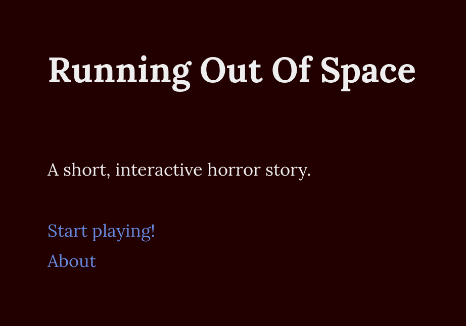

I got the idea for this story when brainstorming for *Ludum Dare 42*, but my teammates didn't like it. We made [Writespace](/writespace/) instead, and I'm happy that we did. But in April 2019, I took the time to make an actual piece of interactive fiction around my original idea. Made with [Twine](http://twinery.org).

[Play it in your browser!](play/)

